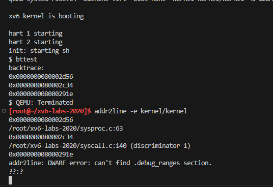
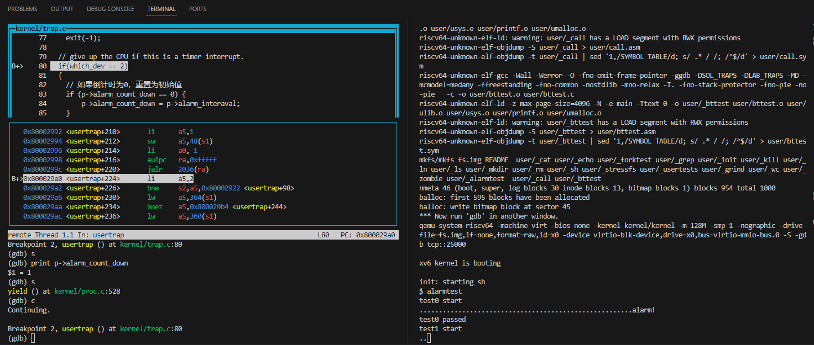
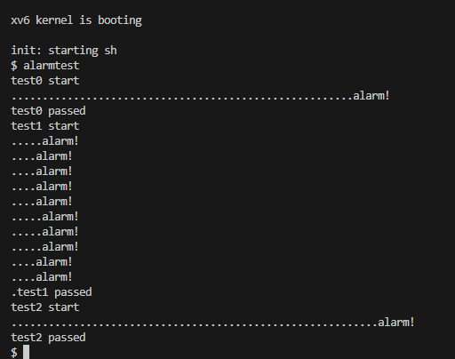
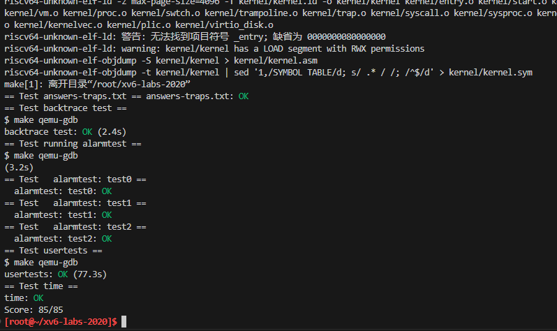

# Lab4 Traps
本实验探索如何使用陷阱实现系统调用。您将首先使用栈做一个热身练习，然后实现一个用户级陷阱处理的示例。
切换实验分支：
```sh
$ git fetch
$ git checkout traps
$ make clean
```
**前置知识：**
* ```kernel/trampoline.S```：涉及从用户空间到内核空间再到内核空间的转换的程序集
* ```kernel/trap.c```：处理所有中断的代码
<span style="background-color:green;">定义一个名为```vmprint()```的函数。它应当接收一个```pagetable_t```作为参数，并以下面描述的格式打印该页表。在***exec.c***中的```return argc```之前插入```if(p->pid==1) vmprint(p->pagetable)```，以打印第一个进程的页表。如果你通过了```pte printout```测试的```make grade```，你将获得此作业的满分。</span>

## Task1 assembly
理解一点RISC-V汇编是很重要的，你应该在6.004中接触过。xv6仓库中有一个文件***user/call.c***。执行```make fs.img```编译它，并在***user/call.asm***中生成可读的汇编版本。

阅读 ***call.asm*** 中函数```g```、```f```和```main```的代码。RISC-V的使用手册在[参考页](https://pdos.csail.mit.edu/6.828/2020/reference.html)上。 以下是您应该回答的一些问题（将答案存储在 ***answers-traps.txt*** 文件中）：

1.  哪些寄存器保存函数的参数？例如，在```main```对```printf```的调用中，哪个寄存器保存13？
1. ```main```的汇编代码中对函数```f```的调用在哪里？对```g```的调用在哪里(提示：编译器可能会将函数内联)
1.  ```printf```函数位于哪个地址？
1. 在```main```中```printf```的```jalr```之后的寄存器```ra```中有什么值？
1. 运行以下代码:
```c
unsigned int i = 0x00646c72;
printf("H%x Wo%s", 57616, &i);
```
程序的输出是什么？这是将字节映射到字符的[ASCII码表](http://web.cs.mun.ca/~michael/c/ascii-table.html).
输出取决于RISC-V小端存储的事实。如果RISC-V是大端存储，为了得到相同的输出，你会把```i```设置成什么？是否需要将```57616```更改为其他值？
这里有一个[小端和大端存储的描述](http://www.webopedia.com/TERM/b/big_endian.html)和一个[更异想天开的描述](http://www.networksorcery.com/enp/ien/ien137.txt)。

6. 在下面的代码中，“```y=```”之后将打印什么(注：答案不是一个特定的值)？为什么会发生这种情况？
```c
printf("x=%d y=%d", 3);
```

***call.asm:***
```
user/_call：     文件格式 elf64-littleriscv


Disassembly of section .text:

0000000000000000 <g>:
#include "kernel/param.h"
#include "kernel/types.h"
#include "kernel/stat.h"
#include "user/user.h"

int g(int x) {
   0:	1141                	addi	sp,sp,-16
   2:	e422                	sd	s0,8(sp)
   4:	0800                	addi	s0,sp,16
  return x+3;
}
   6:	250d                	addiw	a0,a0,3
   8:	6422                	ld	s0,8(sp)
   a:	0141                	addi	sp,sp,16
   c:	8082                	ret

000000000000000e <f>:

int f(int x) {
   e:	1141                	addi	sp,sp,-16
  10:	e422                	sd	s0,8(sp)
  12:	0800                	addi	s0,sp,16
  return g(x);
}
  14:	250d                	addiw	a0,a0,3
  16:	6422                	ld	s0,8(sp)
  18:	0141                	addi	sp,sp,16
  1a:	8082                	ret

000000000000001c <main>:

void main(void) {
  1c:	1141                	addi	sp,sp,-16
  1e:	e406                	sd	ra,8(sp)
  20:	e022                	sd	s0,0(sp)
  22:	0800                	addi	s0,sp,16
  printf("%d %d\n", f(8)+1, 13);
  24:	4635                	li	a2,13
  26:	45b1                	li	a1,12
  28:	00000517          	auipc	a0,0x0
  2c:	7a850513          	addi	a0,a0,1960 # 7d0 <malloc+0x102>
  30:	00000097          	auipc	ra,0x0
  34:	5e6080e7          	jalr	1510(ra) # 616 <printf>
  exit(0);
  38:	4501                	li	a0,0
  3a:	00000097          	auipc	ra,0x0
  3e:	274080e7          	jalr	628(ra) # 2ae <exit>
```

**答案：**

1.  a0-a7寄存器保存函数的参数。a2寄存器保存了13  (可查看[RISC-V寄存器表](#reg))
2.  ```main```对```f```的调用在c代码中的```printf("%d %d\n", f(8)+1, 13)```,```f```又对```g```调用。但是在汇编中
    ```
    26:	45b1                	li	a1,12
    ```
直接计算出了8+3+1=12的结果并储存

3. 由这两行：
    ```
    30:	00000097          	auipc	ra,0x0                      # ra = 0x30
    34:	5e6080e7          	jalr	1510(ra) # 616 <printf>     # 跳转至ra+1510的地址   
    ```
  0x30 + 1510 = 0x30 + 0x5E6 = 0x616

4. ```auipc```(Add Upper Immediate to PC)：```auipc rd imm```，将高位立即数加到PC上
```jalr ```(jump and link register)：```jalr rd, offset(rs1)```跳转并链接寄存器。```jalr```指令会将当前PC+4保存在rd中，然后跳转到指定的偏移地址```offset(rs1)```。
因此跳转到printf函数以后,会将0x34+0x4 = 0x38保存到```ra```中

5. 57616 = 0xE110, 0x00646c72小端存储（little endian）为 72-6c-64-00, 对照ASCII码表
72->r
6c->l
64->d
00->NULL
因此输出为"HE110 World"
如为大端存存储，i应该为0x726c640，不需要改变57616

6. 原本需要两个参数，却只传入了一个，因此y=后面打印的结果取决于之前a2中保存的数据

## Task2 Backtrace
回溯(Backtrace)通常对于调试很有用：它是一个存放于栈上用于指示错误发生位置的函数调用列表。
<span style="background-color:green;">
在***kernel/printf.c***中实现名为```backtrace()```的函数。在```sys_sleep```中插入一个对此函数的调用，然后运行```bttest```，它将会调用```sys_sleep```。</span>你的输出应该如下所示：
```
backtrace:
0x0000000080002cda
0x0000000080002bb6
0x0000000080002898
```
在```bttest```退出qemu后。在你的终端：地址或许会稍有不同，但如果你运行```addr2line -e kernel/kernel```（或```riscv64-unknown-elf-addr2line -e kernel/kernel```），并将上面的地址剪切粘贴如下：
```
$ addr2line -e kernel/kernel
0x0000000080002de2
0x0000000080002f4a
0x0000000080002bfc
Ctrl-D
```
你应该看到类似下面的输出：
```c
kernel/sysproc.c:74
kernel/syscall.c:224
kernel/trap.c:85
```

**提示：**
1. 在***kernel/defs.h***中添加```backtrace```的原型，那样你就能在```sys_sleep```中引用```backtrace```
2. GCC编译器将当前正在执行的函数的帧指针保存在```s0```寄存器，将下面的函数添加到***kernel/riscv.h***
```c
static inline uint64
r_fp()
{
  uint64 x;
  asm volatile("mv %0, s0" : "=r" (x) );
  return x;
}
```
并在```backtrace```中调用此函数来读取当前的帧指针。这个函数使用内联汇编来读取```s0```
3. 这个[课堂笔记](https://pdos.csail.mit.edu/6.828/2020/lec/l-riscv-slides.pdf)中有张栈帧布局图。注意返回地址位于栈帧帧指针的固定偏移(-8)位置，并且保存的帧指针位于帧指针的固定偏移(-16)位置

4.  XV6在内核中以页面对齐的地址为每个栈分配一个页面。你可以通过```PGROUNDDOWN(fp)```和```PGROUNDUP(fp)```（参见k***ernel/riscv.h***）来计算栈页面的顶部和底部地址。这些数字对于```backtrace```终止循环是有帮助的。

一旦你的```backtrace```能够运行，就在***kernel/printf.c***的```panic```中调用它，那样你就可以在```panic```发生时看到内核的```backtrace```。

**步骤：**
1. 按照提示，在***kernel/defs.h***中添加```backtrace```的声明，在***kernel/riscv.h***中添加```r_fp()```函数
2. 在***kernel/printf.c***中实现```backtrace()```:
```c
/**
 * @brief 回溯函数调用的返回地址
*/
void
backtrace()
{
  uint64 kstack = myproc()->kstack;
  printf("backtrace:\n");
  // 调用r_fp来获取当前的帧指针, PGROUNDDOWN用于将地址向下舍入到最接近的页面边界，上一个函数的帧指针在上面偏移16字节的位置
  for (uint64 fp = r_fp(); PGROUNDDOWN(fp) == kstack; fp = *(uint64*)(fp-16))
  {
    printf("%p\n", *(uint64*)(fp-8));  // 打印函数返回地址
  }
}
```
3. 在***sysproc.c***里的```sys_sleep()```中调用```backtrace```:
```c
uint64
sys_sleep(void)
{
  int n;
  uint ticks0;

  backtrace();

  //...
}
```

**测试：**


## Task3 Alarm(Hard)
<span style="background-color:green;">在这个练习中你将向XV6添加一个特性，在进程使用CPU的时间内，XV6定期向进程发出警报。这对于那些希望限制CPU时间消耗的受计算限制的进程，或者对于那些计算的同时执行某些周期性操作的进程可能很有用。更普遍的来说，你将实现用户级中断/故障处理程序的一种初级形式。例如，你可以在应用程序中使用类似的一些东西处理页面故障。如果你的解决方案通过了 ```alarmtest```和```usertests``` 就是正确的。</span>

你应当添加一个新的```sigalarm(interval, handler)```系统调用，如果一个程序调用了````sigalarm(n, fn)````，那么每当程序消耗了CPU时间达到n个“滴答”，内核应当使应用程序函数```fn```被调用。当```fn```返回时，应用应当在它离开的地方恢复执行。在XV6中，一个滴答是一段相当任意的时间单元，取决于硬件计时器生成中断的频率。如果一个程序调用了```sigalarm(0, 0)```，系统应当停止生成周期性的报警调用。

你将在XV6的存储库中找到名为***user/alarmtest.c***的文件。将其添加到```Makefile```。注意：你必须添加了```sigalarm```和```sigreturn```系统调用后才能正确编译（往下看）。

```alarmtest```在t**est0**中调用了```sigalarm(2, periodic)```来要求内核每隔两个滴答强制调用```periodic()```，然后旋转一段时间。你可以在***user/alarmtest.asm***中看到```alarmtest```的汇编代码，这或许会便于调试。当```alarmtest```产生如下输出并且```usertests```也能正常运行时，你的方案就是正确的：
```sh
$ alarmtest
test0 start
........alarm!
test0 passed
test1 start
...alarm!
..alarm!
...alarm!
..alarm!
...alarm!
..alarm!
...alarm!
..alarm!
...alarm!
..alarm!
test1 passed
test2 start
................alarm!
test2 passed
$ usertests
...
ALL TESTS PASSED
$
```
**test0: invoke handler(调用处理程序)**
首先修改内核以跳转到用户空间中的报警处理程序，这将导致```test0```打印“alarm!”。不用担心输出“alarm!”之后会发生什么；如果您的程序在打印“alarm!”后崩溃，对于目前来说也是正常的。
**提示：**
1. 您需要修改***Makefile***以使***alarmtest.c***被编译为xv6用户程序。
1.  放入***user/user.h***的正确声明是：
    ```c
    int sigalarm(int ticks, void (*handler)());
    int sigreturn(void);
    ```
1. 更新***user/usys.pl***（此文件生成***user/usys.S***）、***kernel/syscall.h***和***kernel/syscall.c***以允许```alarmtest```调用```sigalarm```和```sigreturn```系统调用。
1. 目前来说，你的```sys_sigreturn```系统调用返回应该是零。
1. 你的```sys_sigalarm()```应该将报警间隔和指向处理程序函数的指针存储在```struct proc```的新字段中（位于***kernel/proc.h***）。
1. 你也需要在```struct proc```新增一个新字段。用于跟踪自上一次调用（或直到下一次调用）到进程的报警处理程序间经历了多少滴答；您可以在***proc.c***的```allocproc()```中初始化```proc```字段。
1. 每一个滴答声，硬件时钟就会强制一个中断，这个中断在***kernel/trap.c***中的```usertrap()```中处理。
    ```c
    // give up the CPU if this is a timer interrupt.
    if(which_dev == 2)
      yield();
    ```
1. 如果产生了计时器中断，您只想操纵进程的报警滴答；你需要写类似下面的代码:
    ```c
    if(which_dev == 2) ...
    ```
1. 仅当进程有未完成的计时器时才调用报警函数。请注意，用户报警函数的地址可能是0（例如，在***user/alarmtest.asm***中，```periodic```位于地址0）。
1. 您需要修改```usertrap()```，以便当进程的报警间隔期满时，用户进程执行处理程序函数。当RISC-V上的陷阱返回到用户空间时，什么决定了用户空间代码恢复执行的指令地址？
1. 如果您告诉qemu只使用一个CPU，那么使用gdb查看陷阱会更容易，这可以通过运行
    ```sh
    make CPUS=1 qemu-gdb
    ```
1. 如果```alarmtest```打印“alarm!”，则您已成功。

**test1/test2(): resume interrupted code(恢复被中断的代码)**
```alarmtest```打印“alarm!”后，很可能会在test0或test1中崩溃，或者```alarmtest```（最后）打印“test1 failed”，或者```alarmtest```未打印“test1 passed”就退出。要解决此问题，必须确保完成报警处理程序后返回到用户程序最初被计时器中断的指令执行。必须确保寄存器内容恢复到中断时的值，以便用户程序在报警后可以不受干扰地继续运行。最后，您应该在每次报警计数器关闭后“重新配置”它，以便周期性地调用处理程序。
作为一个起始点，我们为您做了一个设计决策：用户报警处理程序需要在完成后调用```sigreturn```系统调用。请查看***alarmtest.c***中的```periodic```作为示例。这意味着您可以将代码添加到```usertrap```和```sys_sigreturn```中，这两个代码协同工作，以使用户进程在处理完警报后正确恢复。
**提示：**
1. 您的解决方案将要求您保存和恢复寄存器——您需要保存和恢复哪些寄存器才能正确恢复中断的代码？(提示：会有很多)
1. 当计时器关闭时，让```usertrap```在```struct proc```中保存足够的状态，以使```sigreturn```可以正确返回中断的用户代码。
1. 防止对处理程序的重复调用——如果处理程序还没有返回，内核就不应该再次调用它。**test2**测试这个。
1. 一旦通过**test0**、**test1**和**test2**，就运行```usertests```以确保没有破坏内核的任何其他部分。

**步骤**：
1. 修改***Makefile***确保```alarmtest```能编译成功，修改***user/user.h***、***user/usys.pl***、***kernel/syscall.h***和***kernel/syscall.c***为添加系统调用的基本流程（参见lab2）
    ```c
    // Makefile
    UPROGS=\
      //...
      $U/_zombie\
      $U/_alarmtest\
    ```

    ```c
    // user/user.h
    // systemcalls
    //...
    int sigalarm(int ticks, void (*handler)());
    int sigreturn(void);

    // end of user/usys.pl
    entry("sigalarm");
    entry("sigreturn");

    // end of kernel/syscall.h
    #define SYS_sigalarm  22
    #define SYS_sigreturn 23

    // kernel/syscall.c
    extern uint64 sys_sigalarm(void);
    extern uint64 sys_sigreturn(void);

    static uint64 (*syscalls[])(void) = {
    //...
    [SYS_sigalarm] sys_sigalarm,
    [SYS_sigreturn] sys_sigreturn,
    };
    ```

1. 在***kernel/proc.h***的```struct proc```中添加**报警间隔**、**指向处理程序函数的指针**和**下一次报警的倒计时**
    ```c
    // Per-process state
    struct proc {
      //...
      char name[16];               // Process name (debugging)
      
      int alarm_interaval;         // 报警间隔
      int alarm_count_down;        // 下一次报警倒计时
      uint64 alarm_handler;        // 报警处理函数
    };
    ```

1. 在```sys_sigalarm```中读取参数, 参照题干中的```sigalarm(interval, handler)```形式
    ```c
    // end of kernel/sysproc.c
    uint64
    sys_sigalarm(void)
    {
      if (argint(0, &myproc()->alarm_interaval) < 0 ||
        argaddr(1, &myproc()->alarm_handler) < 0)
        return -1;
      return 0;
    }
    ```

1. 修改```usertrap()```，根据lec06中[trap过程](#usertrap)可以知道，```p->trapframe->epc```用于存放trap结束时函数返回的地址 
    ```c
    void
    usertrap(void)
    {
      //...

      // give up the CPU if this is a timer interrupt.
      if(which_dev == 2)
      {
        // 如果倒计时为0，重置为初始值
        if (p->alarm_count_down == 0) {
            p->alarm_count_down = p->alarm_interaval;
        }
      
        if (--p->alarm_count_down == 0) {          // 报警 倒计时结束后触发警报
          p->trapframe->epc = p->alarm_handler;    // 使trap结束后返回警报处理函数
          p->alarm_count_down = p->alarm_interaval;  // 重置倒计时
        }

        yield();
      }

      usertrapret();
    }
    ```
1. 暂时定义一个空的```sys_sigreturn()```函数，然后进行 **test0**测试：
    ```c
    //  end of sysproc.c
    uint64
    sys_sigreturn(void)
    {
      return 0;
    }
    ```
    
    通过了**test0**
  
1. 现在trap结束时返回的是```alarm_handler```的地址，为了使程序能够恢复到原来的状态，需要在```usertrap```中保存用户寄存器，在```alarm_handler```调用```sigreturn```时将其恢复，并且需要防止在```alarm_handler```执行过程中重复调用。
首先在```struct proc```中新增两个元素：
    ```c
    // kernel/proc.h
    struct trapframe *alarm_trapframe;  // 警报用陷阱帧
    int    is_alarming;                 // 是否正在执行警报处理的flag
    ```

1. 在初始化进程```allocproc()```和释放进程```freeproc()```时完成相关设置：
    ```c
    // kernel/proc.c: allocproc(), freeproc()

    static struct proc*
    allocproc(void)
    {
      //...

    found:
      p->pid = allocpid();

      // Allocate a trapframe page.
      if((p->trapframe = (struct trapframe *)kalloc()) == 0){
        //...
      }

      // Allocate a alarm_trapframe page.
      if((p->alarm_trapframe = (struct trapframe *)kalloc()) == 0){
        freeproc(p);
        release(&p->lock);
        return 0;
      }
      // init alarm params
      p->is_alarming = 0;
      p->alarm_interaval = 0;
      p->alarm_handler = 0;
      p->alarm_count_down = 0;

      // An empty user page table.
      //...
    }

    static void
    freeproc(struct proc *p)
    {
      if(p->trapframe)
        kfree((void*)p->trapframe);
      p->trapframe = 0;
      if(p->alarm_trapframe)
        kfree((void*)p->alarm_trapframe);
      p->alarm_trapframe = 0;
      //...
      p->is_alarming = 0;
      p->alarm_interaval = 0;
      p->alarm_handler = 0;
      p->alarm_count_down = 0;
    }
    ```

1. 修改```usertrap()```函数，保存陷阱帧```p->trapframe```到```p->alarm_trapframe```
    ```c
    // kernel/trap.c
    void
    usertrap(void)
    {
      //...
      // give up the CPU if this is a timer interrupt.
      if(which_dev == 2)
      {
        // 如果倒计时为0，重置为初始值， 正常来讲只在第一次进入时有用
        if (p->alarm_count_down == 0) {
            p->alarm_count_down = p->alarm_interaval;
        }
      
        if (p->alarm_interaval > 0 && --p->alarm_count_down == 0 && p->is_alarming == 0) {          // 报警 倒计时结束后触发警报
          memmove(p->alarm_trapframe, p->trapframe, sizeof(struct trapframe));  // // 保存寄存器内容
          p->trapframe->epc = p->alarm_handler;    // 使trap结束后返回警报处理函数
          p->alarm_count_down = p->alarm_interaval;  // 重置倒计时
          p->is_alarming = 1; // 标记现在正在触发警报
        }

        yield();
      }

      usertrapret();
    }
    ```

1. 在```sys_sigreturn```中实现陷阱帧的恢复
    ```c
    // end of kernel/sysproc.c
    uint64
    sys_sigreturn(void)
    {
      memmove(myproc()->trapframe, myproc()->alarm_trapframe, sizeof(struct trapframe));
      myproc()->is_alarming = 0;  // 标记警报结束，进程可以执行下一次警报
      return 0;
    }
    ```

1. 测试**test1**和**test2**


1. **make grade**

