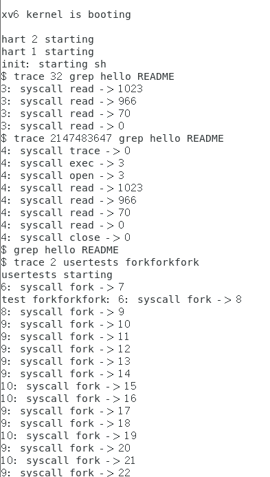

# Lab2 System calls
[实验指导](https://pdos.csail.mit.edu/6.S081/2021/labs/syscall.html)
前置阅读材料：
1. book：《xv6: a simple, Unix-like teaching operating system》chapter2, 4.3, 4.4
2. code： 
* ***user/user.h***和***user/usys.pl*** 中系统调用的用户空间代码
<details>
    <summary><span style="color:blue;">usys.pl</span> </summary>

```pl
#!/usr/bin/perl -w

# Generate usys.S, the stubs for syscalls.

print "# generated by usys.pl - do not edit\n";

print "#include \"kernel/syscall.h\"\n";

sub entry {   # entry 的子例程，该子例程生成每个系统调用的汇编代码存根
    my $name = shift;   # $name为系统调用的名称
    print ".global $name\n";  # 声明系统调用名称为全局符号
    print "${name}:\n";  # 定义系统调用的标签
    print " li a7, SYS_${name}\n";  # 将系统调用号加载到寄存器 'a7' 中
    print " ecall\n";  # 触发系统调用
    print " ret\n";  # 返回
}
	
entry("fork");
entry("exit");
entry("wait");
entry("pipe");
entry("read");
entry("write");
entry("close");
entry("kill");
entry("exec");
entry("open");
entry("mknod");
entry("unlink");
entry("fstat");
entry("link");
entry("mkdir");
entry("chdir");
entry("dup");
entry("getpid");
entry("sbrk");
entry("sleep");
entry("uptime");
```
</details>  其生成的usys.S形式如下：

```c
# generated by usys.pl - do not edit
#include "kernel/syscall.h"  // 其中定义了每个系统调用对应的编号

.global fork  // 可以是其他系统调用
fork:
 li a7, SYS_fork
 ecall
 ret
 ...
```

* ***kernel/syscall.h***和***kernel/syscall.c*** 中的内核空间代码
***kernel/syscall.h*** 定义了每个系统调用对应的编号
***kernel/syscall.c***通过一系列*辅助函数*提取系统调用参数，并通过*系统调用表*找到并执行相应的系统调用处理函数。每个系统调用的具体功能在内核的其他部分实现。
***syscall.c*****定义了六个辅助函数，可在内核其他地方使用他们**：
```c {.line-numbers}
// part of syscall.c

// Fetch the uint64 at addr from the current process.
int
fetchaddr(uint64 addr, uint64 *ip)  // 从当前进程的地址空间中提取一个 64 位的值
{
  struct proc *p = myproc();
  if(addr >= p->sz || addr+sizeof(uint64) > p->sz)
    return -1;
  if(copyin(p->pagetable, (char *)ip, addr, sizeof(*ip)) != 0)
    return -1;
  return 0;
}

// Fetch the nul-terminated string at addr from the current process.
// Returns length of string, not including nul, or -1 for error.
int
fetchstr(uint64 addr, char *buf, int max)  // 从当前进程的地址空间中提取一个以空字符结尾的字符串
{
  struct proc *p = myproc();
  int err = copyinstr(p->pagetable, buf, addr, max);
  if(err < 0)
    return err;
  return strlen(buf);
}

static uint64
argraw(int n)  // 返回第 n 个系统调用参数，参数存储在当前进程的陷阱帧的寄存器中
{
  struct proc *p = myproc();
  switch (n) {
  case 0:
    return p->trapframe->a0;
  case 1:
    return p->trapframe->a1;
  case 2:
    return p->trapframe->a2;
  case 3:
    return p->trapframe->a3;
  case 4:
    return p->trapframe->a4;
  case 5:
    return p->trapframe->a5;
  }
  panic("argraw");
  return -1;
}

// Fetch the nth 32-bit system call argument.
int
argint(int n, int *ip)  // 提取第 n 个 32 位整数类型的系统调用参数
{
  *ip = argraw(n);
  return 0;
}

// Retrieve an argument as a pointer.
// Doesn't check for legality, since
// copyin/copyout will do that.
int
argaddr(int n, uint64 *ip)  // 提取第 n 个地址类型的系统调用参数
{
  *ip = argraw(n);
  return 0;
}

// Fetch the nth word-sized system call argument as a null-terminated string.
// Copies into buf, at most max.
// Returns string length if OK (including nul), -1 if error.
int
argstr(int n, char *buf, int max)  // 提取第 n 个字符串类型的系统调用参数
{
  uint64 addr;
  if(argaddr(n, &addr) < 0)
    return -1;
  return fetchstr(addr, buf, max);
}
...
```

* ***kernel/proc.h***和***kernel/proc.c*** 中的进程相关代码
***kernel/proc.c*** 用于创建、调度和管理进程 。


进行本章实验需切换到syscall分支：
```sh
$ git fetch
$ git checkout syscall
$ make clean
```

## Task1 System call tracing（moderate）
<span style="background-color:green;">在本作业中，您将添加一个系统调用跟踪功能，该功能可能会在以后调试实验时对您有所帮助。您将创建一个新的```trace```系统调用来控制跟踪。它应该有一个参数，这个参数是一个整数“掩码”（mask），它的比特位指定要跟踪的系统调用。例如，要跟踪```fork```系统调用，程序调用```trace(1 << SYS_fork)```，其中```SYS_fork```是***kernel/syscall.h***中的系统调用编号。如果在掩码中设置了系统调用的编号，则必须修改xv6内核，以便在每个系统调用即将返回时打印出一行。该行应该包含进程id、系统调用的名称和返回值；您不需要打印系统调用参数。```trace```系统调用应启用对调用它的进程及其随后派生的任何子进程的跟踪，但不应影响其他进程。</span>

**示例输出：**
```sh
$ trace 32 grep hello README
3: syscall read -> 1023
3: syscall read -> 966
3: syscall read -> 70
3: syscall read -> 0
$
$ trace 2147483647 grep hello README
4: syscall trace -> 0
4: syscall exec -> 3
4: syscall open -> 3
4: syscall read -> 1023
4: syscall read -> 966
4: syscall read -> 70
4: syscall read -> 0
4: syscall close -> 0
$
$ grep hello README
$
$ trace 2 usertests forkforkfork
usertests starting
test forkforkfork: 407: syscall fork -> 408
408: syscall fork -> 409
409: syscall fork -> 410
410: syscall fork -> 411
409: syscall fork -> 412
410: syscall fork -> 413
409: syscall fork -> 414
411: syscall fork -> 415
...
$   
```

**提示：**
* 在***Makefile***的```UPROGS```中添加```$U/_trace```
* 运行```make qemu```，您将看到编译器无法编译***user/trace.c***，因为系统调用的用户空间存根还不存在：将系统调用的原型添加到***user/user.h***，存根添加到***user/usys.pl***，以及将系统调用编号添加到***kernel/syscall.h***，***Makefile***调用perl脚本***user/usys.pl***，它生成实际的系统调用存根***user/usys.S***，这个文件中的汇编代码使用RISC-V的```ecall```指令转换到内核。一旦修复了编译问题（注：如果编译还未通过，尝试先```make clean```，再执行```make qemu```），就运行```trace 32 grep hello README```；但由于您还没有在内核中实现系统调用，执行将失败。
* 在***kernel/sysproc.c***中添加一个```sys_trace()```函数，它通过将参数保存到```proc```结构体（请参见***kernel/proc.h***）里的一个新变量中来实现新的系统调用。从用户空间检索系统调用参数的函数在***kernel/syscall.c***中，您可以在***kernel/sysproc.c***中看到它们的使用示例。
* 修改```fork()```（请参阅***kernel/proc.c***）将跟踪掩码从父进程复制到子进程。
修改***kernel/syscall.c***中的```syscall()```函数以打印跟踪输出。您将需要添加一个系统调用名称数组以建立索引。

按照提示，在***proc.h***中的```struct proc```里新添加一个参数```mask```， 并在***sysproc.c***的```sys_trace()```里去获取它
```c
// kernel/proc.h
struct proc {
  // ...

  int mask;
};

// kernel/sysproc.c
// ...
// lab code
// trace the system call
uint64
sys_trace(void) 
{
	int mask;
	if (argint(0, &mask) < 0) {  // 保存第一个整数类型的参数到mask中
		return -1;
	}
	
	myproc()->mask = mask;
	return 0;
}
```
由于结构体```proc```中新增加了一个参数，按照提示，需要更改```fork()```的代码，使得```fork()```时传递这个新增的参数:
```c
// kernel/proc.c
// ...
// Create a new process, copying the parent.
// Sets up child kernel stack to return as if from fork() system call.
int
fork(void)
{
  // ...

  safestrcpy(np->name, p->name, sizeof(p->name));

  np->mask = p->mask;  // 将掩码拷贝到子进程里（lab2task1)

  pid = np->pid;

  np->state = RUNNABLE;

  release(&np->lock);

  return pid;
}
```

实现系统调用追踪，根据提示，修改***kernel/syscall.c***中的```syscall()```函数：
```c
// end of kernel/syscall.c
void
syscall(void)
{
  int num;
  struct proc *p = myproc();

  num = p->trapframe->a7;
  if(num > 0 && num < NELEM(syscalls) && syscalls[num]) {
    p->trapframe->a0 = syscalls[num]();
     
    if ((1 << num) & p->mask) {  // 参照示例，1<<num生成一个只在第num位为1的二进制数，与mask作与运算
      printf("%d: syscall %s -> %d\n",
		p->pid, syscall_names[num-1], p->trapframe->a0);
    }
  } else {
    printf("%d %s: unknown sys call %d\n",
            p->pid, p->name, num);
    p->trapframe->a0 = -1;
  }
}
```

最后添加必要的声明使得编译成功：
```c
// kernel/syscall.h
#define SYS_trace  22

// part of kernel/syscall.c
//...
extern uint64 sys_trace(void);

static uint64 (*syscalls[])(void) = {
[SYS_fork]    sys_fork,
// ...
[SYS_trace]   sys_trace,
};

char const *syscall_names[] = {"fork", "exit", "wait", "pipe", "read", 
  "kill", "exec", "fstat", "chdir", "dup", "getpid", "sbrk", "sleep", 
  "uptime", "open", "write", "mknod", "unlink", "link", "mkdir", "close", "trace"};
// ...
```

**测试结果：**


## Task2 Sysinfo (moderate)
<span style="background-color:green;">在这个作业中，您将添加一个系统调用```sysinfo```，它收集有关正在运行的系统的信息。系统调用采用一个参数：一个指向```struct sysinfo```的指针（参见***kernel/sysinfo.h***）。内核应该填写这个结构的字段：```freemem```字段应该设置为空闲内存的字节数，```nproc```字段应该设置为```state```字段不为```UNUSED```的进程数。我们提供了一个测试程序***sysinfotest***；如果输出“```sysinfotest: OK```”则通过。</span>

**提示：**

* Add ```$U/_sysinfotest``` to ```UPROGS``` in ***Makefile***

* Run ```make qemu```; ***user/sysinfotest.c*** will fail to compile. Add the system call sysinfo, following the same steps as in the previous assignment. To declare the prototype for sysinfo() in ***user/user.h*** you need predeclare the existence of ```struct sysinfo```:

```c    
struct sysinfo;
int sysinfo(struct sysinfo *);
```
  查看***sysinfo.h***里对```sysinfo```结构体的定义：
  ```c
 struct sysinfo {
  uint64 freemem;   // amount of free memory (bytes)
  uint64 nproc;     // number of process
};
  ```
* Once you fix the compilation issues, run ```sysinfotest```; it will fail because you haven't implemented the system call in the kernel yet.
sysinfo needs to copy a ```struct sysinfo``` back to user space; see ```sys_fstat()``` (***kernel/sysfile.c***) and ```filestat()``` (***kernel/file.c***) for examples of how to do that using ```copyout()```.
```copyout()```用于从内核空间复制数据到用户空间
```c
// part of kernel/vm.c

// Copy from kernel to user.
// Copy len bytes from src to virtual address dstva in a given page table.
// Return 0 on success, -1 on error.
/*
 *@param pagetable 页表
 *@param dstva 目标虚拟地址（用户空间）
 *@param src 源地址 （内核空间）
 *@param len 要复制的数据长度
*/
int
copyout(pagetable_t pagetable, uint64 dstva, char *src, uint64 len)
{
  uint64 n, va0, pa0;

  while(len > 0){
    va0 = PGROUNDDOWN(dstva);
    pa0 = walkaddr(pagetable, va0);
    if(pa0 == 0)
      return -1;
    n = PGSIZE - (dstva - va0);
    if(n > len)
      n = len;
    memmove((void *)(pa0 + (dstva - va0)), src, n);

    len -= n;
    src += n;
    dstva = va0 + PGSIZE;
  }
  return 0;
}
```

* To collect the amount of free memory, add a function to ***kernel/kalloc.c***

* To collect the number of processes, add a function to ***kernel/proc.c***


1. 在***kernel/kalloc.c***中添加一个函数来获取空闲内存的数量：
```c
// end of kernel/kalloc.c
//...
// 内存通过链表管理（见kalloc.c：struct run, struct kmem），因此遍历kmem中的空闲链表以获取所有空闲内存
void
freemem(uint64 *dst)
{
  struct run* r;  // 用于遍历
  *dst = 0;  // 空闲内存页的数量
  acquire(&kmem.lock);  // 获取锁，确保在遍历链表时不会有其他进程修改链表
  r = kmem.freelist;  
  while (r) {
    (*dst) += 1;
    r = r->next;
  }

  release(&kmem.lock);
  *dst = (*dst) << 12;  // 见书Fig3.2， 每个内存页的大小是 4096 字节（2^12）
}
```
2. 在***kernel/proc.c***中添加一个函数来获取进程数：
```c
// end of kernel/proc.c
struct proc proc[NPROC];   // 已经定义了一个数组proc[NPROC]用于储存每个进程的状态和信息
// ...
// 遍历进程数组计数
void
numproc(uint64 *dst)
{
  struct proc* p; 
  *dst = 0;

  for (p=proc; p < &proc[NPROC]; p++) {  // 遍历proc数组
    if (p->state != UNUSED) {
      (*dst)++;
    }
  }
}
```

3. ***sysproc.c***里```sys_sysinfo```的实现：
```c
// end of sysproc.c
uint64
sys_sysinfo(void)
{
  uint64 addr;
  if (argaddr(0, &addr) < 0) {  // 获取用户空间的虚拟地址，储存在addr中
    return -1;
  }

  struct proc *p = myproc();
  struct sysinfo info;

  freemem(&info.freemem);
  numproc(&info.nproc);
  if(copyout(p->pagetable, addr, (char *)&info, sizeof(info)) < 0) {  // 参见sysfile.c中示例用法
    return -1;
  }

  return 0;
}
```

4. 编译，注意应在sysproc.c添加新增的两个函数的声明：
```c
// sysproc.c
#include "proc.h"
#include "sysinfo.h"

void freemem(uint64*);
void numproc(uint64*);
```

**测试结果：**
