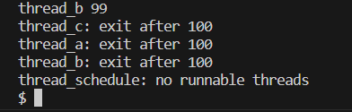
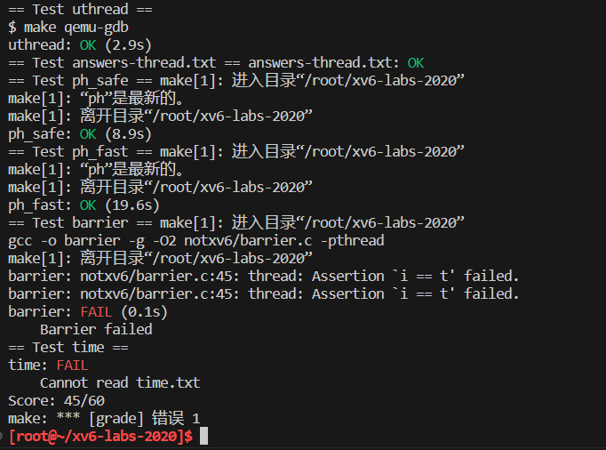
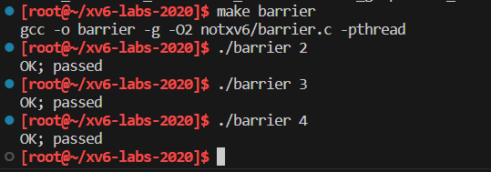
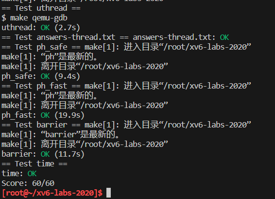

# Lab7 Multithreading
本实验分支：
```sh
$ git fetch
$ git checkout thread
$ make clean
```
## Task1 Uthread: switching between threads 
在本练习中，您将为用户级线程系统设计上下文切换机制，然后实现它。为了让您开始，您的xv6有两个文件：***user/uthread.c***和***user/uthread_switch.S***，以及一个规则：运行在***Makefile***中以构建```uthread```程序。***uthread.c***包含大多数用户级线程包，以及三个简单测试线程的代码。线程包缺少一些用于创建线程和在线程之间切换的代码。

<span style="background-color:green;">您的工作是提出一个创建线程和保存/恢复寄存器以在线程之间切换的计划，并实现该计划。完成后，```make grade```应该表明您的解决方案通过了```uthread```测试。</span>

完成后，在xv6上运行```uthread```时应该会看到以下输出（三个线程可能以不同的顺序启动）：
```sh
$ make qemu
...
$ uthread
thread_a started
thread_b started
thread_c started
thread_c 0
thread_a 0
thread_b 0
thread_c 1
thread_a 1
thread_b 1
...
thread_c 99
thread_a 99
thread_b 99
thread_c: exit after 100
thread_a: exit after 100
thread_b: exit after 100
thread_schedule: no runnable threads
$
```
该输出来自三个测试线程，每个线程都有一个循环，该循环打印一行，然后将CPU让出给其他线程。

然而在此时还没有上下文切换的代码，您将看不到任何输出。

您需要将代码添加到***user/uthread.c***中的```thread_create()```和```thread_schedule()```，以及***user/uthread_switch.S***中的t```hread_switch```。一个目标是确保当```thread_schedule()```第一次运行给定线程时，该线程在自己的栈上执行传递给```thread_create()```的函数。另一个目标是确保```thread_switch```保存被切换线程的寄存器，恢复切换到线程的寄存器，并返回到后一个线程指令中最后停止的点。您必须决定保存/恢复寄存器的位置；修改struct thread以保存寄存器是一个很好的计划。您需要在```thread_schedule```中添加对```thread_switch```的调用；您可以将需要的任何参数传递给```thread_switch```，但目的是将线程从```t```切换到```next_thread```。

**提示：**
1. ```thread_switch```只需要保存/还原被调用方保存的寄存器（callee-save register，参见LEC5使用的文档《Calling Convention》）。为什么？
1. 您可以在***user/uthread.asm***中看到```uthread```的汇编代码，这对于调试可能很方便。
1. 这可能对于测试你的代码很有用，使用```riscv64-linux-gnu-gdb```的单步调试通过你的```thread_switch```，你可以按这种方法开始：
    ```sh
    (gdb) file user/_uthread
    Reading symbols from user/_uthread...
    (gdb) b uthread.c:60
    ```
    这将在uthread.c的第60行设置断点。断点可能会（也可能不会）在运行uthread之前触发。为什么会出现这种情况？

一旦您的xv6 shell运行，键入“```uthread```”，gdb将在第60行停止。现在您可以键入如下命令来检查```uthread```的状态：

```(gdb) p/x *next_thread```

使用“```x```”，您可以检查内存位置的内容：

```(gdb) x/x next_thread->stack```

您可以跳到```thread_switch ```的开头，如下：

```(gdb) b thread_switch```

```(gdb) c```

您可以使用以下方法单步执行汇编指令：

```(gdb) si```

gdb的在线文档在[这里](https://sourceware.org/gdb/current/onlinedocs/gdb/)。

**步骤**：
1. 仿照***swtch.S***, 实现***uthread_switch.S***, 实际上用户态上下文与内核态上下文都是一样的，所以直接复制粘贴即可。

1. 定义用户态上下文结构体```ucontext```并在```struct thread```中增加```ucontext```成员
    ```c
    // uthread.c
    struct ucontext {
      uint64 ra;  // return address register
      uint64 sp;  // stack pointer register

      // callee regs
      uint64 s0;
      uint64 s1;
      uint64 s2;
      uint64 s3;
      uint64 s4;
      uint64 s5;
      uint64 s6;
      uint64 s7;
      uint64 s8;
      uint64 s9;
      uint64 s10;
      uint64 s11;
    };

    struct thread {
      char       stack[STACK_SIZE]; /* the thread's stack */
      int        state;             /* FREE, RUNNING, RUNNABLE */
      struct ucontext context;      /*user space context*/
    };
    ```

1. 在```thread_create```中初始化```thread```结构体  ,确保当```thread_schedule()```第一次运行给定线程时，该线程在自己的栈上执行传递给```thread_create()```的函数
    ```c
    void 
    thread_create(void (*func)())
    {
      struct thread *t;

      for (t = all_thread; t < all_thread + MAX_THREAD; t++) {
        if (t->state == FREE) break;
      }
      t->state = RUNNABLE;
      // YOUR CODE HERE
      // prepare for the very first "return" of thread_create(), which is func.
      t->context.ra = (uint64)func;   
      t->context.sp = (uint64)t->stack + STACK_SIZE;
    }
    ```   
    
1. 确保```thread_switch```保存被切换线程的寄存器，恢复切换到线程的寄存器，并返回到后一个线程指令中最后停止的点。在```thread_schedule```中添加对```thread_switch```的调用:
    ```c
    if (current_thread != next_thread) {         /* switch threads?  */
      next_thread->state = RUNNING;
      t = current_thread;
      current_thread = next_thread;
      /* YOUR CODE HERE
        * Invoke thread_switch to switch from t to next_thread:
        * thread_switch(??, ??);
        */
      thread_switch((uint64)&t->context, (uint64)&current_thread->context);
    } else
      next_thread = 0;
    ```

**测试结果**：


## Task2 Using threads
在本作业中，您将探索使用哈希表的线程和锁的并行编程。您应该在具有多个内核的真实Linux或MacOS计算机（不是xv6，不是qemu）上执行此任务。最新的笔记本电脑都有多核处理器。

这个作业使用UNIX的```pthread```线程库。您可以使用```man pthreads```在手册页面上找到关于它的信息，您可以在web上查看，例如[这里](https://pubs.opengroup.org/onlinepubs/007908799/xsh/pthread_mutex_lock.html)、[这里](https://pubs.opengroup.org/onlinepubs/007908799/xsh/pthread_mutex_init.html)和[这里](https://pubs.opengroup.org/onlinepubs/007908799/xsh/pthread_create.html)。

文件***notxv6/ph.c***包含一个简单的哈希表，如果单个线程使用，该哈希表是正确的，但是多个线程使用时，该哈希表是不正确的。在您的xv6主目录（可能是```~/xv6-labs-2020```）中，键入以下内容：
```sh
$ make ph
$ ./ph 1
```

请注意，要构建```ph```，***Makefile***使用操作系统的gcc，而不是6.S081的工具。```ph```的参数指定在哈希表上执行```put```和```get```操作的线程数。运行一段时间后，```ph 1```将产生与以下类似的输出：

```sh
100000 puts, 3.991 seconds, 25056 puts/second
0: 0 keys missing
100000 gets, 3.981 seconds, 25118 gets/second
```
您看到的数字可能与此示例输出的数字相差两倍或更多，这取决于您计算机的速度、是否有多个核心以及是否正在忙于做其他事情。

```ph```运行两个基准程序。首先，它通过调用```put()```将许多键添加到哈希表中，并以每秒为单位打印puts的接收速率。之后它使用```get()```从哈希表中获取键。它打印由于puts而应该在哈希表中但丢失的键的数量（在本例中为0），并以每秒为单位打印gets的接收数量。

通过给```ph```一个大于1的参数，可以告诉它同时从多个线程使用其哈希表。试试```ph 2```：

```sh
$ ./ph 2
100000 puts, 1.885 seconds, 53044 puts/second
1: 16579 keys missing
0: 16579 keys missing
200000 gets, 4.322 seconds, 46274 gets/second
```
这个```ph 2```输出的第一行表明，当两个线程同时向哈希表添加条目时，它们达到每秒53044次插入的总速率。这大约是运行```ph 1```的单线程速度的两倍。这是一个优秀的“并行加速”，大约达到了人们希望的2倍（即两倍数量的核心每单位时间产出两倍的工作）。

然而，声明```16579 keys missing```的两行表示散列表中本应存在的大量键不存在。也就是说，puts应该将这些键添加到哈希表中，但出现了一些问题。请看一下***notxv6/ph.c***，特别是```put()```和i```nsert()```。

<span style="background-color:green;">为什么两个线程都丢失了键，而不是一个线程？确定可能导致键丢失的具有2个线程的事件序列。在***answers-thread.txt***中提交您的序列和简短解释。
  为了避免这种事件序列，请在***notxv6/ph.c***中的```put```和```get```中插入```lock```和```unlock```语句，以便在两个线程中丢失的键数始终为0。相关的pthread调用包括：</span>

  ```c
  pthread_mutex_t lock; // declare a lock
  pthread_mutex_init(&lock, NULL); // initialize the lock
  pthread_mutex_lock(&lock); // acquire lock
  pthread_mutex_unlock(&lock); // release lock
  ```
  <span style="background-color:green;">当```make grade```说您的代码通过```ph_safe```测试时，您就完成了，该测试需要两个线程的键缺失数为0。在此时，```ph_fast```测试失败是正常的。 </span>

不要忘记调用```pthread_mutex_init()```。首先用1个线程测试代码，然后用2个线程测试代码。您主要需要测试：程序运行是否正确呢（即，您是否消除了丢失的键？）？与单线程版本相比，双线程版本是否实现了并行加速（即单位时间内的工作量更多）？

在某些情况下，并发```put()```在哈希表中读取或写入的内存中没有重叠，因此不需要锁来相互保护。您能否更改***ph.c***以利用这种情况为某些```put()```获得并行加速？**提示：**每个哈希桶加一个锁怎么样？

<span style="background-color:green;">修改代码，使某些```put```操作在保持正确性的同时并行运行。当```make grade```说你的代码通过了```ph_safe```和```ph_fast```测试时，你就完成了。```ph_fast```测试要求两个线程每秒产生的put数至少是一个线程的1.25倍。</span>

**步骤：**
1. 数据会丢失的原因：

    Q1: Why are there missing keys with 2 threads, but not with 1 thread? Identify a sequence of events with 2 threads that can lead to a key being missing. 

    A1: If ```key%NBUCKET``` has the same value in thread1 and thread2, there's a chance that they call ```insert()``` to insert value to the same bucket at the same time. So the first-inseted-data could be overwritten if its thread haven't returned yet. 

1. 为每个哈希桶定义一把锁
    ```c
    #define NBUCKET 5
    #define NKEYS 100000

    pthread_mutex_t lock[NBUCKET] = { PTHREAD_MUTEX_INITIALIZER };  // spinlock for each bucket
    ```

1. 放防止两个线程同时对```table[i]```写入数据，在```put```函数中对```insert()```操作上锁：
    ```c
    static 
    void put(int key, int value)
    {
      int i = key % NBUCKET;

      // is the key already present?
      struct entry *e = 0;
      for (e = table[i]; e != 0; e = e->next) {
        if (e->key == key)
          break;
      }
      if(e){
        // update the existing key.
        e->value = value;
      } else {
        // the new is new.
        pthread_mutex_lock(&lock[i]);
        insert(key, value, &table[i], table[i]);
        pthread_mutex_unlock(&lock[i]);
      }
    }
    ```

**make grade测试：**


## Task3 Barrier
在本作业中，您将实现一个[屏障（Barrier）](http://en.wikipedia.org/wiki/Barrier_(computer_science))：应用程序中的一个点，所有参与的线程在此点上必须等待，直到所有其他参与线程也达到该点。您将使用pthread条件变量，这是一种序列协调技术，类似于xv6的```sleep```和```wakeup```。

您应该在真正的计算机（不是xv6，不是qemu）上完成此任务。

文件***notxv6/barrier.c***包含一个残缺的屏障实现。

```sh
$ make barrier
$ ./barrier 2
barrier: notxv6/barrier.c:42: thread: Assertion `i == t' failed.
```
2指定在屏障上同步的线程数（***barrier.c***中的```nthread```）。每个线程执行一个循环。在每次循环迭代中，线程都会调用```barrier()```，然后以随机微秒数休眠。如果一个线程在另一个线程到达屏障之前离开屏障将触发断言（assert）。期望的行为是每个线程在```barrier()```中阻塞，直到```nthreads```的所有线程都调用了```barrier()```。

<span style="background-color:green;">您的目标是实现期望的屏障行为。除了在**ph**作业中看到的lock原语外，还需要以下新的pthread原语；详情请看[这里](https://pubs.opengroup.org/onlinepubs/007908799/xsh/pthread_cond_wait.html)和[这里](https://pubs.opengroup.org/onlinepubs/007908799/xsh/pthread_cond_broadcast.html)。</span>
  ```
  // 在cond上进入睡眠，释放锁mutex，在醒来时重新获取
  pthread_cond_wait(&cond, &mutex);
  // 唤醒睡在cond的所有线程
  pthread_cond_broadcast(&cond);
  ```
<span style="background-color:green;">确保您的方案通过```make grade```的```barrier```测试。</span>

```pthread_cond_wait```在调用时释放```mutex```，并在返回前重新获取```mutex```。

我们已经为您提供了```barrier_init()```。您的工作是实现```barrier()```，这样panic就不会发生。我们为您定义了```struct barrier```；它的字段供您使用。

**有两个问题使您的任务变得复杂：**
* 你必须处理一系列的```barrier```调用，我们称每一连串的调用为一轮（round）。```bstate.round```记录当前轮数。每次当所有线程都到达屏障时，都应增加```bstate.round```。
* 您必须处理这样的情况：一个线程在其他线程退出```barrier```之前进入了下一轮循环。特别是，您在前后两轮中重复使用```bstate.nthread```变量。确保在前一轮仍在使用```bstate.nthread```时，离开```barrier```并循环运行的线程不会增加```bstate.nthread```。

使用一个、两个和两个以上的线程测试代码。

**步骤：**
1. 写个条件语句，分别使用题干中的 ```pthread_cond_wait``` 和 ```pthread_cond_broadcast```处理这两种情况。 然后用互斥锁保护一下这个函数的操作。
```c
static void 
barrier()
{
  // YOUR CODE HERE
  //
  // Block until all threads have called barrier() and
  // then increment bstate.round.
  //

  pthread_mutex_lock(&bstate.barrier_mutex);  // acqr lock

  bstate.nthread++;  // this thread has arrived the barrier

  // 所有线程到达屏障时增加计数
  if(bstate.nthread == nthread) {
    bstate.round ++;
    bstate.nthread = 0;  // 重置到达屏障的线程数
    pthread_cond_broadcast(&bstate.barrier_cond);  //  Wake up all threads waiting for barrier_cond.
  }
  else {
    // wait for other threads
    pthread_cond_wait(&bstate.barrier_cond, &bstate.barrier_mutex);   // 在barrier_cond上进入睡眠，释放mutex锁，在醒来时重新获取
  }

  pthread_mutex_unlock(&bstate.barrier_mutex);  // release lock  
}
```

**barrier 测试结果：**


**make grade测试结果：**
