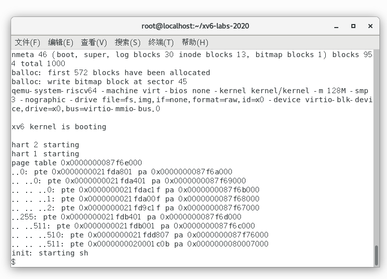
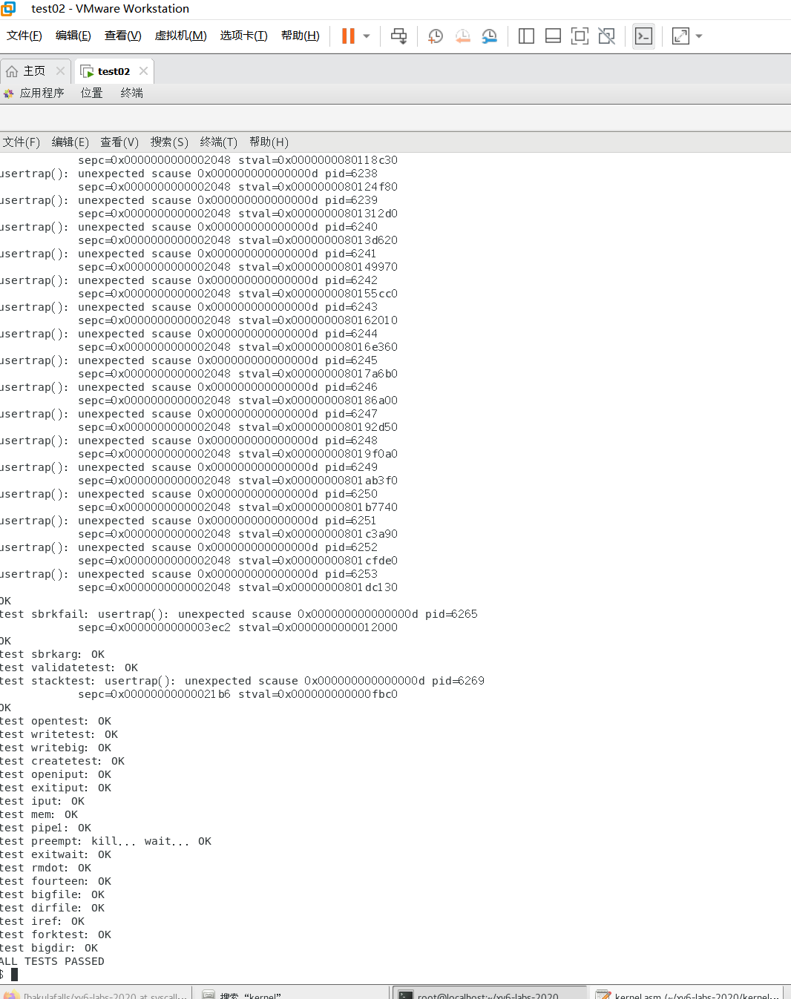
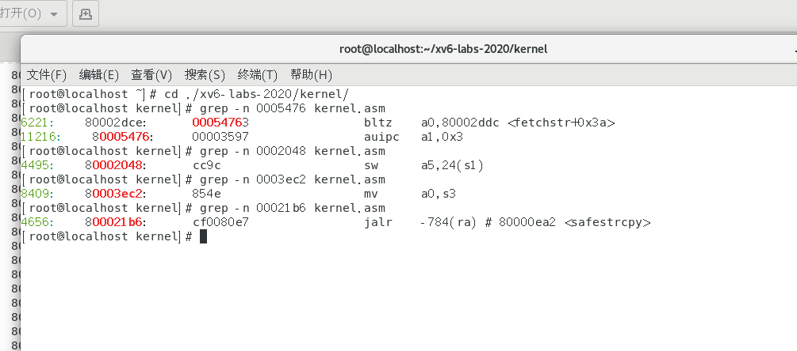
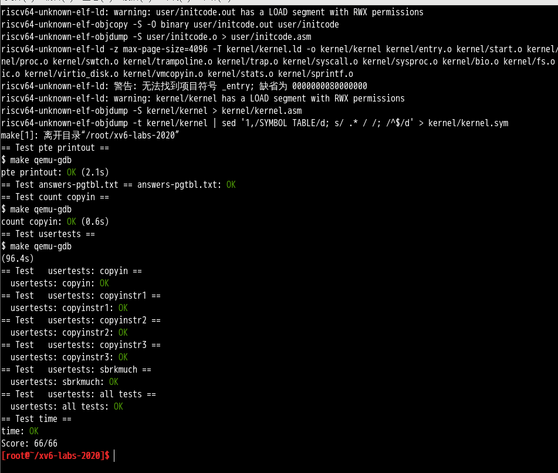

# Lab3: page tables
前置知识：
* ***kernel/memlayout.h***，它捕获了内存的布局。
* ***kernel/vm.c***，其中包含大多数虚拟内存（VM）代码。
* ***kernel/kalloc.c***，它包含分配和释放物理内存的代码。
实验分支：
```sh
$ git fetch
$ git checkout pgtbl
$ make clean
```

## Task1 Print a page table 
<span style="background-color:green;">定义一个名为```vmprint()```的函数。它应当接收一个```pagetable_t```作为参数，并以下面描述的格式打印该页表。在***exec.c***中的```return argc```之前插入```if(p->pid==1) vmprint(p->pagetable)```，以打印第一个进程的页表。如果你通过了```pte printout```测试的```make grade```，你将获得此作业的满分。</span>
启动xv6时，它应该像这样打印输出来描述第一个进程刚刚完成```exec()``` ing ```init```时的页表：
```sh
page table 0x0000000087f6e000
..0: pte 0x0000000021fda801 pa 0x0000000087f6a000
.. ..0: pte 0x0000000021fda401 pa 0x0000000087f69000
.. .. ..0: pte 0x0000000021fdac1f pa 0x0000000087f6b000
.. .. ..1: pte 0x0000000021fda00f pa 0x0000000087f68000
.. .. ..2: pte 0x0000000021fd9c1f pa 0x0000000087f67000
..255: pte 0x0000000021fdb401 pa 0x0000000087f6d000
.. ..511: pte 0x0000000021fdb001 pa 0x0000000087f6c000
.. .. ..510: pte 0x0000000021fdd807 pa 0x0000000087f76000
.. .. ..511: pte 0x0000000020001c0b pa 0x0000000080007000
```
第一行显示```vmprint```的参数。之后的每行对应一个PTE，包含树中指向页表页的PTE。每个PTE行都有一些“```..```”的缩进表明它在树中的深度。每个PTE行显示其在页表页中的PTE索引、PTE比特位以及从PTE提取的物理地址。不要打印无效的PTE。在上面的示例中，顶级页表页具有条目0和255的映射。条目0的下一级只映射了索引0，该索引0的下一级映射了条目0、1和2。

**提示：**
* 你可以将```vmprint()```放在***kernel/vm.c***中
* 使用定义在***kernel/riscv.h***末尾处的宏
* 函数```freewalk```可能会对你有所启发
```c
// part  of  vm.c
// Recursively free page-table pages.
// All leaf mappings must already have been removed.
void
freewalk(pagetable_t pagetable)
{
  // there are 2^9 = 512 PTEs in a page table.
  for(int i = 0; i < 512; i++){
    pte_t pte = pagetable[i];
    if((pte & PTE_V) && (pte & (PTE_R|PTE_W|PTE_X)) == 0){   // 有效的页表项并且不在最后一层
      // this PTE points to a lower-level page table.
      uint64 child = PTE2PA(pte);
      freewalk((pagetable_t)child);   // 递归
      pagetable[i] = 0;
    } else if(pte & PTE_V){
      panic("freewalk: leaf");
    }
  }
  kfree((void*)pagetable);
}

```
* 将```vmprint```的原型定义在***kernel/defs.h***中，这样你就可以在**exec.c**中调用它了
* 在你的```printf```调用中使用```%p```来打印像上面示例中的完成的64比特的十六进制PTE和地址

用递归实现```vmprint```，通过参数level控制打印的“```..```”数量：
```c
/**
 *@brief 打印页表 
 *@param pagetable 所要打印的页表
 *@param level 当前页表所在层级
*/
void
_vmprint(pagetable_t pagetable, int level)
{
  // there are 2^9 = 512 PTEs in a page table.
  for(int i = 0; i < 512; i++){
    pte_t pte = pagetable[i];
    if(pte & PTE_V){   // 有效的页表项
      for (int j = 0; j < level; j++){  // level=1/2/3
        if (j) printf(" ");
        printf("..");
      }

      uint64 child = PTE2PA(pte);
      printf("%d: pte %p pa %p\n", i, pte, child);
      if ((pte & (PTE_R|PTE_W|PTE_X))  == 0)
      // 该PTE指向下一级页表
      {
        _vmprint((pagetable_t) child, level+1);   // 递归
      }
    } 
  }
}

void
vmprint(pagetable_t pagetable)
{
  printf("page table %p\n", pagetable);
  _vmprint(pagetable, 1);
}
```

然后根据提示在kernel/defs.h里添加声明：
```c
int             copyin(pagetable_t, char *, uint64, uint64);
int             copyinstr(pagetable_t, char *, uint64, uint64);
void            vmprint(pagetable_t);
```

根据提示，在***exec.c***中的```return argc```之前插入```if(p->pid==1) vmprint(p->pagetable);```
**测试结果：**

<span style="background-color:blue;">根据书中的 [图3-4](#fig3.4) 解释```vmprint```的输出。page 0包含什么？page 2中是什么？在用户模式下运行时，进程是否可以读取/写入page 1映射的内存？</span>

## Task2  A kernel page table per process (hard)
Xv6有一个单独的用于在内核中执行程序时的内核页表。内核页表直接映射（恒等映射）到物理地址，也就是说内核虚拟地址```x```映射到物理地址仍然是```x```。Xv6还为每个进程的用户地址空间提供了一个单独的页表，只包含该进程用户内存的映射，从虚拟地址0开始。因为内核页表不包含这些映射，所以用户地址在内核中无效。因此，当内核需要使用在系统调用中传递的用户指针（例如，传递给```write()```的缓冲区指针）时，内核必须首先将指针转换为物理地址。本节和下一节的目标是允许内核直接解引用用户指针。
<span style="background-color:green;">你的第一项工作是修改内核来让每一个进程在内核中执行时使用它自己的内核页表的副本。修改```struct proc```来为每一个进程维护一个内核页表，修改调度程序使得切换进程时也切换内核页表。对于这个步骤，每个进程的内核页表都应当与现有的的全局内核页表完全一致。如果你的```usertests```程序正确运行了，那么你就通过了这个实验。</span>

**提示：**
1. 在```struct proc```中为进程的内核页表增加一个字段
1. 为一个新进程生成一个内核页表的合理方案是实现一个修改版的```kvminit```，这个版本中应当创造一个新的页表而不是修改```kernel_pagetable```。你将会考虑在```allocproc```中调用这个函数
1. 确保每一个进程的内核页表都关于该进程的内核栈有一个映射。在未修改的XV6中，所有的内核栈都在```procinit```中设置。你将要把这个功能部分或全部的迁移到```allocproc```中
1. 修改```scheduler()```来加载进程的内核页表到核心的satp寄存器(参阅```kvminithart```来获取启发)。不要忘记在调用完```w_satp()```后调用```sfence_vma()```
1. 没有进程运行时```scheduler()```应当使用```kernel_pagetable```
1. 在```freeproc```中释放一个进程的内核页表
1. 你需要一种方法来释放页表，而不必释放叶子物理内存页面。
1. 调试页表时，也许```vmprint```能派上用场
1. 修改XV6本来的函数或新增函数都是允许的；你或许至少需要在***kernel/vm.c***和***kernel/proc.c***中这样做（但不要修改***kernel/vmcopyin.c***, ***kernel/stats.c***, ***user/usertests.c***, 和***user/stats.c***）
1. 页表映射丢失很可能导致内核遭遇页面错误。这将导致打印一段包含```sepc=0x00000000XXXXXXXX```的错误提示。你可以在***kernel/kernel.asm***通过查询```XXXXXXXX```来定位错误。

**步骤：**
1. 参照提示，在***kernel/proc.h***修改```struct proc```:
```c
// Per-process state
struct proc {
  struct spinlock lock;

  // p->lock must be held when using these:
  //...
  // these are private to the process, so p->lock need not be held.
  //...

  // add a kernel page for each process
  pagetable_t ex_kernel_pagetable;       // exclusive kernel pagetable
};
```

2. 按照提示，在***kernel/proc.c***中的```allocproc```添加如下调用：
```c
//...
 // An empty user page table.
  p->pagetable = proc_pagetable(p);
  if(p->pagetable == 0){
    freeproc(p);
    release(&p->lock);
    return 0;
  }

  // Init a kernel page table.
  p->ex_kernel_pagetable = proc_kernel_pagetable();
  if(p->ex_kernel_pagetable == 0){
    freeproc(p);
    release(&p->lock);
    return 0;
  }

  //...
```
参照[```kvminit```](#kvminit)来实现```proc_kernel_pagetable```,添加在***vm.c***中：
```c
// 添加一个辅助函数,功能和kvmmap一样
void
uvmmap(pagetable_t kpgtbl, uint64 va, uint64 pa, uint64 sz, int perm)
{
  if(mappages(kpgtbl, va, sz, pa, perm) != 0)
    panic("uvmmap");
}

// Make a direct-map page table for the kernel.
pagetable_t
proc_kernel_pagetable()
{
  pagetable_t kpgtbl;

  // An empty page table.  参照proc.c中的proc_pagetable()
  kpgtbl = uvmcreate();
  if(kpgtbl == 0)
    return 0;

  // uart registers
  uvmmap(kpgtbl, UART0, UART0, PGSIZE, PTE_R | PTE_W);  //  将UART0映射到内核的地址空间

  // virtio mmio disk interface
  uvmmap(kpgtbl, VIRTIO0, VIRTIO0, PGSIZE, PTE_R | PTE_W);

  uvmmap(kpgtbl, CLINT, CLINT, 0x10000, PTE_R | PTE_W);

  // PLIC
  uvmmap(kpgtbl, PLIC, PLIC, 0x400000, PTE_R | PTE_W);

  // map kernel text executable and read-only.
  uvmmap(kpgtbl, KERNBASE, KERNBASE, (uint64)etext-KERNBASE, PTE_R | PTE_X);

  // map kernel data and the physical RAM we'll make use of.
  uvmmap(kpgtbl, (uint64)etext, (uint64)etext, PHYSTOP-(uint64)etext, PTE_R | PTE_W);

  // map the trampoline for trap entry/exit to
  // the highest virtual address in the kernel.
  uvmmap(kpgtbl, TRAMPOLINE, (uint64)trampoline, PGSIZE, PTE_R | PTE_X);
  
  return kpgtbl;
}
```

3. 按照提示，把```procinit```中设置内核栈的部分迁移到```allocproc```中, 把```procinit```中下面代码剪切到```// Init a kernel page table.```部分的后面，把
```kvmmap(va, (uint64)pa, PGSIZE, PTE_R | PTE_W);```
改为
```uvmmap(p->kernel_pagetable, va, (uint64)pa, PGSIZE, PTE_R | PTE_W);```
```c
// Allocate a page for the process's kernel stack.
// Map it high in memory, followed by an invalid
// guard page.
char *pa = kalloc();
if(pa == 0)
  panic("kalloc");
uint64 va = KSTACK((int) (p - proc));
uvmmap(p->ex_kernel_pagetable, va, (uint64)pa, PGSIZE, PTE_R | PTE_W);  // modified
p->kstack = va;
```

4&5.  修改```scheduler()```来加载进程的内核页表到核心的satp寄存器,参考```kvminithart```代码如下：
```c
// part of kernel/vm.c
// Switch h/w page table register to the kernel's page table,
// and enable paging.
void
kvminithart()
{
  w_satp(MAKE_SATP(kernel_pagetable));   // 把原来的内核页表地址传给satp寄存器
  sfence_vma();
}
```
在其下面实现一个新方法用来把**进程的内核页表**传给satp寄存器：
```c
// Store process's kernel page table to SATP register
void
proc_kvminithart(pagetable_t kpt)
{
  w_satp(MAKE_SATP(kpt));   // 把原来的内核页表地址传给satp寄存器
  sfence_vma();
}
```
按照提示在```scheduler()```中调用它，并根据提示5，没有进程运行时切换回原来的内核页表：
```c
// part of  proc.c
// Per-CPU process scheduler.
// Each CPU calls scheduler() after setting itself up.
// Scheduler never returns.  It loops, doing:
//  - choose a process to run.
//  - swtch to start running that process.
//  - eventually that process transfers control
//    via swtch back to the scheduler.
void
scheduler(void)
{
  struct proc *p;
  struct cpu *c = mycpu();
  
  c->proc = 0;
  for(;;){
    // Avoid deadlock by ensuring that devices can interrupt.
    intr_on();
    
    int found = 0;
    for(p = proc; p < &proc[NPROC]; p++) {
      acquire(&p->lock);
      if(p->state == RUNNABLE) {
        // Switch to chosen process.  It is the process's job
        // to release its lock and then reacquire it
        // before jumping back to us.
        p->state = RUNNING;
        c->proc = p;

        // 在这里将进程的内核页表传给SATP寄存器
        proc_kvminithart(p->ex_kernel_pagetable);

        swtch(&c->context, &p->context);  // CPU 的控制权会从调度器转移到选定的进程 p

        // 没有进程运行时切换回原来的内核页表
        kvminithart();

        // Process is done running for now.
        // It should have changed its p->state before coming back.
        c->proc = 0;

        found = 1;
      }
      release(&p->lock);
    }
//...
  }
}
```
6. 在```freeproc```中释放一个进程的内核页表
```c
// part of proc.c:freeproc()
if(p->pagetable)
    proc_freepagetable(p->pagetable, p->sz);
// free the kernel stack in the RAM
uvmunmap(p->ex_kernel_pagetable, p->kstack, 1, 1);  // 解除内核栈映射并释放物理内存
p->kstack = 0;
if(p->ex_kernel_pagetable)
  proc_freekpt(p->ex_kernel_pagetable);   // 释放进程的内核页表
p->pagetable = 0;
//...
```  
在***vm.c***中实现```proc_freekpt()```,参照```freewalk```函数(同[Task1](#task1-print-a-page-table)) :
```c
void
proc_freekpt(pagetable_t kpt)
{
  // there are 2^9 = 512 PTEs in a page table.
  for(int i = 0; i < 512; i++){
    pte_t pte = kpt[i];
    if (pte & PTE_V) {  // 有效页表
      kpt[i] = 0;
      if ((pte & (PTE_R|PTE_W|PTE_X)) == 0) {
        // this PTE points to a lower-level page table.
        uint64 child = PTE2PA(pte);
        proc_freekpt((pagetable_t)child);  // 递归
      }    
    } 
  }
  kfree((void*)kpt);
}
```

7.  在***kernel/defs.h***添加必要定义
```c
// part of defs.h
// vm.c
void            kvminit(void);
pagetable_t     proc_kernel_pagetable(void);       // 用于内核页表的初始化
void            kvminithart(void);
void            proc_kvminithart(pagetable_t);  // 把进程的内核页表传给satp寄存器
void            proc_freekpt(pagetable_t);      // 释放进程的内核页表 
uint64          kvmpa(uint64);
void            kvmmap(uint64, uint64, uint64, int);
void            uvmmap(pagetable_t, uint64, uint64, uint64, int);  // copy from kvmmap
//...
```

8. 修改***vm.c***中的```kvmpa```,将原先的```kernel_pagetable```改成```myproc()->ex_kernel_pagetable```，使用进程的内核页表,并添加include。
```c
#include "spinlock.h" 
#include "proc.h"

// translate a kernel virtual address to
// a physical address. only needed for
// addresses on the stack.
// assumes va is page aligned.
uint64
kvmpa(uint64 va)
{
  uint64 off = va % PGSIZE;
  pte_t *pte;
  uint64 pa;
  
  //pte = walk(kernel_pagetable, va, 0);
  pte = walk(myproc()->ex_kernel_pagetable, va, 0);  //  使用进程的内核页表
  if(pte == 0)
    panic("kvmpa");
  if((*pte & PTE_V) == 0)
    panic("kvmpa");
  pa = PTE2PA(*pte);
  return pa+off;
}
```

**测试结果：**

通过测试并看到有一些页表映射丢失报错，具体为
```sh
sepc=0x0000000000005476
sepc=0x0000000000002048
sepc=0x0000000000003ec2
sepc=0x00000000000021b6
```
查看***kernel/kernel.asm***：

 ```80005476:	00003597          	auipc	a1,0x3```这一句位于```create```函数中,查看***sysfile.c***中的```create```函数：
```c
static struct inode*
create(char *path, short type, short major, short minor)
{
  struct inode *ip, *dp;
  char name[DIRSIZ];

  if((dp = nameiparent(path, name)) == 0)  // 80005476与这一句匹配
    return 0;

  ilock(dp);
  //...
```


## Task3 Simplify ```copyin/copyinstr``` (hard)
内核的```copyin```函数读取用户指针指向的内存。它通过将用户指针转换为内核可以直接解引用的物理地址来实现这一点。这个转换是通过在软件中遍历进程页表来执行的。在本部分的实验中，您的工作是将用户空间的映射添加到每个进程的内核页表（上一节中创建），以允许```copyin```（和相关的字符串函数```copyinstr```）直接解引用用户指针。

<span style="background-color:green;">将定义在***kernel/vm.c***中的```copyin```的主题内容替换为对```copyin_new```的调用（在k***ernel/vmcopyin.c***中定义）；对```copyinstr```和```copyinstr_new```执行相同的操作。为每个进程的内核页表添加用户地址映射，以便```copyin_new```和```copyinstr_new```工作。如果```usertests```正确运行并且所有make grade测试都通过，那么你就完成了此项作业。</span>

此方案依赖于用户的虚拟地址范围不与内核用于自身指令和数据的虚拟地址范围重叠。Xv6使用从零开始的虚拟地址作为用户地址空间，幸运的是内核的内存从更高的地址开始。然而，这个方案将用户进程的最大大小限制为小于内核的最低虚拟地址。内核启动后，在XV6中该地址是```0xC000000```，即PLIC寄存器的地址；请参见***kernel/vm.c***中的```kvminit()```、***kernel/memlayout.h***和文中的[图3-4](#fig3.4)。您需要修改xv6，以防止用户进程增长到超过PLIC的地址。

**提示：**
* 先用对```copyin_new```的调用替换```copyin()```，确保正常工作后再去修改```copyinstr```
* 在内核更改进程的用户映射的每一处，都以相同的方式更改进程的内核页表。包括```fork()```, ```exec()```, 和```sbrk()```.
* 不要忘记在```userinit```的内核页表中包含第一个进程的用户页表
* 用户地址的PTE在进程的内核页表中需要什么权限？(在内核模式下，无法访问设置了```PTE_U```的页面)
* 别忘了上面提到的PLIC限制

**步骤：**
1. 首先在***vm.c***中实现一个函数用于将用户进程空间映射到用户内核页表(需熟练掌握```walk```函数)：
```c
// end of vm.c
/**
 *@brief 用于将用户空间的映射添加到用户内核页表
 *@param pagetable 用户空间页表
 *@param kernelpt 内核空间页表
 *@param oldsz 旧的内存大小
 *@param newsz 新的内存大小
*/
void
uvm2kvmcopy(pagetable_t pagetable, pagetable_t kpagetable, uint64 oldsz, uint64 newsz)
{
  pte_t *pte, *kpte; 

  if (newsz >= PLIC) {  // 防止用户进程增长到超过PLIC的地址
    panic("uvm2kvmcopy: user process space is overwritten to kernel process space");
  }

  oldsz = PGROUNDUP(oldsz);  // 避免潜在的内存对齐问题
  uint64 va;

  for(va = oldsz; va < newsz; va += PGSIZE)
  {
    if ((pte = walk(pagetable, va, 0)) == 0) {  // 将va在用户空间页表对应的最后一级PTE地址传给pte
      panic("uvm2kvmcopy: pte invaild!");   // *pte & PTE_V == 0
    }
    if ((kpte = walk(kpagetable, va, 1)) == 0) { //  在用户内核页表创建新的页表项kpte用与存储va对应的PTE地址
      panic("uvm2kvmcopy: kpte alloc failed!");   // (pagetable = (pde_t*)kalloc()) == 0
    }
    *kpte = *pte;   // 页表指向相同的物理页
    *kpte &= ~PTE_U;  // 取消掉用户模式对kpt的访问权限
  }

  for(va = newsz; va < oldsz; va += PGSIZE) {
    if((kpte = walk(kpagetable, va, 1)) == 0)
      panic("uvm2kvmcopy: kpte should exist");
    *kpte &= ~PTE_V;
  }
}
```

2. 更改```fork()```, ```exec()```, 和```sbrk()```:
```c
//  kernel/exec.c
int
exec(char *path, char **argv)
{
  // ...
  sp = sz;
  stackbase = sp - PGSIZE;

  //  添加复制映射
  uvm2kvmcopy(pagetable, p->ex_kernel_pagetable, 0, sz);

  // Push argument strings, prepare rest of stack in ustack.
  for(argc = 0; argv[argc]; argc++) {
    //...
  }
}

//  kernel/proc.c
int
fork(void)
{
  //...
  np->state = RUNNABLE;

  // 添加复制映射
  uvm2kvmcopy(np->pagetable, np->ex_kernel_pagetable, 0,  np->sz);

  release(&np->lock);

  return pid;
}

// kernel/sysproc:sys_sbrk()跳转到kernel/proc.c:growproc()
int
growproc(int n)
{
  uint sz;
  struct proc *p = myproc();

  sz = p->sz;
  if(n > 0){
    if((sz = uvmalloc(p->pagetable, sz, sz + n)) == 0) {
      return -1;
    }
  } else if(n < 0){
    sz = uvmdealloc(p->pagetable, sz, sz + n);
  }
  //  添加复制映射 
  uvm2kvmcopy(p->pagetable, p->ex_kernel_pagetable,p->sz, sz);
  p->sz = sz;
  return 0;
}
```

3. 替换掉```copyin()```和```copyinstr()```:
```c
// part of vm.c
// Copy from user to kernel.
// Copy len bytes to dst from virtual address srcva in a given page table.
// Return 0 on success, -1 on error.
int
copyin(pagetable_t pagetable, char *dst, uint64 srcva, uint64 len)
{
  /*uint64 n, va0, pa0;

  while(len > 0){
    va0 = PGROUNDDOWN(srcva);
    pa0 = walkaddr(pagetable, va0);
    if(pa0 == 0)
      return -1;
    n = PGSIZE - (srcva - va0);
    if(n > len)
      n = len;
    memmove(dst, (void *)(pa0 + (srcva - va0)), n);

    len -= n;
    dst += n;
    srcva = va0 + PGSIZE;
  }
  return 0;*/
  return copyin_new(pagetable, dst, srcva, len);
}

int
copyinstr(pagetable_t pagetable, char *dst, uint64 srcva, uint64 max)
{
  /*uint64 n, va0, pa0;
  int got_null = 0;

  while(got_null == 0 && max > 0){
    va0 = PGROUNDDOWN(srcva);
    pa0 = walkaddr(pagetable, va0);
    if(pa0 == 0)
      return -1;
    n = PGSIZE - (srcva - va0);
    if(n > max)
      n = max;

    char *p = (char *) (pa0 + (srcva - va0));
    while(n > 0){
      if(*p == '\0'){
        *dst = '\0';
        got_null = 1;
        break;
      } else {
        *dst = *p;
      }
      --n;
      --max;
      p++;
      dst++;
    }

    srcva = va0 + PGSIZE;
  }
  if(got_null){
    return 0;
  } else {
    return -1;
  }*/
  return copyinstr_new(pagetable, dst, srcva, max);
}
```

4. 添加必要的定义：
```c
// defs.h
// vm.c
void uvm2kvmcopy(pagetable_t, pagetable_t, uint64, uint64);

// vmcopyin.c
int             copyin_new(pagetable_t, char *, uint64, uint64);
int             copyinstr_new(pagetable_t, char *, uint64, uint64);
```

**测试结果：**
测试时发现bug导致xv6无法启动
```sh
hart 2 starting
hart 1 starting
scause 0x000000000000000d
sepc=0x000000008000668c stval=0x0000000000000024
panic: kerneltrap
QEMU: Terminated
```
解决方法：
在***proc.c***:```userinit()```函数中也添加对```uvm2kvmcopy```的调用
```c
// Set up first user process.
void
userinit(void)
{
  //...
  p->state = RUNNABLE;

  
  // 将用户进程地址映射至用户内核页表中
   setupuvm2kvm(p->pagetable, p->ex_kernel_pagetable, 0, p->sz);

  release(&p->lock);
}
```
可以正常启动，开始测试, 在项目目录下运行```make grade```
