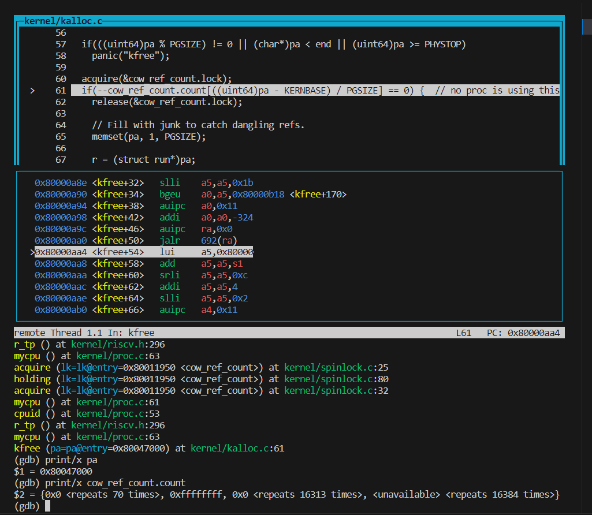
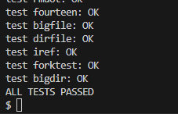

# Lab6 Copy-on-Write Fork for xv6
**这个实验涉及到锁，因此建议学完Lec10再做。**
虚拟内存提供了一定程度的间接寻址：内核可以通过将PTE标记为无效或只读来拦截内存引用，从而导致页面错误，还可以通过修改PTE来更改地址的含义。在计算机系统中有一种说法，任何系统问题都可以用某种程度的抽象方法来解决。Lazy allocation实验中提供了一个例子。这个实验探索了另一个例子：写时复制分支（copy-on write fork）。
本实验分支：
```sh
$ git fetch
$ git checkout cow
$ make clean
```

**The problem**
The ```fork()``` system call in xv6 copies all of the parent process's user-space memory into the child. If the parent is large, copying can take a long time. Worse, the work is often largely wasted; for example, a ```fork()``` followed by ```exec()``` in the child will cause the child to discard the copied memory, probably without ever using most of it. On the other hand, if both parent and child use a page, and one or both writes it, a copy is truly needed.

**The solution**
The goal of copy-on-write (COW) fork() is to defer allocating and copying physical memory pages for the child until the copies are actually needed, if ever.
COW fork() creates just a pagetable for the child, with PTEs for user memory pointing to the parent's physical pages. COW fork() marks all the user PTEs in both parent and child as not writable. When either process tries to write one of these COW pages, the CPU will force a page fault. The kernel page-fault handler detects this case, allocates a page of physical memory for the faulting process, copies the original page into the new page, and modifies the relevant PTE in the faulting process to refer to the new page, this time with the PTE marked writeable. When the page fault handler returns, the user process will be able to write its copy of the page.

COW fork() makes freeing of the physical pages that implement user memory a little trickier. A given physical page may be referred to by multiple processes' page tables, and should be freed only when the last reference disappears.

## Task Implement copy-on write (hard)
<span style="background-color:green;">您的任务是在xv6内核中实现copy-on-write fork。如果修改后的内核同时成功执行```cowtest```和```usertests```程序就完成了。</span>
为了帮助测试你的实现方案，我们提供了一个名为```cowtest```的xv6程序（源代码位于***user/cowtest.c***）。```cowtest```运行各种测试，但在未修改的xv6上，即使是第一个测试也会失败。因此，最初您将看到：
```sh
$ cowtest
simple: fork() failed
$
```
“simple”测试分配超过一半的可用物理内存，然后执行一系列的```fork()```。```fork```失败的原因是没有足够的可用物理内存来为子进程提供父进程内存的完整副本。

完成本实验后，内核应该通过```cowtest```和```usertests```中的所有测试。即：
```sh
$ cowtest
simple: ok
simple: ok
three: zombie!
ok
three: zombie!
ok
three: zombie!
ok
file: ok
ALL COW TESTS PASSED
$ usertests
...
ALL TESTS PASSED
$
```
**这是一个合理的攻克计划：**
1. 修改```uvmcopy()```将父进程的物理页映射到子进程，而不是分配新页。在子进程和父进程的PTE中清除```PTE_W```标志。
1. 修改```usertrap()```以识别页面错误。当COW页面出现页面错误时，使用```kalloc()```分配一个新页面，并将旧页面复制到新页面，然后将新页面添加到PTE中并设置```PTE_W```。
1. 确保每个物理页在最后一个PTE对它的引用撤销时被释放——而不是在此之前。这样做的一个好方法是为每个物理页保留引用该页面的用户页表数的“引用计数”。当```kalloc()```分配页时，将页的引用计数设置为1。当```fork```导致子进程共享页面时，增加页的引用计数；每当任何进程从其页表中删除页面时，减少页的引用计数。```kfree()```只应在引用计数为零时将页面放回空闲列表。可以将这些计数保存在一个固定大小的整型数组中。你必须制定一个如何索引数组以及如何选择数组大小的方案。例如，您可以用页的物理地址除以4096对数组进行索引，并为数组提供等同于***kalloc.c***中```kinit()```在空闲列表中放置的所有页面的最高物理地址的元素数。
1. 修改```copyout()```在遇到COW页面时使用与页面错误相同的方案。

**提示：**
1. lazy page allocation实验可能已经让您熟悉了许多与copy-on-write相关的xv6内核代码。但是，您不应该将这个实验室建立在您的lazy allocation解决方案的基础上；相反，请按照上面的说明从一个新的xv6开始。
1. 有一种可能很有用的方法来记录每个PTE是否是COW映射。您可以使用RISC-V PTE中的RSW（reserved for software，即为软件保留的）位来实现此目的。
1. ```usertests```检查```cowtest```不测试的场景，所以别忘两个测试都需要完全通过。
1. ***kernel/riscv.h***的末尾有一些有用的宏和页表标志位的定义。
1. 如果出现COW页面错误并且没有可用内存，则应终止进程。

**步骤：**
1. 在***kernel/riscv.h***中使用PTE中的RSW，新增一个flag来标记一个页面是否为COW fork页面
    ```c
    #define PTE_F (1L << 8) // 1 -> COW fork page, 8,9,10 was Reserved for supervisor software
    ```
1. 修改```uvmcopy()```，不为子进程分配新页，而是将父进程的PA映射到其中，同时禁用```PTE_W```，标记为```PTE_F```
    ```c
    // vm.c
    int
    uvmcopy(pagetable_t old, pagetable_t new, uint64 sz)
    {
      pte_t *pte;
      uint64 pa, i;
      uint flags;
      // char *mem;

      for(i = 0; i < sz; i += PGSIZE){
        if((pte = walk(old, i, 0)) == 0)
          panic("uvmcopy: pte should exist");
        if((*pte & PTE_V) == 0)
          panic("uvmcopy: page not present");
        pa = PTE2PA(*pte);
        flags = PTE_FLAGS(*pte);

        // 将可写页面标记COW fork page
        if(flags & PTE_W) {
          flags = (flags | PTE_F) & ~PTE_W;  // 在父子进程中清除可写标志
          *pte = PA2PTE(pa) | flags;
        }

        // if((mem = kalloc()) == 0)
        //   goto err;
        // memmove(mem, (char*)pa, PGSIZE);
        if(mappages(new, i, PGSIZE, pa, flags) != 0){  // map parent's pa to child's va
          // kfree(mem);
          goto err;
        }
      }
      return 0;

    err:
    //   uvmunmap(new, 0, i / PGSIZE, 1);
      return -1;
    }
    ```

1. 修改```usertrap()```以识别页面错误。当COW页面出现页面错误时，使用```kalloc()```分配一个新页面，并将旧页面复制到新页面，然后将新页面添加到PTE中并设置```PTE_W```。
    ```c
    // trap.c
    void
    usertrap(void)
    {
      //...
      uint64 cause = r_scause();
      if(cause == 8){
        //...
      } else if((which_dev = devintr()) != 0){
        // ok
      } 
      else if(cause == 13 || cause == 15) {  // page fault
        uint64 va = r_stval();  // where the page fault is
        if(va >= p->sz)
          p->killed = 1;
        // if (va对应PTE的PTE_F被设置)
          // char *pa = kalloc(); 给va分配新的页面
          // memmove(pa, (char*)walkaddr(p->pageteble, va)); 将对应的pa copy 到新page
          // 用mappages将pa映射到va上
      }
      else {
        //...
      }
    //...
    }
    ```
    为了实现上述方法，在***vm.c***中新增2个函数:  ```iscowpage```用来判断是否为COW fork va，```cowalloc```用来执行后续操作（分配、复制、修改标志位、映射等）：
    ```c
    /**
     * @brief check if va is on cow page
    * @return 0 yes
    * @return -1 no
    */
    int
    iscowpage(pagetable_t pagetable, uint64 va)
    {
      if(va >= MAXVA)
        return -1;
      pte_t* pte = walk(pagetable, va, 0);
      if(pte == 0)
        return -1;
      if((*pte & PTE_V) == 0)
        return -1;
      return (*pte & PTE_F ? 0 : -1);
    }


    /**
    * @brief COW fork allocator
    * @param mem new physical page for child process
    * @param pa parent's physical page
    * @return 0 => alloc failed
    * @return the physical address va eventually mapped to
    */
    void*
    cowalloc(pagetable_t pagetable, uint64 va)
    {
      if(va % PGSIZE != 0)
        return 0;
      pte_t* pte = walk(pagetable, va, 0);  
      uint64 pa = walkaddr(pagetable, va);  // Get PA

      if(pa == 0)
        return 0;  // not mapped

      char* mem = kalloc();  // create a new physical apge
      if(mem == 0)
        return 0;  // OOM
      
      // Copy parent's physical page to Child's physical page mem
      memmove(mem, (char*)pa, PGSIZE);
      
      // clear PTE_V so that we can use mappages() to map again
      *pte &= ~PTE_V;  
      
      // Map va to mem, set PTE_W to 1, clear PTE_F
      if(mappages(pagetable, va, PGSIZE, (uint64)mem, (PTE_FLAGS(*pte) | PTE_W) & ~PTE_F) != 0) {
        kfree(mem);
        *pte |= PTE_V;  // Reset PTE_V incase cowalloc failed but we still need to use this PTE
        return 0;
      }
        
      return (void*)mem;
    }
    ```
    然后在***kernel/defs.h***中添加必要的定义，在```usertrap```中添加调用
    ```c
    // kernel/defs.h
    // vm.c
    //...
    void*           cowalloc(pagetable_t, uint64);
    ```
    ```c
    // kernel/trap.c
    else if(cause == 13 || cause == 15) {  // page fault
    uint64 va = r_stval();  // where the page fault is
    if(va >= p->sz)
      p->killed = 1;
    // alloc new page for COW fork va  
    if(iscowpage(p->pagetable, va) != 0 || cowalloc(p->pagetable, PGROUNDDOWN(va)) == 0)  
      p->killed = 1;
    }
    ```
1. 现在来处理“引用计数”的问题。
如果把引用计数放在proc结构体中，显然不行，因为涉及到多个进程。需要把引用计数放在**全局变量**中。
由于涉及到多进程（多CPU）对同一内存(引用计数所在的全局变量)进行访问、修改，因此我们需要用到**锁**来保护引用计数。
在***kalloc.c*** 中定义引用计数的全局变量和自旋锁,并在```kinit()```将其初始化。 按照提示用页的物理地址除以4096对数组进行索引，并为数组提供等同于***kalloc.c***中```kinit()```在空闲列表中放置的所有页面的最高物理地址（```PHYSTOP```）的元素数。

    ```c
    // kalloc.c
    struct {
      struct spinlock lock;
      int count[(PHYSTOP - KERNBASE) / PGSIZE];  // 引用计数，大小为RAM最大页数
    } cow_ref_count;

    void
    kinit()
    {
      initlock(&kmem.lock, "kmem");
      initlock(&cow_ref_count.lock, "cow_ref_count");
      freerange(end, (void*)PHYSTOP);
    }
    ```
1. ```kalloc()```分配页时，将页的引用计数设置为1。由于存在CPU并发，故对该操作上锁。 这里约定先获取```kmem```锁再获取```cow_ref_count```锁，避免deadly embrace。
    ```c
    // kalloc.c
    void *
    kalloc(void)
    {
      struct run *r;

      acquire(&kmem.lock);
      r = kmem.freelist;
      
      if(r) {
        kmem.freelist = r->next;
        acquire(&cow_ref_count.lock);
        cow_ref_count.count[((uint64)r - KERNBASE) / PGSIZE] = 1;  // set count to 1 when alloc a new page
        release(&cow_ref_count.lock);
      }
        
      release(&kmem.lock);

      if(r)
        memset((char*)r, 5, PGSIZE); // fill with junk
      return (void*)r;
    }
    ```
1. 进程用```kfree()```从其页表中删除页面时，减少页的引用计数。```kfree()```只应在引用计数为零时将页面放回空闲列表。
    ```c
    // kalloc.c
    void
    kfree(void *pa)
    {
      struct run *r;

      if(((uint64)pa % PGSIZE) != 0 || (char*)pa < end || (uint64)pa >= PHYSTOP)
        panic("kfree");

      acquire(&cow_ref_count.lock);
      if(--cow_ref_count.count[((uint64)pa - KERNBASE) / PGSIZE] == 0) {  // no proc is using this page
        release(&cow_ref_count.lock);

        // Fill with junk to catch dangling refs.
        memset(pa, 1, PGSIZE);

        r = (struct run*)pa;

        acquire(&kmem.lock);
        r->next = kmem.freelist;
        kmem.freelist = r;
        release(&kmem.lock);

      }
      else {  // can not free page since there are other procs using it
        release(&cow_ref_count.lock);
      }
    }
    ```
1. 当```fork```导致子进程共享页面时，增加页的引用计数， 在```uvmcopy```中增加计数。由于我们在***kalloc.c***中定义的```cow_ref_count```，在***kalloc.c***中添加一个辅助函数```kadd_cow_ref_count```来实现引用计数增加
    ```c
    // kalloc
    /**
     * @brief 使cow_ref_count.count加1，call from uvmcopy()
    * @param pa cow page’s address
    */
    void
    kadd_cow_ref_count(uint64 pa)
    {
      acquire(&cow_ref_count.lock);
      cow_ref_count.count[(pa - KERNBASE) / PGSIZE]++;
      release(&cow_ref_count.lock);
    }
    ```

    在***vm.c***的```uvmcopy()```中对其进行调用：

    ```c
    // vm.c
    int
    uvmcopy(pagetable_t old, pagetable_t new, uint64 sz)
    {
      //...
        // 将可写页面标记COW fork page
        if(flags & PTE_W) {
          flags = (flags | PTE_F) & ~PTE_W;  // 在父子进程中清除可写标志
          *pte = PA2PTE(pa) | flags;
        }

        if(mappages(new, i, PGSIZE, pa, flags) != 0){  // map parent's pa to child's va
          uvmunmap(new, 0, i / PGSIZE, 1);
          return -1;
        }
        // COW page 引用计数+1
          kadd_cow_ref_count(pa);
      }
      return 0;
    }
    ```
1. 现在我们设置好了引用计数，应当重新修改 ```cowalloc```。确保每个物理页在最后一个PTE对它的引用撤销时被释放——而不是在此之前。增加一个函数```get_cow_ref_count```用于获取当前引用计数。
    ```c
    //  end of kalloc.c
    /**
     * @brief 获取当前的cow 引用计数， call from cawalloc()
    * @param pa cow page’s address
    * @return 当前cow 引用计数 
    */
    int
    get_cow_ref_count(uint64 pa)
    {
      return cow_ref_count.count[(pa - KERNBASE) / PGSIZE];
    }
    ```
    ```c
    /**
    * @brief COW fork allocator
    * @param mem new physical page for child process
    * @param pa parent's physical page
    * @return 0 => alloc failed
    * @return the physical address va eventually mapped to
    */
    void*
    cowalloc(pagetable_t pagetable, uint64 va)
    {
      if(va % PGSIZE != 0)
        return 0;
      pte_t* pte = walk(pagetable, va, 0);  
      uint64 pa = walkaddr(pagetable, va);  // Get PA

      if(pa == 0)
        return 0;  // not mapped

      if(get_cow_ref_count(pa)  == 1) {  // only one proc maps to this pa, no need to copy 
        *pte |= PTE_W;
        *pte &= ~PTE_F;
        return (void*)pa;
      }
      else {  // multi-proc map to this pa, need to kalloc, memmove and mappages
          char* mem = kalloc();  // create a new physical apge
          if(mem == 0)
            return 0;  // OOM
          
          // Copy parent's physical page to Child's physical page mem
          memmove(mem, (char*)pa, PGSIZE);
          
          // clear PTE_V so that we can use mappages() to map again
          *pte &= ~PTE_V;  
          
          // Map va to mem, set PTE_W to 1, clear PTE_F
          if(mappages(pagetable, va, PGSIZE, (uint64)mem, (PTE_FLAGS(*pte) | PTE_W) & ~PTE_F) != 0) {
            kfree(mem);
            *pte |= PTE_V;  // Reset PTE_V incase cowalloc failed but we still need to use this PTE
            return 0;
          }

          kfree((char*)PGROUNDDOWN(pa));
          return (void*)mem;
      }
    }
    ```

1. 修改```copyout()```在遇到COW页面时使用与页面错误相同的方案(参照```usertrap()```)。
    ```c
    // vm.c
    int
    copyout(pagetable_t pagetable, uint64 dstva, char *src, uint64 len)
    {
      uint64 n, va0, pa0;

      while(len > 0){
        va0 = PGROUNDDOWN(dstva);
        pa0 = walkaddr(pagetable, va0);

      if(iscowpage(pagetable, va0) == 0) {  // alloc new page for COW fork va
        pa0 = (uint64)cowalloc(pagetable, va0);
      }  
    //...
      }
      return 0;
    }
    ```

**Debug过程 ：**
1. 添加必要引用使得编译成功后发现xv6无法正常启动，console显示出```xv6 kernel is booting```后卡住 。打开gdb，在```main()```函数中挨个设置断点，发现程序卡在```kinit()```被调用以后。进一步调试发现bug在```kfree()```中:

引用计数数组中的值没有被设置过，在这里会被减成负数。
**解决方法：** 在之前的```freerange()```函数中将引用计数数组初始化，该函数里已经有一个遍历结构了，并且该函数目前只在```kinit()```中 被调用
    ```c
    // kalloc.c
    void
    freerange(void *pa_start, void *pa_end)
    {
      char *p;
      p = (char*)PGROUNDUP((uint64)pa_start);
      for(; p + PGSIZE <= (char*)pa_end; p += PGSIZE) {
        cow_ref_count.count[((uint64)p - KERNBASE) / PGSIZE] = 1;  
        kfree(p);
      }   
    }
    ```
2. 重新编译后触发panic:
    ```sh
    panic: copyout:  alloc for COW fork failed
    ```
    好在之前设置了这个报错 ，查看出错代码发现是逻辑错误。```cowalloc```中检查到pte不是cow fork的pte时会返回0，这种情况在```copyout```中不应该被认为是错误，而应该直接跳过。

    **解决方法：** 在```cowalloc```中, 新增一个返回值```(void*)-1```表示不为cow fork page, 
    ```c
    /**
     * @brief COW fork allocator
     * @param mem new physical page for child process
     * @param pa parent's physical page
     * @return 0 => alloc failed
     * @return (void*)-1 => not a cow fork page
     * @return the physical address va eventually mapped to
    */
    void*
    cowalloc(pagetable_t pagetable, uint64 va)
    {
      pte_t* pte = walk(pagetable, va, 0);  
      if(pte == 0) 
        return 0;  // Invalid pte

      if((*pte & PTE_F) == 0)  // Check if the va is on COW fork page
        return (void*)-1;
      //...
    }
    ```

    然后修改```usertrap()```中的代码，判断条件增加：

    ```c
    // alloc new page for COW fork va  
    if(cowalloc(p->pagetable, va) == 0 || cowalloc(p->pagetable, va) == (void*)-1)  
      p->killed = 1;
    ```
**测试结果**：
