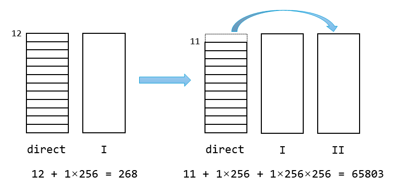
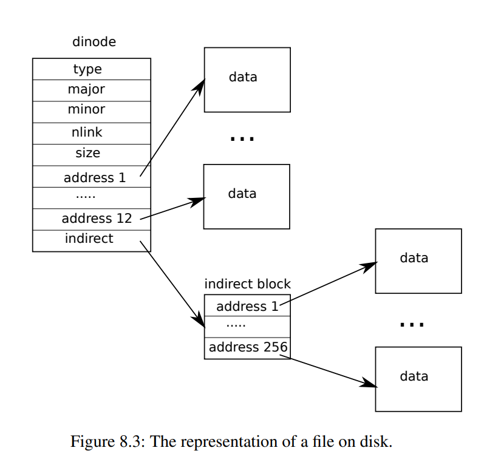
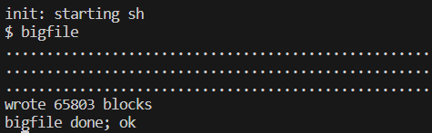
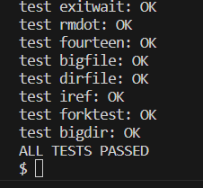
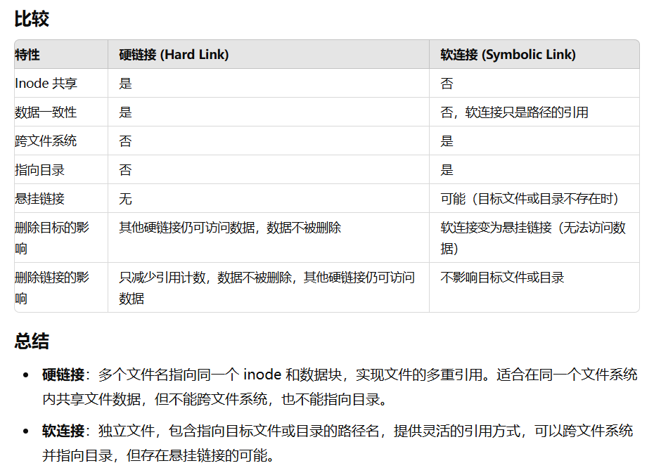
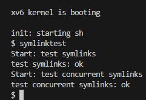
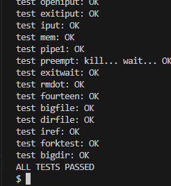

# Lab9 File system
本实验分支：
```sh
$ git fetch
$ git checkout fs
$ make clean
```

## Task1 Large files
在本作业中，您将增加xv6文件的最大大小。目前，xv6文件限制为268个块或```268*BSIZE```字节（在xv6中```BSIZE```为1024）。此限制来自以下事实：一个xv6 inode包含12个“直接”块号和一个“间接”块号，“一级间接”块指一个最多可容纳256个块号的块，总共12+256=268个块。

```bigfile```命令可以创建最长的文件，并报告其大小：
```sh
$ bigfile
..
wrote 268 blocks
bigfile: file is too small
$
```
测试失败，因为```bigfile```希望能够创建一个包含65803个块的文件，但未修改的xv6将文件限制为268个块。

您将更改xv6文件系统代码，以支持每个inode中可包含256个一级间接块地址的“二级间接”块，每个一级间接块最多可以包含256个数据块地址。结果将是一个文件将能够包含多达65803个块，或256*256+256+11个块（11而不是12，因为我们将为二级间接块牺牲一个直接块号）。

**预备**
```mkfs```程序创建xv6文件系统磁盘映像，并确定文件系统的总块数；此大小由***kernel/param.h***中的```FSSIZE```控制。您将看到，该实验室存储库中的```FSSIZE```设置为200000个块。您应该在```make```输出中看到来自```mkfs/mkfs```的以下输出：
```sh
nmeta 70 (boot, super, log blocks 30 inode blocks 13, bitmap blocks 25) blocks 199930 total 200000
```

这一行描述了```mkfs/mkfs```构建的文件系统：它有70个元数据块（用于描述文件系统的块）和199930个数据块，总计200000个块。

如果在实验期间的任何时候，您发现自己必须从头开始重建文件系统，您可以运行```make clean```，强制make重建fs.img。

**What to Look At**
磁盘索引节点的格式由***fs.h***中的```struct dinode```定义。您应当尤其对```NDIRECT```、```NINDIRECT```、```MAXFILE```和```struct dinode```的```addrs[]```元素感兴趣。查看《XV6手册》中的图8.3，了解标准xv6索引结点的示意图。

在磁盘上查找文件数据的代码位于***fs.c***的```bmap()```中。看看它，确保你明白它在做什么。在读取和写入文件时都会调用```bmap()```。写入时，```bmap()```会根据需要分配新块以保存文件内容，如果需要，还会分配间接块以保存块地址。

```bmap()```处理两种类型的块编号。```bn```参数是一个“逻辑块号”——文件中相对于文件开头的块号。```ip->addrs[]```中的块号和```bread()```的参数都是磁盘块号。您可以将```bmap()```视为将文件的逻辑块号映射到磁盘块号。

**Your job**
<span style="background-color:green;">修改```bmap()```，以便除了直接块和一级间接块之外，它还实现二级间接块。你只需要有11个直接块，而不是12个，为你的新的二级间接块腾出空间；不允许更改磁盘inode的大小。```ip->addrs[]```的前11个元素应该是直接块；第12个应该是一个一级间接块（与当前的一样）；13号应该是你的新二级间接块。当```bigfile```写入65803个块并成功运行```usertests```时，此练习完成：</span>
```sh
$ bigfile
..................................................................................................................................................................................................................................................................................................................................................................................................................................................................................................................................................................................................................................................................................
wrote 65803 blocks
done; ok
$ usertests
...
ALL TESTS PASSED
$
```
运行```bigfile```至少需要一分钟半的时间。

**提示**：
1. 确保您理解```bmap()```。写出```ip->addrs[]```、间接块、二级间接块和它所指向的一级间接块以及数据块之间的关系图。确保您理解为什么添加二级间接块会将最大文件大小增加256*256个块（实际上要-1，因为您必须将直接块的数量减少一个）。
1. 考虑如何使用逻辑块号索引二级间接块及其指向的间接块。
1. 如果更改```NDIRECT```的定义，则可能必须更改***file.h***文件中```struct inode```中```addrs[]```的声明。确保```struct inode```和```struct dinode```在其```addrs[]```数组中具有相同数量的元素。
1. 如果更改NDIRECT的定义，请确保创建一个新的```fs.img```，因为```mkfs```使用```NDIRECT```构建文件系统。
1. 如果您的文件系统进入坏状态，可能是由于崩溃，请删除```fs.img```（从Unix而不是xv6执行此操作）。```make```将为您构建一个新的干净文件系统映像。
1. 别忘了把你```bread()```的每一个块都```brelse()```。
1. 您应该仅根据需要分配间接块和二级间接块，就像原始的```bmap()```。
1. 确保```itrunc```释放文件的所有块，包括二级间接块。

**步骤**：

*本实验数据块指针的变化*

*xv6索引结点的示意图*
1. 修改***fs.h***中定义：
    ```c
    #define NDIRECT 11
    #define NINDIRECT (BSIZE / sizeof(uint))
    #define NININDIRCT (BSIZE / sizeof(uint)) * (BSIZE / sizeof(uint))  // 二级间接块能映射的数据块数量
    #define MAXFILE (NDIRECT + NINDIRECT + NININDIRCT)
    ```

1. 修改```struct inode```和```struct dinode```:
    ```c
    // fs.h
    // On-disk inode structure
    struct dinode {
      short type;           // File type
      short major;          // Major device number (T_DEVICE only)
      short minor;          // Minor device number (T_DEVICE only)
      short nlink;          // Number of links to inode in file system
      uint size;            // Size of file (bytes)
      uint addrs[NDIRECT+1+1];   // Data block addresses
    };
    ```
    ```c
    // file.h
    // in-memory copy of an inode
    struct inode {
      uint dev;           // Device number
      uint inum;          // Inode number
      int ref;            // Reference count
      struct sleeplock lock; // protects everything below here
      int valid;          // inode has been read from disk?

      short type;         // copy of disk inode
      short major;
      short minor;
      short nlink;
      uint size;
      uint addrs[NDIRECT+1+1];
    };
    ```

1. 修改```bmap```实现二级索引
    ```c
    // fs.c
    static uint
    bmap(struct inode *ip, uint bn)
    {
      //...

      if(bn < NDIRECT){
        //...
      }
      bn -= NDIRECT;

      if(bn < NINDIRECT){
        //...
      }
      bn -= NINDIRECT;

      if(bn < NININDIRCT) {
        // 加载一级间接块，必要时分配
        if((addr = ip->addrs[NDIRECT + 1]) == 0)
          ip->addrs[NDIRECT + 1] = addr = balloc(ip->dev);
        bp = bread(ip->dev, addr);
        a = (uint*)bp->data;  // 指向一级间接块的数据区域

        // 计算索引
        uint index1 = bn / NINDIRECT;  // 一级间接块中的索引
        uint index2 = bn % NINDIRECT;  // 二级间接块中的索引

        // 加载二级间接块，必要时分配
        if((addr = a[index1]) == 0){
          a[index1] = addr = balloc(ip->dev);
          log_write(bp);
        }
        brelse(bp);

        // 读取二级间接块
        bp = bread(ip->dev, addr);
        a = (uint*)bp->data;  // // 指向二级间接块的数据区域

        // 分配实际的数据块
        if((addr = a[index2]) == 0){
          a[index2] = addr = balloc(ip->dev);
          log_write(bp);
        }
        brelse(bp);
        return addr;
      }

      panic("bmap: out of range");
    }
    ```

1. 修改```itrunc```，确保其释放文件的所有块，包括二级间接块。
    ```c
    // fs.c
    // Truncate inode (discard contents).
    // Caller must hold ip->lock.
    void
    itrunc(struct inode *ip)
    {
      int i, j;
      struct buf *bp;
      struct buf *bp1;
      uint *a;
      uint *b;

      for(i = 0; i < NDIRECT; i++){
        if(ip->addrs[i]){
          bfree(ip->dev, ip->addrs[i]);
          ip->addrs[i] = 0;
        }
      }

      if(ip->addrs[NDIRECT]){
        bp = bread(ip->dev, ip->addrs[NDIRECT]);
        a = (uint*)bp->data;
        for(j = 0; j < NINDIRECT; j++){
          if(a[j])
            bfree(ip->dev, a[j]);
        }
        brelse(bp);
        bfree(ip->dev, ip->addrs[NDIRECT]);
        ip->addrs[NDIRECT] = 0;
      }

      if(ip->addrs[NDIRECT+1]) {
        bp = bread(ip->dev, ip->addrs[NDIRECT+1]);
        a = (uint*)bp->data;  // 指向一级间接块的数据区域
        for(i = 0; i < NINDIRECT; i++) {
          if(a[i]) {
            bp1 = bread(ip->dev, a[i]);
            b = (uint*)bp1->data;
            for(j = 0; j < NINDIRECT; j++) {
              if(b[j])
                bfree(ip->dev, b[j]);
            }
            brelse(bp1);
            bfree(ip->dev, a[i]);
        }
      }
      brelse(bp);
      bfree(ip->dev, ip->addrs[NDIRECT+1]);
      ip->addrs[NDIRECT+1] = 0;
      }
      
      ip->size = 0;
      iupdate(ip);
    }
    ```

**测试结果**：



## Task2 Symbolic links
在本练习中，您将向xv6添加符号链接。符号链接（或软链接）是指按路径名链接的文件；当一个符号链接打开时，内核跟随该链接指向引用的文件。符号链接类似于硬链接，但硬链接仅限于指向同一磁盘上的文件，而符号链接可以跨磁盘设备。尽管xv6不支持多个设备，但实现此系统调用是了解路径名查找工作原理的一个很好的练习。
**Your job**
<span style="background-color:green;">您将实现```symlink(char *target, char *path)```系统调用，该调用在引用由```target```命名的文件的路径处创建一个新的符号链接。有关更多信息，请参阅symlink手册页（注：执行```man symlink```）。要进行测试，请将```symlinktest```添加到***Makefile***并运行它。当测试产生以下输出（包括```usertests运行成功）时，您就完成本作业了。```
```sh
$ symlinktest
Start: test symlinks
test symlinks: ok
Start: test concurrent symlinks
test concurrent symlinks: ok
$ usertests
...
ALL TESTS PASSED
$ 
```

**提示**：
1. 首先，为```symlink```创建一个新的系统调用号，在***user/usys.pl***、***user/user.h***中添加一个条目，并在***kernel/sysfile.c***中实现一个空的```sys_symlink```。
1. 向***kernel/stat.h***添加新的文件类型（```T_SYMLINK```）以表示符号链接。
1. 在***kernel/fcntl.h***中添加一个新标志（```O_NOFOLLOW```），该标志可用于```open```系统调用。请注意，传递给```open```的标志使用按位或运算符组合，因此新标志不应与任何现有标志重叠。一旦将***user/symlinktest.c***添加到***Makefile***中，您就可以编译它。
1. 实现```symlink(target, path)```系统调用，以在```path```处创建一个新的指向```target```的符号链接。请注意，系统调用的成功不需要```target```已经存在。您需要选择存储符号链接目标路径的位置，例如在inode的数据块中。```symlink```应返回一个表示成功（0）或失败（-1）的整数，类似于```link```和```unlink```。
1. 修改```open```系统调用以处理路径指向符号链接的情况。如果文件不存在，则打开必须失败。当进程向```open```传递```O_NOFOLLOW```标志时，```open```应打开符号链接（而不是跟随符号链接）。
1. 如果链接文件也是符号链接，则必须递归地跟随它，直到到达非链接文件为止。如果链接形成循环，则必须返回错误代码。你可以通过以下方式估算存在循环：通过在链接深度达到某个阈值（例如10）时返回错误代码。
1. 其他系统调用（如```link```和```unlink```）不得跟随符号链接；这些系统调用对符号链接本身进行操作。
1. 您不必处理指向此实验的目录的符号链接。



**步骤**：
1. 新建系统调用```symlink```，修改***user/usys.pl***、***user/user.h***、***syscall.h***、***syscall.c***和***kernel/sysfile.c***
    ```c
    // end of user/usys.pl
    entry("symlink");

    // user.h
    // systemcalls
    // ...
    int symlink(const char*, const char*);

    // end of syscall.h
    #define SYS_symlink 22

    // syscall.c
    extern uint64 sys_symlink(void);

    static uint64 (*syscalls[])(void) = {
    //...
    [SYS_symlink] sys_symlink,
    };


    // end of sysfile.c
    uint64
    sys_symlink(void)
    {
      return 0;
    }
    ```
1. 修改***kernel/stat.h***，添加新文件类型
    ```c
    #define T_DIR     1   // Directory
    #define T_FILE    2   // File
    #define T_DEVICE  3   // Device
    #define T_SYMLINK 4   // Symbolic links
    ```
1. 修改***kernel/fcntl.h***，添加新标志
    ```c
    #define O_RDONLY  0x000
    #define O_WRONLY  0x001
    #define O_RDWR    0x002
    #define O_NOFOLLOW  0x008  // make sure that 0x008 hasn't been used
    #define O_CREATE  0x200
    #define O_TRUNC   0x400
    ```
    在***Makefile***中添加symlinktest

1. 在***sysfile.c***中实现```symlink(target, path)```系统调用。参照```sys_open```,调用```create```函数来分配并获取inode节点。用```writei```函数将数据写入inode
    ```c
    uint64
    sys_symlink(void)
    {
      char target[MAXPATH], path[MAXPATH];
      struct inode *ip;

      if(argstr(0, target, MAXPATH) < 0 || argstr(1, path, MAXPATH) < 0) {
        return -1;
      }

      begin_op();
      
      // alloc an inode 
      ip = create(path, T_SYMLINK, 0, 0);
      if(ip == 0) {  // alloc inode failed
        end_op();
        return -1;
      }

      // write target into ip
      if(writei(ip, 0, (uint64)target, 0, MAXPATH) != MAXPATH) {
        iunlockput(ip);
        end_op();
        return -1;
      }

      iunlockput(ip);
      end_op();

      return 0;
    }
    ```

1. 修改```sys_open```以处理路径指向符号链接的情况。按照提示6，设置链接深度阈值为10
```c
// sysfile.c
#define MAX_SYMLINK_DEPTH 10
//...
uint64
sys_open(void)
{
  //...

  if(ip->type == T_DEVICE && (ip->major < 0 || ip->major >= NDEV)){
    //...
  }

  // Symbolic link
  if(ip->type == T_SYMLINK && !(omode & O_NOFOLLOW)) {   // still point to a symbol link
    // recrusion until we find a real file
    for(int i = 0; i < MAX_SYMLINK_DEPTH; i++) {
      // ip = where the symbol link point to
      if(readi(ip, 0, (uint64)path, 0, MAXPATH) != MAXPATH) {
        iunlockput(ip);
        end_op();
        return -1;
      }
      iunlockput(ip);
      ip = namei(path);

      if(ip == 0) {
        end_op();
        return -1;
      }

      ilock(ip);
      if(ip->type != T_SYMLINK)  // found the real file
        break;
    }

    // Exceed the MAX_SYMLINK_PATH
    if(ip->type == T_SYMLINK) {
      iunlockput(ip);
      end_op();
      return -1;
    }
  }

  if((f = filealloc()) == 0 || (fd = fdalloc(f)) < 0){
    //...
  }
  //...
}
```

**测试结果：**

