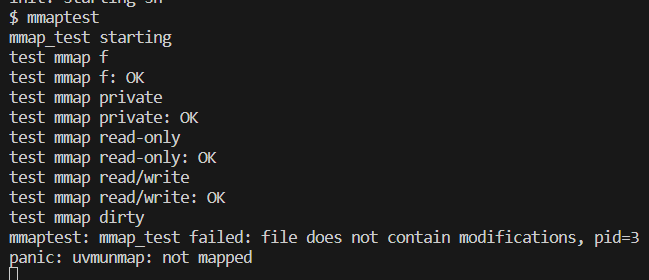
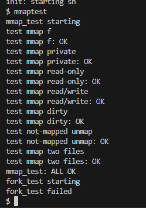
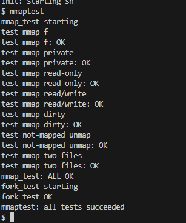
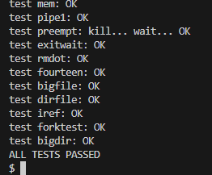

# Lab10 mmap
## Task mmap (hard)
本实验分支：
```sh
$ git fetch
$ git checkout mmap
$ make clean
```
```mmap```和```munmap```系统调用允许UNIX程序对其地址空间进行详细控制。它们可用于在进程之间共享内存，将文件映射到进程地址空间，并作为用户级页面错误方案的一部分，如本课程中讨论的垃圾收集算法。在本实验室中，您将把```mmap```和```munmap```添加到xv6中，重点关注内存映射文件（memory-mapped files）。
手册页面（运行```man 2 mmap```）显示了```mmap```的以下声明：
```sh
void *mmap(void *addr, size_t length, int prot, int flags,
           int fd, off_t offset);
```
可以通过多种方式调用```mmap```，但本实验只需要与内存映射文件相关的功能子集。您可以假设```addr```始终为零，这意味着内核应该决定映射文件的虚拟地址。```mmap```返回该地址，如果失败则返回```0xffffffffffffffff```。```length```是要映射的字节数；它可能与文件的长度不同。```prot```指示内存是否应映射为可读、可写，and/or可执行的；您可以认为```prot```是```PROT_READ```或```PROT_WRITE```或两者兼有。```flags```要么是```MAP_SHARED```（映射内存的修改应写回文件），要么是```MAP_PRIVATE```（映射内存的修改不应写回文件）。您不必在```flags```中实现任何其他位。```fd```是要映射的文件的打开文件描述符。可以假定```offset```为零（它是要映射的文件的起点）。

允许进程映射同一个```MAP_SHARED```文件而不共享物理页面。

```munmap(addr, length)```应删除指定地址范围内的```mmap```映射。如果进程修改了内存并将其映射为```MAP_SHARED```，则应首先将修改写入文件。```munmap```调用可能只覆盖```mmap```区域的一部分，但您可以认为它取消映射的位置要么在区域起始位置，要么在区域结束位置，要么就是整个区域(但不会在区域中间“打洞”)。

**Your job**
<span style="background-color:green;">您应该实现足够的```mmap```和```munmap```功能，以使```mmaptest```测试程序正常工作。如果```mmaptest```不会用到某个```mmap```的特性，则不需要实现该特性。</span>

**期望输出**：
```sh
$ mmaptest
mmap_test starting
test mmap f
test mmap f: OK
test mmap private
test mmap private: OK
test mmap read-only
test mmap read-only: OK
test mmap read/write
test mmap read/write: OK
test mmap dirty
test mmap dirty: OK
test not-mapped unmap
test not-mapped unmap: OK
test mmap two files
test mmap two files: OK
mmap_test: ALL OK
fork_test starting
fork_test OK
mmaptest: all tests succeeded
$ usertests
usertests starting
...
ALL TESTS PASSED
$
```

**提示**：
1. 首先，向```UPROGS```添加```_mmaptest```，以及```mmap```和```munmap```系统调用，以便让***user/mmaptest.c***进行编译。现在，只需从```mmap```和```munmap```返回错误。我们在***kernel/fcntl.h***中为您定义了```PROT_READ```等。运行```mmaptest```，它将在第一次```mmap```调用时失败。
1. 惰性地填写页表，以响应页错误。也就是说，```mmap```不应该分配物理内存或读取文件。相反，在```usertrap```中（或由```usertrap```调用）的页面错误处理代码中执行此操作，就像在lazy page allocation实验中一样。惰性分配的原因是确保大文件的```mmap```是快速的，并且比物理内存大的文件的```mmap```是可能的。
1. 跟踪```mmap```为每个进程映射的内容。定义与第15课中描述的VMA（虚拟内存区域）对应的结构体，记录```mmap```创建的虚拟内存范围的地址、长度、权限、文件等。由于xv6内核中没有内存分配器，因此可以声明一个固定大小的VMA数组，并根据需要从该数组进行分配。大小为16应该就足够了。
1. 实现```mmap```：在进程的地址空间中找到一个未使用的区域来映射文件，并将VMA添加到进程的映射区域表中。VMA应该包含指向映射文件对应```struct file```的指针；```mmap```应该增加文件的引用计数，以便在文件关闭时结构体不会消失（提示：请参阅```filedup```）。运行```mmaptest```：第一次```mmap```应该成功，但是第一次访问被```mmap```的内存将导致页面错误并终止```mmaptest```。
1. 添加代码以导致在```mmap```的区域中产生页面错误，从而分配一页物理内存，将4096字节的相关文件读入该页面，并将其映射到用户地址空间。使用```readi```读取文件，它接受一个偏移量参数，在该偏移处读取文件（但必须lock/unlock传递给```readi```的索引结点）。不要忘记在页面上正确设置权限。运行```mmaptest```；它应该到达第一个```munmap```。
1. 实现```munmap```：找到地址范围的VMA并取消映射指定页面（提示：使用```uvmunmap```）。如果```munmap```删除了先前```mmap```的所有页面，它应该减少相应```struct file```的引用计数。如果未映射的页面已被修改，并且文件已映射到```MAP_SHARED```，请将页面写回该文件。查看```filewrite```以获得灵感。
1. 理想情况下，您的实现将只写回程序实际修改的```MAP_SHARED```页面。RISC-V PTE中的脏位（```D```）表示是否已写入页面。但是，```mmaptest```不检查非脏页是否没有回写；因此，您可以不用看```D```位就写回页面。
1. 修改```exit```将进程的已映射区域取消映射，就像调用了```munmap```一样。运行```mmaptest```；```mmap_test```应该通过，但可能不会通过```fork_test```。
1. 修改```fork```以确保子对象具有与父对象相同的映射区域。不要忘记增加VMA的```struct file```的引用计数。在子进程的页面错误处理程序中，可以分配新的物理页面，而不是与父级共享页面。后者会更酷，但需要更多的实施工作。运行```mmaptest```；它应该通过```mmap_test```和```fork_test```。

运行```usertests```以确保一切正常。

**步骤**：
1. 修改***Makefile***添加```_mmaptest```, 修改***user/usys.pl***、***user/user.h***、***syscall.h***、***syscall.c***和***kernel/sysfile.c***来添加系统调用
    ```c
    // usys.pl
    entry("mmap");
    entry("munmap");

    // user/user.h
    // system calls
    void* mmap(void*, int, int, int, int, int);
    int munmap(void*, int);

    // syscall.h
    #define SYS_mmap  22
    #define SYS_munmap  23

    // syscall.c
    extern uint64 sys_mmap(void);
    extern uint64 sys_munmap(void);

    static uint64 (*syscalls[])(void) = {
    //...
    [SYS_mmap]   sys_mmap,
    [SYS_munmap]   sys_munmap,
    };

    // end of sysfile.c
    uint64
    sys_mmap(void)
    {
      return 0;
    }

    uint64
    sys_munmap(void)
    {
      return 0;
    }
    ```
    确保编译成功
1. 按照提示3和4，定义VMA结构体，记录```mmap```创建的虚拟内存范围的地址、长度、权限、文件等。现代操作系统一般会把VMA放在一种称为“区间树”的结构中来动态创建和管理，用指针等方式间接连接到进程结构体。这里我们直接在进程结构体中创建个数组去存放VMA。 VMA里的内容参照Linux中```mmap```的参数含义：
    ```c
    /**
     * @brief map files or devices into memory
    * @param addr the address you want map to. 
                  kernel will choose one if it's null.
    * @param len the length of fd
    * @param prot Protrction bit. PROT_NONE/PROT_READ/PROT_WRITE/PROT_EXEC...
    * @param flags determines whether updates to the mapping are
                   visible to other processes mapping the same region
    * @param fd the object you want to map 
    */
    void *mmap(void *addr[.len], size_t len, int prot, int flags,
    int fd, off_t offset) 
    ```
    VMA定义：
    ```c
    // kernel/proc.h
    #define NVMA 16  // 每个进程最多允许的VMA数量

    struct vm_area {
      int used;           // 是否已被使用
      uint64 addr;        // 起始地址
      int len;            // 长度
      int prot;           // 权限
      int flags;          // 标志位
      int vfd;            // 对应的文件描述符
      struct file* vfile; // 对应文件
      int offset;         // 文件偏移，本实验中一直为0
    };

    // Per-process state
    struct proc {
      //...
      struct vm_area vma[NVMA];    // Virtual memory areas
    };
    ```
1. 在```allocproc```函数中初始化vma:
    ```c
    // kernel/proc.c
    static struct proc*
    allocproc(void)
    {
      //...

    found:
      //...
      // Set up VMA, filled with 0
      memset(&p->vma, 0, sizeof(p->vma));

      return p;
    }
    ```
1. 下面开始实现```sys_mmap```, 按照提示2，参照lazy lab中的方法，延迟分配物理内存。根据提示4中的描述来更新vma的成员变量, 根据题干设定addr = offset = 0, 返回错误代码0xffffffffffffffff：
    ```c
    uint64
    sys_mmap(void) {
      uint64 addr;
      int length;
      int prot;
      int flags;
      int vfd;
      struct file* vfile;
      int offset;
      uint64 err = 0xffffffffffffffff;

      // 获取系统调用参数
      if(argaddr(0, &addr) < 0 || argint(1, &length) < 0 || argint(2, &prot) < 0 ||
        argint(3, &flags) < 0 || argfd(4, &vfd, &vfile) < 0 || argint(5, &offset) < 0)
        return err;

      // 实验提示中假定addr和offset为0，简化程序可能发生的情况
      if(addr != 0 || offset != 0 || length < 0)
        return err;

      // 文件不可写则不允许拥有PROT_WRITE权限时映射为MAP_SHARED
      if(vfile->writable == 0 && (prot & PROT_WRITE) != 0 && flags == MAP_SHARED)
        return err;

      struct proc* p = myproc();
      // 没有足够的虚拟地址空间
      if(p->sz + length > MAXVA)
        return err;

      // 遍历查找未使用的VMA结构体
      for(int i = 0; i < NVMA; ++i) {
        if(p->vma[i].used == 0) {
          p->vma[i].used = 1;
          p->vma[i].addr = p->sz;
          p->vma[i].len = length;
          p->vma[i].flags = flags;
          p->vma[i].prot = prot;
          p->vma[i].vfile = vfile;
          p->vma[i].vfd = vfd;
          p->vma[i].offset = offset;

          // 增加文件的引用计数
          filedup(vfile);

          p->sz += length;
          return p->vma[i].addr;
        }
      }

      return err;
    }
    ```

1. 根据提示5修改```usertrap```. page fault的原因参见[对照表](#pagefault_table). 用```ilock```保护对文件的访问。 新函数须在```defs.h```中声明
    ```c
    // trap.c
    #include "sleeplock.h"
    #include "fs.h"
    #include "file.h"
    #include "fcntl.h"
    //...
    void
    usertrap(void)
    {
      //...
      uint64 cause = r_scause();
      if(cause == 8){
        //...
      } else if((which_dev = devintr()) != 0){
        // ok
      } 
      else if(cause == 13 || cause == 15) {
      #ifdef LAB_MMAP
        // 读取产生页面故障的虚拟地址，并判断是否位于有效区间
        uint64 fault_va = r_stval();
        if(PGROUNDUP(p->trapframe->sp) - 1 < fault_va && fault_va < p->sz) {
          if(mmap_handler(r_stval(), cause) != 0) p->killed = 1;
        } else
          p->killed = 1;
      #endif
      }
      else {
        //...
      }
      //...
    }

    /**
     * @brief handler of page faults caused by mmap's lazy allocation
    * @param va the address of the page fault
    * @param cause page fault's reason
    * @return 0 if successful, -1 otherwise
    */
    int mmap_handler(int va, int cause) {
    int i;
    struct proc* p = myproc();
    // 根据地址查找属于哪一个VMA
    for(i = 0; i < NVMA; ++i) {
      if(p->vma[i].used && p->vma[i].addr <= va && va <= p->vma[i].addr + p->vma[i].len - 1) {
        break;
      }
    }
    if(i == NVMA)
      return -1;

    int pte_flags = PTE_U;
    if(p->vma[i].prot & PROT_READ) pte_flags |= PTE_R;
    if(p->vma[i].prot & PROT_WRITE) pte_flags |= PTE_W;
    if(p->vma[i].prot & PROT_EXEC) pte_flags |= PTE_X;


    struct file* vf = p->vma[i].vfile;
    // 读导致的页面错误
    if(cause == 13 && vf->readable == 0) return -1;
    // 写导致的页面错误
    if(cause == 15 && vf->writable == 0) return -1;

    void* pa = kalloc();
    if(pa == 0)
      return -1;
    memset(pa, 0, PGSIZE);

    // 读取文件内容
    ilock(vf->ip);
    // 计算当前页面读取文件的偏移量，实验中p->vma[i].offset总是0
    // 要按顺序读读取，例如内存页面A,B和文件块a,b
    // 则A读取a，B读取b，而不能A读取b，B读取a
    int offset = p->vma[i].offset + PGROUNDDOWN(va - p->vma[i].addr);
    int readbytes = readi(vf->ip, 0, (uint64)pa, offset, PGSIZE);
    // 什么都没有读到
    if(readbytes == 0) {
      iunlock(vf->ip);
      kfree(pa);
      return -1;
    }
    iunlock(vf->ip);

    // 添加页面映射
    if(mappages(p->pagetable, PGROUNDDOWN(va), PGSIZE, (uint64)pa, pte_flags) != 0) {
      kfree(pa);
      return -1;
    }

    return 0;
    }
    ```

    尝试编译，运行```mmaptest```：
    

1. 按照提示6来实现```int munmap(void* addr, int length);```, ```munmap```调用可能只覆盖```mmap```区域的一部分，但您可以认为它取消映射的位置要么在区域起始位置，要么在区域结束位置，要么就是整个区域
    ```c
    uint64
    sys_munmap(void)
    {
      uint64 addr;
      int len;
      // 获取系统调用参数
      if(argaddr(0, &addr) < 0 || argint(1, &len) < 0)
        return -1;

      struct proc* p = myproc();
      int i = 0;
      // 找到地址范围的VMA，更新VMA中数据
      for(; i < NVMA; ++i) {
        if(p->vma[i].used && p->vma[i].len >= len) {
          if(p->vma[i].addr == addr) {  // 在起始位置/覆盖整个mmap区域
            p->vma[i].addr += len;  // 右移起始地址
            p->vma[i].len -= len;
            break;
          }
          else if(p->vma[i].addr + p->vma[i].len == addr + len) {  // 在mmap的结束位置
            p->vma[i].len -= len;  // 起始地址不变，只改变长度
            break;
          }
          else  // 越界
            return -1;
        }
      }
      if(i == NVMA)  // didn't found
        return -1;

      // 如果未映射的页面已被修改，并且文件已映射到MAP_SHARED，将页面写回该文件
      if(p->vma[i].flags == MAP_SHARED && (p->vma[i].prot & PROT_WRITE) != 0) {
        filewrite(p->vma[i].vfile, addr, len);
      }

      // 取消映射指定页面
      uvmunmap(p->pagetable, PGROUNDUP(addr), len / PGSIZE, 1);

      // 如果munmap删除了先前mmap的所有页面，它应该减少相应struct file的引用计数
      if(p->vma[i].len == 0) {
        fileclose(p->vma[i].vfile);
        p->vma[i].used = 0;  // recollect this vma
      }

      return 0;
    }
    ```
1. 参照lazy lab, 修改***vm.c***中的```uvmcopy```和```uvmunmap```, 取消掉访问PTE_V未设置的页表项时的panic
    ```c
    if((*pte & PTE_V) == 0)
      // panic("uvmcopy: page not present");
      continue;
    ```
1. 修改```exit```将进程的已映射区域取消映射:
    ```c
    // proc.c
    #include "fcntl.h"
    //...
    void
    exit(int status)
    {
      struct proc *p = myproc();

      if(p == initproc)
        panic("init exiting");

      // Close all open files.
      for(int fd = 0; fd < NOFILE; fd++){
        //...
      }

      // 将进程的已映射区域取消映射
        for(int i = 0; i < NVMA; ++i) {
        if(p->vma[i].used) {
          // 确保退出后其他进程能看见对文件中的修改
          if(p->vma[i].flags == MAP_SHARED && (p->vma[i].prot & PROT_WRITE) != 0) {
            filewrite(p->vma[i].vfile, p->vma[i].addr, p->vma[i].len);
          }
          fileclose(p->vma[i].vfile);
          uvmunmap(p->pagetable, p->vma[i].addr, p->vma[i].len / PGSIZE, 1);
          p->vma[i].used = 0;
        }
      }

      begin_op();
      //...
    ```
    编译并测试：
    
1. 修改```fork```以确保子对象具有与父对象相同的映射区域。增加VMA的```struct file```的引用计数。
    ```c
    int
    fork(void)
    {
      //...
      np->cwd = idup(p->cwd);

      // copy VMA
      for(i = 0; i < NVMA; i++) {
        if(p->vma[i].used) {
          memmove(&np->vma[i], &p->vma[i], sizeof(p->vma[i]));
          filedup(p->vma[i].vfile); 
        }
      }

      safestrcpy(np->name, p->name, sizeof(p->name));
      //...
    ```

**测试结果**：
mmaptest:

usertests:
