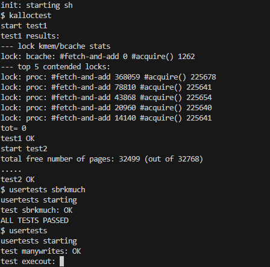
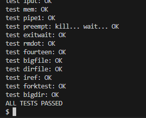
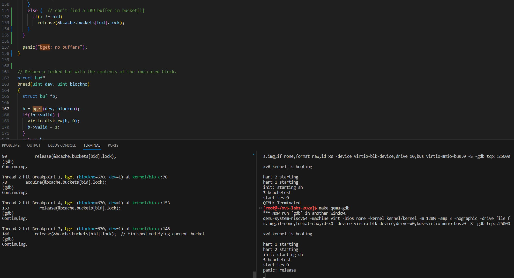
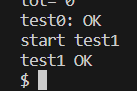
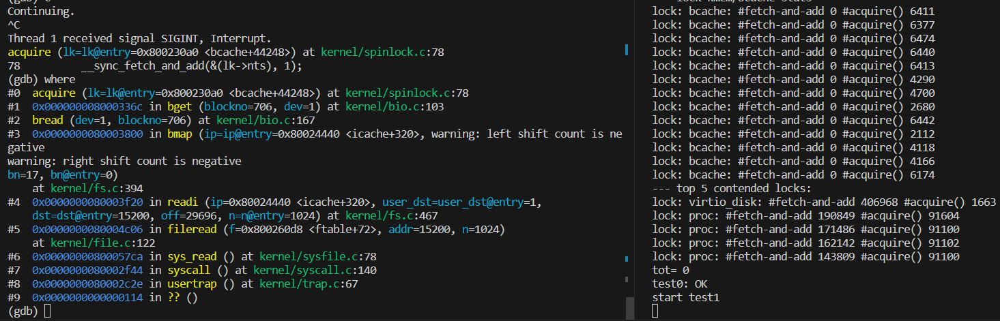
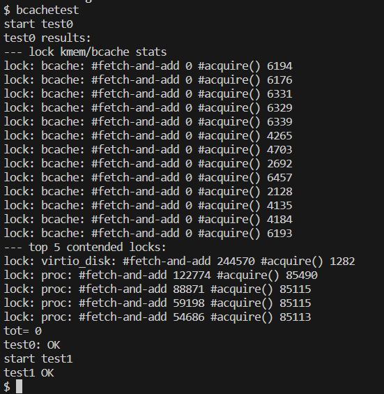
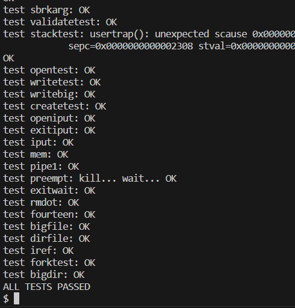

# Lab8: locks
在本实验中，您将获得重新设计代码以提**高并行性**的经验。多核机器上并行性差的一个常见症状是频繁的锁争用。提高并行性通常涉及**更改数据结构**和**锁定策略以减少争用**。您将对xv6内存分配器和块缓存执行此操作。
本实验分支：
```sh
$ git fetch
$ git checkout lock
$ make clean
```
## Task1 Memory allocator
程序***user/kalloctest.c***强调了xv6的内存分配器：三个进程增长和缩小地址空间，导致对```kalloc```和```kfree```的多次调用。```kalloc```和```kfree```获得```kmem.lock```。```kalloctest```打印（作为“#fetch-and-add”）在```acquire```中由于尝试获取另一个内核已经持有的锁而进行的循环迭代次数，如```kmem```锁和一些其他锁。```acquire```中的循环迭代次数是锁争用的粗略度量。完成实验前，```kalloctest```的输出与此类似：

```sh
$ kalloctest
start test1
test1 results:
--- lock kmem/bcache stats
lock: kmem: #fetch-and-add 83375 #acquire() 433015
lock: bcache: #fetch-and-add 0 #acquire() 1260
--- top 5 contended locks:
lock: kmem: #fetch-and-add 83375 #acquire() 433015
lock: proc: #fetch-and-add 23737 #acquire() 130718
lock: virtio_disk: #fetch-and-add 11159 #acquire() 114
lock: proc: #fetch-and-add 5937 #acquire() 130786
lock: proc: #fetch-and-add 4080 #acquire() 130786
tot= 83375
test1 FAIL
```
```acquire```为每个锁维护要获取该锁的```acquire```调用计数，以及```acquire```中循环尝试但未能设置锁的次数。```kalloctest```调用一个系统调用，使内核打印```kmem```和```bcache```锁（这是本实验的重点）以及5个最有具竞争的锁的计数。如果存在锁争用，则```acquire```循环迭代的次数将很大。系统调用返回```kmem```和```bcache```锁的循环迭代次数之和。

对于本实验，您必须使用具有多个内核的专用空载机器。如果你使用一台正在做其他事情的机器，```kalloctest```打印的计数将毫无意义。你可以使用专用的Athena 工作站或你自己的笔记本电脑，但不要使用拨号机。

```kalloctest```中锁争用的根本原因是```kalloc()```有一个空闲列表，由一个锁保护。要消除锁争用，您必须重新设计内存分配器，以避免使用单个锁和列表。基本思想是为每个CPU维护一个空闲列表，每个列表都有自己的锁。因为每个CPU将在不同的列表上运行，不同CPU上的分配和释放可以并行运行。主要的挑战将是处理一个CPU的空闲列表为空，而另一个CPU的列表有空闲内存的情况；在这种情况下，一个CPU必须“窃取”另一个CPU空闲列表的一部分。窃取可能会引入锁争用，但这种情况希望不会经常发生。

<span style="background-color:green;">您的工作是实现每个CPU的空闲列表，并在CPU的空闲列表为空时进行窃取。所有锁的命名必须以“```kmem```”开头。也就是说，您应该为每个锁调用```initlock```，并传递一个以“```kmem```”开头的名称。运行```kalloctest```以查看您的实现是否减少了锁争用。要检查它是否仍然可以分配所有内存，请运行```usertests sbrkmuch```。您的输出将与下面所示的类似，在```kmem```锁上的争用总数将大大减少，尽管具体的数字会有所不同。确保```usertests```中的所有测试都通过。评分应该表明考试通过。</span>
```sh
$ kalloctest
start test1
test1 results:
--- lock kmem/bcache stats
lock: kmem: #fetch-and-add 0 #acquire() 42843
lock: kmem: #fetch-and-add 0 #acquire() 198674
lock: kmem: #fetch-and-add 0 #acquire() 191534
lock: bcache: #fetch-and-add 0 #acquire() 1242
--- top 5 contended locks:
lock: proc: #fetch-and-add 43861 #acquire() 117281
lock: virtio_disk: #fetch-and-add 5347 #acquire() 114
lock: proc: #fetch-and-add 4856 #acquire() 117312
lock: proc: #fetch-and-add 4168 #acquire() 117316
lock: proc: #fetch-and-add 2797 #acquire() 117266
tot= 0
test1 OK
start test2
total free number of pages: 32499 (out of 32768)
.....
test2 OK
$ usertests sbrkmuch
usertests starting
test sbrkmuch: OK
ALL TESTS PASSED
$ usertests
...
ALL TESTS PASSED
$
```

**提示：**
1. 您可以使用***kernel/param.h***中的常量NCPU
1. 让```freerange```将所有可用内存分配给运行```freerange```的CPU。
1.  函数```cpuid```返回当前的核心编号，但只有在中断关闭时调用它并使用其结果才是安全的。您应该使用```push_off()```和```pop_off()```来关闭和打开中断。
1. 看看***kernel/sprintf.c***中的```snprintf```函数，了解字符串如何进行格式化。尽管可以将所有锁命名为“```kmem```”。

**步骤**：
1.  将```kmem```修改为一个数组，长度为CPU数目
    ```c
    // kalloc.c
    struct {
      struct spinlock lock;
      struct run *freelist;
    } kmem[NCPU];
    ```

1. 接着修改```kinit```，让```freerange```将所有可用内存分配给运行```freerange```的CPU。调用```snprintf```函数来格式化字符串
    ```c
    // kalloc.c
    void
    kinit()
    {
      char lockname[8];  // 5(kmem_)+2(i)+1(\0)
      for(int i = 0; i < NCPU; i++) {
        snprintf(lockname, sizeof(lockname), "kmem_%d", i);
        initlock(&kmem[i].lock, lockname);  // 给第i个CPU初始化锁
      }
      freerange(end, (void*)PHYSTOP);
    }
    ```
* 修改```kfree```,使函数```cpuid```只有在中断关闭时被调用，使用```push_off()```和```pop_off()```来关闭和打开中断。使用```cpuid()```**的结果**时也必须关闭中断！
    ```c
    // kalloc.c
    void
    kfree(void *pa)
    {
      struct run *r;

      if(((uint64)pa % PGSIZE) != 0 || (char*)pa < end || (uint64)pa >= PHYSTOP)
        panic("kfree");

      // Fill with junk to catch dangling refs.
      memset(pa, 1, PGSIZE);

      r = (struct run*)pa;

      push_off();  // disable the intr
      int id = cpuid();  // get current cpu id. must turn off the intr before calling this.
      acquire(&kmem[id].lock);
      r->next = kmem[id].freelist;
      kmem[id].freelist = r;
      release(&kmem[id].lock);
      pop_off();  // enble the intr
    }
    ```
* 修改```kalloc```, 处理一个CPU的空闲列表为空，而另一个CPU的列表有空闲内存的情况下，一个CPU必须“窃取”另一个CPU空闲列表的一部分。
    ```c
    void *
    kalloc(void)
    {
      struct run *r;

      push_off();  // disable the intr
      int id = cpuid();  // get current cpu id. must turn off the intr before calling this.

      acquire(&kmem[id].lock);
      r = kmem[id].freelist;
      if(r)
        kmem[id].freelist = r->next;
      else {  // this cpu doesn't have free block, need to "steal" from other cpu 
        for(int i = 0; i < NCPU; i++) {  // start to check every ohter cpu
          if(i == id) 
            continue; 
          else {  // i is a cpuid of another cpu
            acquire(&kmem[i].lock);
            r = kmem[i].freelist;
            if(r) {  // cpu i has free block to steal from
              kmem[i].freelist = r->next;  // steal r, cpui's freelist starts from r->next
              release(&kmem[i].lock);
              break;
            } 
            else 
              release(&kmem[i].lock);
          }
        }
      }
      release(&kmem[id].lock);
      pop_off();  // enble the intr

      if(r)
        memset((char*)r, 5, PGSIZE); // fill with junk
      return (void*)r;
    }
    ```

**测试结果：**



## Task2 Buffer cache (Hard)
这一半作业独立于前一半；不管你是否完成了前半部分，你都可以完成这半部分（并通过测试）。

如果多个进程密集地使用文件系统，它们可能会争夺```bcache.lock```，它保护***kernel/bio.c***中的磁盘块缓存。```bcachetest```创建多个进程，这些进程重复读取不同的文件，以便在```bcache.lock```上生成争用；（在完成本实验之前）其输出如下所示：
```sh
$ bcachetest
start test0
test0 results:
--- lock kmem/bcache stats
lock: kmem: #fetch-and-add 0 #acquire() 33035
lock: bcache: #fetch-and-add 16142 #acquire() 65978
--- top 5 contended locks:
lock: virtio_disk: #fetch-and-add 162870 #acquire() 1188
lock: proc: #fetch-and-add 51936 #acquire() 73732
lock: bcache: #fetch-and-add 16142 #acquire() 65978
lock: uart: #fetch-and-add 7505 #acquire() 117
lock: proc: #fetch-and-add 6937 #acquire() 73420
tot= 16142
test0: FAIL
start test1
test1 OK
```
您可能会看到不同的输出，但bcache锁的```acquire```循环迭代次数将很高。如果查看***kernel/bio.c***中的代码，您将看到```bcache.lock```保护已缓存的块缓冲区的列表、每个块缓冲区中的引用计数（```b->refcnt```）以及缓存块的标识（```b->dev```和```b->blockno```）。

<span style="background-color:green;">修改块缓存，以便在运行```bcachetest```时，bcache（buffer cache的缩写）中所有锁的```acquire```循环迭代次数接近于零。理想情况下，块缓存中涉及的所有锁的计数总和应为零，但只要总和小于500就可以。修改```bget```和```brelse```，以便bcache中不同块的并发查找和释放不太可能在锁上发生冲突（例如，不必全部等待```bcache.lock```）。你必须保护每个块最多缓存一个副本的不变量。完成后，您的输出应该与下面显示的类似（尽管不完全相同）。确保```usertests```仍然通过。完成后，```make grade```应该通过所有测试。</span>

```sh
$ bcachetest
start test0
test0 results:
--- lock kmem/bcache stats
lock: kmem: #fetch-and-add 0 #acquire() 32954
lock: kmem: #fetch-and-add 0 #acquire() 75
lock: kmem: #fetch-and-add 0 #acquire() 73
lock: bcache: #fetch-and-add 0 #acquire() 85
lock: bcache.bucket: #fetch-and-add 0 #acquire() 4159
lock: bcache.bucket: #fetch-and-add 0 #acquire() 2118
lock: bcache.bucket: #fetch-and-add 0 #acquire() 4274
lock: bcache.bucket: #fetch-and-add 0 #acquire() 4326
lock: bcache.bucket: #fetch-and-add 0 #acquire() 6334
lock: bcache.bucket: #fetch-and-add 0 #acquire() 6321
lock: bcache.bucket: #fetch-and-add 0 #acquire() 6704
lock: bcache.bucket: #fetch-and-add 0 #acquire() 6696
lock: bcache.bucket: #fetch-and-add 0 #acquire() 7757
lock: bcache.bucket: #fetch-and-add 0 #acquire() 6199
lock: bcache.bucket: #fetch-and-add 0 #acquire() 4136
lock: bcache.bucket: #fetch-and-add 0 #acquire() 4136
lock: bcache.bucket: #fetch-and-add 0 #acquire() 2123
--- top 5 contended locks:
lock: virtio_disk: #fetch-and-add 158235 #acquire() 1193
lock: proc: #fetch-and-add 117563 #acquire() 3708493
lock: proc: #fetch-and-add 65921 #acquire() 3710254
lock: proc: #fetch-and-add 44090 #acquire() 3708607
lock: proc: #fetch-and-add 43252 #acquire() 3708521
tot= 128
test0: OK
start test1
test1 OK
$ usertests
  ...
ALL TESTS PASSED
$
```

请将你所有的锁以“```bcache```”开头进行命名。也就是说，您应该为每个锁调用```initlock```，并传递一个以“```bcache```”开头的名称。

减少块缓存中的争用比```kalloc```更复杂，因为bcache缓冲区真正的在进程（以及CPU）之间共享。对于```kalloc```，可以通过给每个CPU设置自己的分配器来消除大部分争用；这对块缓存不起作用。我们建议您使用每个哈希桶都有一个锁的哈希表在缓存中查找块号。

在您的解决方案中，以下是一些存在锁冲突但可以接受的情形：
* 当两个进程同时使用相同的块号时。```bcachetest test0```始终不会这样做。
* 当两个进程同时在cache中未命中时，需要找到一个未使用的块进行替换。```bcachetest test0```始终不会这样做。
* 在你用来划分块和锁的方案中某些块可能会发生冲突，当两个进程同时使用冲突的块时。例如，如果两个进程使用的块，其块号散列到哈希表中相同的槽。```bcachetest test0```可能会执行此操作，具体取决于您的设计，但您应该尝试调整方案的细节以避免冲突（例如，更改哈希表的大小）。

```bcachetest```的```test1```使用的块比缓冲区更多，并且执行大量文件系统代码路径。

**提示：**
1. 请阅读xv6手册中对块缓存的描述（第8.1-8.3节）。
1. 可以使用固定数量的散列桶，而不动态调整哈希表的大小。使用素数个存储桶（例如13）来降低散列冲突的可能性。
1. 在哈希表中搜索缓冲区并在找不到缓冲区时为该缓冲区分配条目必须是原子的。
1. 删除保存了所有缓冲区的列表（```bcache.head```等），改为标记上次使用时间的时间戳缓冲区（即使用***kernel/trap.c***中的```ticks```）。通过此更改，```brelse```不需要获取bcache锁，并且```bget```可以根据时间戳选择最近使用最少的块。
1. 可以在```bget```中串行化回收（即```bget```中的一部分：当缓存中的查找未命中时，它选择要复用的缓冲区）。
1. 在某些情况下，您的解决方案可能需要持有两个锁；例如，在回收过程中，您可能需要持有bcache锁和每个bucket（哈希桶）一个锁。确保避免死锁。
1. 替换块时，您可能会将```struct buf```从一个bucket移动到另一个bucket，因为新块散列到不同的bucket。您可能会遇到一个棘手的情况：新块可能会散列到与旧块相同的bucket中。在这种情况下，请确保避免死锁。
1. 一些调试技巧：实现bucket锁，但将全局```bcache.lock```的```acquire/release```保留在```bget```的开头/结尾，以串行化代码。一旦您确定它在没有竞争条件的情况下是正确的，请移除全局锁并处理并发性问题。您还可以运行```make CPUS=1 qemu```以使用一个内核进行测试。

**步骤**：
1. 根据提示，定义素数（13）个哈希桶，修改```bcache```的结构, 增加哈希桶，将头结点和锁放在哈希桶中. 宏```HASH```根据```buf->blockno```查找哈希桶编号
    ```c
    #define NBUCKET 13
    #define HASH(bid) (bid % NBUCKET)

    struct hashbuf {
      // Linked list of all buffers in this bucket, through prev/next.
      // Sorted by how recently the buffer was used.
      // head.next is most recent, head.prev is least.
      struct buf head;
      struct spinlock lock;
    };

    struct {
      struct buf buf[NBUF];
      struct hashbuf buckets[NBUCKET];
    } bcache;
    ```

1. 参照task1中对锁命名的方式，在```binit```中初始化哈希桶的锁并命名, 将所有散列桶中的```head->prev```和```prev->next```都指向自身表示为空，将所有缓冲区都挂载到```bucket[0]```中：
    ```c
    void
    binit(void)
    {
      struct buf *b;
      char lockname[16];  // only 10(7+2+1) bytes will be used

      for(int i = 0; i < NBUCKET; i++) {
        // init the spinlocks of hash bucket
        snprintf(lockname, sizeof(lockname), "bcache_%d" ,i);
        initlock(&bcache.buckets[i].lock, "bcache");  
        // init the heads of hash bucket,
        // pointing to itself means it's empty
        bcache.buckets[i].head.prev = &bcache.buckets[i].head;
        bcache.buckets[i].head.next = &bcache.buckets[i].head;
      }

      // Create linked list of buffers
      for(b = bcache.buf; b < bcache.buf + NBUF; b++) {
        b->next = bcache.buckets[0].head.next;
        b->prev = &bcache.buckets[0].head;
        initsleeplock(&b->lock, "buffer");
        bcache.buckets[0].head.next->prev = b;
        bcache.buckets[0].head.next = b;
      }
    }
    ```

1. 根据提示4， 在```struct buf```中添加标记上次使用时间的时间戳缓冲区（即使用***kernel/trap.c***中的```ticks```）
    ```c
    // buf.h
    struct buf {
      //...
      uint timestamp;   // time stamp for LRU, call from brelse
    };
    ```
    然后在```brelse```中使用时间戳来判定最近被使用过的锁，而不再使用头插法
    ```c
    void
    brelse(struct buf *b)
    {
      if(!holdingsleep(&b->lock))
        panic("brelse");

      releasesleep(&b->lock);

      int bid = HASH(b->blockno);

      // acquire(&bcache.lock);
      // acquire the lock of hash bucket instead of a meta lock
      acquire(&bcache.buckets[bid].lock);
      b->refcnt--;

      // use buf->timestamp to apply LRU
      // update timestap here
      acquire(&tickslock);
      b->timestamp = ticks;
      release(&tickslock);

      release(&bcache.buckets[bid].lock);
    }
    ```

1. 修改```bget```，和上面一样把大锁改成哈希桶的小锁。遍历每个桶中的LRU list, 寻找没有引用且```timestamp```最小的buffer，找到后拿过来移至当前桶的LRU list前面。
    ```c
    static struct buf*
    bget(uint dev, uint blockno)
    {
      struct buf *b;

      int bid = HASH(blockno);

      acquire(&bcache.buckets[bid].lock);

      // Is the block already cached?
      for(b = bcache.buckets[bid].head.next; b != &bcache.buckets[bid].head; b = b->next) {
        if(b->dev == dev && b->blockno == blockno) {  // b is cached
          b->refcnt++;

          // b is used, so we need to update the timestamp
          acquire(&tickslock);
          b->timestamp = ticks;
          release(&tickslock);

          release(&bcache.buckets[bid].lock);
          acquiresleep(&b->lock);
          return b;
        }
      }

      // Not cached.

      // search buckets for the LRU unused buffer
      for(int i = 0; i < NBUCKET; i++) {
        // acqr bucket's lock before we change buckets[i]'s LRU cache list.
        if(i != bid) {
          if(!holding(&bcache.buckets[i].lock))  // prevent dead lock
            acquire(&bcache.buckets[i].lock);
          else  // find in current bucket, doesn't need to lock again
            continue;  
        }

        // Go through bucket[i]'s LRU cache list, and
        // find the most recently used buffer to replace the current buffer
        b = 0;
        for(struct buf* tmp = bcache.buckets[i].head.next;
        tmp != &bcache.buckets[i].head; 
        tmp = tmp->next) {
          if(tmp->refcnt == 0 && (b == 0 || tmp->timestamp < b->timestamp))  
            // tmp has no reference,
            // and has been more recently used than b
            b = tmp;
        }

        if(b) {  // b has been replaced
          if(i != bid) {  // stealed from other bucket
            // remove b form buckets[i]'s LRU cache list
            // since it's no longer in this bucket
            b->next->prev = b->prev;
            b->prev->next = b->next;
            release(&bcache.buckets[i].lock);

            // add b right after buckets[bid]'s LRU cache list's head
            b->next = bcache.buckets[bid].head.next;
            b->prev = &bcache.buckets[bid].head;
            bcache.buckets[bid].head.next->prev = b;
            bcache.buckets[bid].head.next = b;
          }

          // Recycle the least recently used (LRU) unused buffer.
          b->dev = dev;
          b->blockno = blockno;
          b->valid = 0;
          b->refcnt = 1;

          // update b->timestamp
          acquire(&tickslock);
          b->timestamp = ticks;
          release(&tickslock);

          release(&bcache.buckets[bid].lock);  // finished modifying current bucket

          acquiresleep(&b->lock);
          return b;
        }
        else {  // can't find a LRU buffer in bucket[i]
          if(i != bid)
            release(&bcache.buckets[i].lock);
        }
      }

      panic("bget: no buffers");
    } 
    ```

1. 修改 ```bpin```和 ```bunpin```
```c
void
bpin(struct buf *b) {
  int bid = HASH(b->blockno);
  acquire(&bcache.buckets[bid].lock);
  b->refcnt++;
  release(&bcache.buckets[bid].lock);
}

void
bunpin(struct buf *b) {
  int bid = HASH(b->blockno);
  acquire(&bcache.buckets[bid].lock);
  b->refcnt--;
  release(&bcache.buckets[bid].lock);
}
```

**调试：**
1. 第一次运行报错```paninc("release")```说明锁在没有持有时被释放。使用gdb查看出错位置：
    
    发现在***bio.c***的153行释放锁后，没有再获取锁程序就运行到了146行。这里153行释放错锁了，应该释放编号为i的桶的锁而不是bid的。修改代码：
    ```c
    else {  // can't find a LRU buffer in bucket[i]
          if(i != bid)
            release(&bcache.buckets[i].lock);
        }
    ```

1. 再次运行```bcachetest```发现程序一直卡在test1中，推测是因为死锁。使用```make CPU=1 qemu```进行测试发现可以通过测试：
    
    说明问题只出现在并发情况下，用gdb查看出错位置：
    
    在***bio.c***的103行获取锁时形成了死锁, 查看代码
    ```c
    // search buckets for the LRU unused buffer
    for(int i = 0; i < NBUCKET; i++) {
      // acqr bucket's lock before we change buckets[i]'s LRU cache list.
      if(i != bid) {
        if(!holding(&bcache.buckets[i].lock))  // prevent dead lock
          acquire(&bcache.buckets[i].lock);
        else  // find in current bucket, doesn't need to lock again
          continue;  
      }
      //...
    }  
    ```
    之前做的死锁检查```if(!holding(&bcache.buckets[i].lock))```能够防止同一个线程尝试获取已经被持有的锁，但是在**并发状态下**，可能会出现这样一种情况：
    线程1中，桶a持有自己的锁，申请桶b的锁；
    线程2中，桶b持有自己的锁，申请桶a的锁。
    这就导致了之前课上讲到的[deadly embrace](#deadlyembrace)的情况。通常的解决办法是对所有锁排序，获取时严格按照顺序获取。这里摘录一段书中的话：
    ***
    Honoring a global deadlock-avoiding order can be surprisingly difficult. Sometimes the lock order conflicts with logical program structure, e.g., perhaps code module M1 calls module M2, but the lock order requires that a lock in M2 be acquired before a lock in M1. **Sometimes the identities of locks aren’t known in advance, perhaps because one lock must be held in order to discover the identity of the lock to be acquired next.** This kind of situation arises in the file system as it looks up successive components in a path name, and in the code for ```wait``` and ```exit``` as they search the table of processes looking for child processes. Finally, the danger of deadlock is often a constraint on how fine-grained one can make a locking scheme, since more locks often means more opportunity for deadlock. The need to avoid deadlock is often a major factor in kernel implementation.
    ***
    现在的情况属于加粗地方提到的，获取```bucket[i].lcok```前必须持有```bucket[bid].lock```，但是这里的```bid```和```i```都是变量。需要让```bid```和```i```尽量满足恒定的大小关系（```bid``` <= ```i```）, 修改遍历哈希桶的方式，从```bid```开始向后遍历:
    ```c
    // search buckets for the LRU unused buffer
    for(int j = 0; j < NBUCKET; j++) {
      int i = (bid + j) % NBUCKET;
      // acqr bucket's lock before we change buckets[i]'s LRU cache list.
      if(i != bid) {
        //...
      }
    }
    ```
    修改后通过```bcachetest```
    

**usertest测试**：
