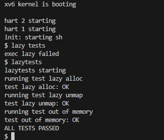

# Lab5 Xv6 lazy page allocation
**前置知识：**
* 书第四章，特别是4.6
* ***kernel/trap.c***
* ***kernel/vm.c***
* ***kernel/sysproc.c***

## Task1 Eliminate allocation from sbrk() 
<span style="background-color:green;">你的首项任务是删除```sbrk(n)```系统调用中的页面分配代码（位于***sysproc.c***中的函数```sys_sbrk()```）。```sbrk(n)```系统调用将进程的内存大小增加n个字节，然后返回新分配区域的开始部分（即旧的大小）。新的```sbrk(n)```应该只将进程的大小（```myproc()->sz```）增加n，然后返回旧的大小。它不应该分配内存——因此您应该删除对```growproc()的```调用（但是您仍然需要增加进程的大小！）。</span>

这个任务在课上做过，见[Lec08](#lab5task1&2)

## Task2 allocation
<span style="background-color:green;">修改***trap.c***中的代码以响应来自用户空间的页面错误，方法是新分配一个物理页面并映射到发生错误的地址，然后返回到用户空间，让进程继续执行。您应该在生成“```usertrap(): …```”消息的```printf```调用之前添加代码。你可以修改任何其他xv6内核代码，以使```echo hi```正常工作。</span>

**提示：**
* 你可以在```usertrap()```中查看```r_scause()```的返回值是否为13或15来判断该错误是否为页面错误
* ```stval```寄存器中保存了造成页面错误的虚拟地址，你可以通过```r_stval()```读取
* 参考***vm.c***中的```uvmalloc()```中的代码，那是一个```sbrk()```通过```growproc()```调用的函数。你将需要对```kalloc()```和```mappages()```进行调用
* 使用```PGROUNDDOWN(va)```将出错的虚拟地址向下舍入到页面边界
* 当前```uvmunmap()```会导致系统```panic```崩溃；请修改程序保证正常运行
* 如果内核崩溃，请在k***ernel/kernel.asm***中查看```sepc```
* 使用pgtbl lab的```vmprint```函数打印页表的内容
* 如果您看到错误“incomplete type proc”，请include“***spinlock.h***”然后是“***proc.h***”。

如果一切正常，你的lazy allocation应该使```echo hi```正常运行。您应该至少有一个页面错误（因为延迟分配），也许有两个。

这个任务在课堂上也完成了大部分，具体需要修正一些地方:
1. 将```usertrap```中的page fault 判断条件完善
1. PTE检查条件加一个```PTE_X```
    ```c
    void
    trapinithart(void)
    {
      w_stvec((uint64)kernelvec);
    }

    //
    // handle an interrupt, exception, or system call from user space.
    // called from trampoline.S
    //
    void
    usertrap(void)
    {
      //...
        syscall();
      } else if((which_dev = devintr()) != 0){
        // ok
      } 
      else if (r_scause() == 15 || r_scause() == 13) {  // page fault
        uint64 va = r_stval();  // where the page fault is 
        printf("page fault %p\n", va);
        uint64 ka = (uint64) kalloc();
        if (ka == 0) {  // OOM
          p->killed = 1;
        }
        else {
          memset((void *) ka, 0, PGSIZE);
          va = PGROUNDDOWN(va);
          if (mappages(p->pagetable, va, PGSIZE, ka, PTE_W|PTE_U|PTE_R|PTE_X) !=0) {
            kfree((void *)ka);
            p->killed = 1;
          }
        }
      }
      else {
        //...
      }
    //...
    }
    ```
1. 最后将[pgtbl lab中的vmprint](#task1-print-a-page-table)添加进代码，测试通过

## Task3 Lazytests and Usertests
我们为您提供了```lazytests```，这是一个xv6用户程序，它测试一些可能会给您的惰性内存分配器带来压力的特定情况。修改内核代码，使所有```lazytests```和```usertests```都通过。
1. 处理```sbrk()```参数为负的情况。
1. 如果某个进程在高于```sbrk()```分配的任何虚拟内存地址上出现页错误，则终止该进程。
1. 在```fork()```中正确处理父到子内存拷贝。
1. 处理这种情形：进程从```sbrk()```向系统调用（如```read```或```write```）传递有效地址，但尚未分配该地址的内存。
1. 正确处理内存不足：如果在页面错误处理程序中执行```kalloc()```失败，则终止当前进程。
1. 处理用户栈下面的无效页面上发生的错误。

**步骤：**
1. 当```sbrk()```参数为负数时，意为缩减内存，需调用```uvmdealloc()```函数，需要限制缩小后的内存空间不能小于0
    ```c
    // kernel/sys_proc.c
    uint64
    sys_sbrk(void)
    {
      int addr;
      int n;

      if(argint(0, &n) < 0)
        return -1;

      struct proc* p = myproc();
      addr = p->sz;
      uint64 sz = p->sz; 

      if(n>0) {  // lazy alloc
        p->sz += n;
      }
      else if(sz + n > 0) {
        sz = uvmdealloc(p->pagetable, sz, sz+n);
        p->sz = sz;
      }
      else {
        return -1;
      }

      return addr;
    }
    ```

1. 修改```uvmcopy()```，使得fork能够正确处理父到子的内存拷贝
    ```c
    // kernel/vm.c
    int
    uvmcopy(pagetable_t old, pagetable_t new, uint64 sz)
    {
      ...
      for(i = 0; i < sz; i += PGSIZE){
        if((pte = walk(old, i, 0)) == 0)
          continue;
        if((*pte & PTE_V) == 0)
          continue;
        //...
      }
      //...
    }
    ```

1. 修改```uvmunmap```， 使得运行不报错
    ```c
    // vm.c
    void
    uvmunmap(pagetable_t pagetable, uint64 va, uint64 npages, int do_free)
    {
      ...

      for(a = va; a < va + npages*PGSIZE; a += PGSIZE){
        if((pte = walk(pagetable, a, 0)) == 0)
          continue;
        if((*pte & PTE_V) == 0)
          continue;

        ...
      }
    }
    ```

1. 处理进程从```sbrk()```向系统调用（如```read```或```write```）传递有效地址，但尚未分配该地址的内存的情况。
在***kernel/syscall.c***:```argaddr()```中添加分配物理内存的实现，因为将地址传入系统调用后，会在这里从寄存器中读取。
    ```c
    // kernel/syscall.c
    // Retrieve an argument as a pointer.
    // Doesn't check for legality, since
    // copyin/copyout will do that.
    int
    argaddr(int n, uint64 *ip)
    {
      *ip = argraw(n);
      struct proc* p = myproc();

      // page fault of lazy allocation
      if(walkaddr(p->pagetable, *ip) == 0) {  // addr not mapped. TODO: reduce the call of walkaddr() here
        if(PGROUNDUP(p->trapframe->sp) - 1 < *ip && *ip < p->sz) {  // p->sz was updated already
          char* pa = kalloc();
          if(pa == 0)   // OOM
            return -1;
          memset(pa, 0, PGSIZE);

          if(mappages(p->pagetable, PGROUNDDOWN(*ip), PGSIZE, (uint64)pa, 
          PTE_R | PTE_W | PTE_X | PTE_U) != 0) {
            kfree(pa);
            return -1;
          }
        }
        else {  // not on the pages allocated in lazy alloc
          return -1;
        }
      }

      return 0;
    }
    ```

**测试结果**：
第二个测试报错
```sh
panic: freewalk: leaf
```
在***vm.c***:```freewalk()```中修改一下：
```c
void
freewalk(pagetable_t pagetable)
{
  // there are 2^9 = 512 PTEs in a page table.
  for(int i = 0; i < 512; i++){
    //...
    } else if(pte & PTE_V){
      //panic("freewalk: leaf");
    }
  }
  //...
}
```
再次测试报错uvmunmapped,在usertrap中添加判断条件，当```va > p->sz```时杀掉进程:

    ```c
    void
    usertrap(void)
    {
      //...
      else if (r_scause() == 15 || r_scause() == 13) {  // page fault
        uint64 va = r_stval();  // where the page fault is 
        do {
          if(va > p->sz) {
            p->killed = 1;
            break;
          }
          uint64 ka = (uint64) kalloc();
          if (ka == 0) {  // OOM
            p->killed = 1;
          }
          else {
            memset((void *) ka, 0, PGSIZE);
            va = PGROUNDDOWN(va);
            if (mappages(p->pagetable, va, PGSIZE, ka, PTE_W|PTE_U|PTE_R|PTE_X) !=0) {
              kfree((void *)ka);
              p->killed = 1;
            }
          }
            } while(0);
      }
      else {
        //...
      }
    //...
    }
    ```
再次进行```lazytests```测试：
\
**usertests**有一项没有通过：
```sh
test stacktest: (null): stacktest: read below stack 0x0000000000000001
FAILED
```
刚才忽略了保护页，在新增的判断条件下面再加一个判断：

```c
void
usertrap(void)
{
  //...
  else if (r_scause() == 15 || r_scause() == 13) {  // page fault
    uint64 va = r_stval();  // where the page fault is 
    do {
      if(va > p->sz) {
        p->killed = 1;
        break;
      }
      if(va > p->sz - 2*PGSIZE && va < p->sz - PGSIZE) {  // guard page
        p->killed = 1;
        break;
      }
      //...
```

再次运行```usertests```:


