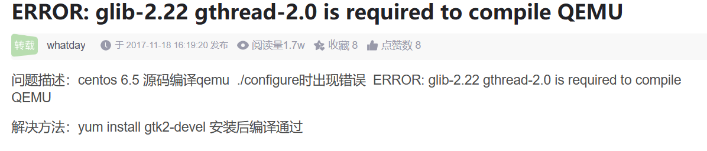
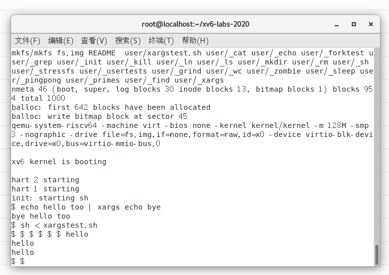

# Lab1: Xv6 and Unix utilities
## Task1 Launch xv6
参考网站：[课程官方实验部署指南](https://pdos.csail.mit.edu/6.828/2018/tools.html)， [CENTOS7部署经验](https://blog.csdn.net/weixin_46803360/article/details/128116051?ops_request_misc=&request_id=&biz_id=102&utm_term=CENTOSMIT6.828&utm_medium=distribute.pc_search_result.none-task-blog-2~all~sobaiduweb~default-0-128116051.142^v100^pc_search_result_base1&spm=1018.2226.3001.4187)， [Ubuntu部署经验](https://blog.csdn.net/u013573243/article/details/129403949?ops_request_misc=%257B%2522request%255Fid%2522%253A%2522171627969616800197084566%2522%252C%2522scm%2522%253A%252220140713.130102334.pc%255Fall.%2522%257D&request_id=171627969616800197084566&biz_id=0&utm_medium=distribute.pc_search_result.none-task-blog-2~all~first_rank_ecpm_v1~rank_v31_ecpm-3-129403949-null-null.142^v100^pc_search_result_base1&utm_term=Error%3A%20Couldnt%20find%20a%20riscv64%20version%20of%20GCC%2Fbinutils.%20***%20To%20turn%20off%20this%20error%2C%20run%20gmake%20TOOLPREFIX%3D%20....&spm=1018.2226.3001.4187)
自用环境：CentOS7(VMware) + https://github.com/mit-pdos/xv6-public
实验用：```$ git clone git://g.csail.mit.edu/xv6-labs-2020```
**编译错误：**
1. 
1. install riscv tool-gnu-toolchain 时，make时之前添加的PATH中的环境变量不在了，需重新在控制台输入
```
# source ~/.bash_profile
# echo $PATH
> /usr/local/bin:/usr/local/sbin:/usr/bin:/usr/sbin:/bin:/sbin:/root/bin:/root/bin:/opt/riscv/bin
```
或者在.bashrc中设置环境变量

**clone 错误：**
```
error: RPC failed; result=18, HTTP code = 20000 KiB/s   
fatal: The remote end hung up unexpectedly
fatal: 过早的文件结束符（EOF）
fatal: index-pack failed
```
解决方法：
  ```
  git config --global http.postBuffer 524288000
  ```

  **toolchain make 错误：**
 1. ``` log2’不是‘std’的成员```原因是Linux系统中C标准库版本过低
[解决方法](https://blog.csdn.net/m0_43453853/article/details/109381488?ops_request_misc=%257B%2522request%255Fid%2522%253A%2522171634022916800184171915%2522%252C%2522scm%2522%253A%252220140713.130102334.pc%255Fall.%2522%257D&request_id=171634022916800184171915&biz_id=0&utm_medium=distribute.pc_search_result.none-task-blog-2~all~first_rank_ecpm_v1~rank_v31_ecpm-4-109381488-null-null.142^v100^pc_search_result_base1&utm_term=make%20%E6%8A%A5%E9%94%99Log2%E4%B8%8D%E6%98%AFstd%E7%9A%84%E6%88%90%E5%91%98&spm=1018.2226.3001.4187)
1. 
```
g++: fatal error: 已杀死 signal terminated program cc1plus
compilation terminated.
```
原因：内存不足
尝试在VMware中将内存设为8G

<h2 id="make-err"> xv6-labs-2020 make 错误：</h2>

1. 
```
user/sh.c: In function 'runcmd':
user/sh.c:58:1: error: infinite recursion detected []8;;https://gcc.gnu.org/onlinedocs/gcc/Warning-Options.html#index-Winfinite-recursion-Werror=infinite-recursion]8;;]
```
参照[记录MIT6.s081 编译QEMU中的错误](https://blog.csdn.net/weixin_51472360/article/details/128800041),修改user/sh.c:58处，添加__attribute__((noreturn))
```c {.line-numbers}
diff --git a/user/sh.c b/user/sh.c
index 83dd513..c96dab0 100644
--- a/user/sh.c
+++ b/user/sh.c
@@ -54,6 +54,7 @@ void panic(char*);
 struct cmd *parsecmd(char*);
 
 // Execute cmd.  Never returns.
+__attribute__((noreturn))
 void
 runcmd(struct cmd *cmd)
 {
```
2. make: qemu-system-riscv64：命令未找到
新版的实验代码是在riscv上编译的，所以对应的qemu也需要安装riscv版本
[方法参考](https://stackoverflow.com/questions/66718225/qemu-system-riscv64-is-not-found-in-package-qemu-system-misc)


启动成功

***退出 qemu*** : ```Ctrl-a x```
***显示当前进程***：```Ctrl-p```

## Task2 Sleep
<span style="background-color:green;">实现xv6的UNIX程序```sleep```：您的```sleep```应该暂停到用户指定的计时数。一个滴答(tick)是由xv6内核定义的时间概念，即来自定时器芯片的两个中断之间的时间。您的解决方案应该在文件***user/sleep.c***中。</span>

**提示：**
* 在你开始编码之前，请阅读《book-riscv-rev1》的第一章

* 看看其他的一些程序（如 ***/user/echo.c, /user/grep.c, /user/rm.c***）查看如何获取传递给程序的命令行参数
<details>
    <summary><span style="color:lightblue;">echo.c</span> </summary>

```c {.line-numbers}
#include "kernel/types.h"
#include "kernel/stat.h"
#include "user/user.h"

int
main(int argc, char *argv[])  // argc为命令行的总的参数个数；argv为一个包含所有参数的字符串数组
{
  int i;

  for(i = 1; i < argc; i++){  // i=0为程序名称跳过
    write(1, argv[i], strlen(argv[i]));  // 1 为标准输出文件描述符；argv[i]为要写入的字符串
    if(i + 1 < argc){  // 当前参数不是最后一个参数时，输出一个空格
      write(1, " ", 1);
    } else {
      write(1, "\n", 1);  //当前参数是最后一个参数时，输出一个换行符
    }
  }
  exit(0);
}
```
</details>

<details>
    <summary><span style="color:lightblue;">grep.c</span> </summary>

```c {.line-numbers}
// Simple grep.  Only supports ^ . * $ operators.

#include "kernel/types.h"
#include "kernel/stat.h"
#include "user/user.h"

char buf[1024];
int match(char*, char*);

void
grep(char *pattern, int fd)
{
  int n, m;   // 用于跟踪读取的字符数和缓冲区中的字符总数
  char *p, *q;  // 用于在缓冲区中操作字符串

  m = 0; 
  while((n = read(fd, buf+m, sizeof(buf)-m-1)) > 0){
    m += n;  // 更新缓存区字符总数
    buf[m] = '\0';  // 放置字符串结束符，使得buf为有效字符串
    p = buf;  // 将指针p设置为缓冲区的开始，准备开始处理缓冲区中的数据
    while((q = strchr(p, '\n')) != 0){   // 查找每一行的结束位置(\n), strchr函数查找从p开始的第一个\n字符
      *q = 0;  // 将找到的换行符替换为字符串结束符，这样从p到q的内容现在是一个独立的字符串
      if(match(pattern, p)){
        *q = '\n';  // 如果匹配，将之前替换的字符串结束符恢复为换行符，以保持原始数据的完整性
        write(1, p, q+1 - p);  // 将该行(包括\n)写入标准输出
      }
      p = q+1;  // 指针移至下一行的开始位置
    }
    if(m > 0){  // 检查是否还有未处理的数据在缓冲区中
      m -= p - buf;  // 计算剩余未处理的数据长度，并更新m
      memmove(buf, p, m);  // 将剩余的数据移动到缓冲区的开始位置，为下一次读取做准备
    } 
  }
}

int
main(int argc, char *argv[])
{
  int fd, i;
  char *pattern;

  if(argc <= 1){
    fprintf(2, "usage: grep pattern [file ...]\n");
    exit(1);
  }
  pattern = argv[1];

  if(argc <= 2){
    grep(pattern, 0);
    exit(0);
  }

  for(i = 2; i < argc; i++){  // 遍历所有命令行参数（文件名）
    if((fd = open(argv[i], 0)) < 0){
      printf("grep: cannot open %s\n", argv[i]);
      exit(1);
    }
    grep(pattern, fd);
    close(fd);
  }
  exit(0);
}

// Regexp matcher from Kernighan & Pike,
// The Practice of Programming, Chapter 9.

int matchhere(char*, char*);
int matchstar(int, char*, char*);

int
match(char *re, char *text)
{
  if(re[0] == '^')
    return matchhere(re+1, text);
  do{  // must look at empty string
    if(matchhere(re, text))
      return 1;
  }while(*text++ != '\0');
  return 0;
}

// matchhere: search for re at beginning of text
int matchhere(char *re, char *text)
{
  if(re[0] == '\0')
    return 1;
  if(re[1] == '*')
    return matchstar(re[0], re+2, text);
  if(re[0] == '$' && re[1] == '\0')
    return *text == '\0';
  if(*text!='\0' && (re[0]=='.' || re[0]==*text))
    return matchhere(re+1, text+1);
  return 0;
}

// matchstar: search for c*re at beginning of text
int matchstar(int c, char *re, char *text)
{
  do{  // a * matches zero or more instances
    if(matchhere(re, text))
      return 1;
  }while(*text!='\0' && (*text++==c || c=='.'));
  return 0;
}

```
</details>

<details>
    <summary><span style="color:lightblue;">rm.c</span> </summary>

```c {.line-numbers}
#include "kernel/types.h"
#include "kernel/stat.h"
#include "user/user.h"

int
main(int argc, char *argv[])
{
  int i;

  if(argc < 2){  // 检查是否至少提供了一个文件名
    fprintf(2, "Usage: rm files...\n");
    exit(1);
  }

  for(i = 1; i < argc; i++){
    if(unlink(argv[i]) < 0){  // unlink函数返回一个小于0的值，表示删除操作失败
      fprintf(2, "rm: %s failed to delete\n", argv[i]);
      break;
    }
  }

  exit(0);
}
```
</details>

* 如果用户忘记传递参数，```sleep```应该打印一条错误信息

* 命令行参数作为字符串传递; 您可以使用```atoi```将其转换为数字（详见 ***/user/ulib.c***）
```c {.line-numbers}
// ulib.c
#include "kernel/types.h"
#include "kernel/stat.h"
#include "kernel/fcntl.h"
#include "user/user.h"

// ...

int
atoi(const char *s)
{
  int n;

  n = 0;
  while('0' <= *s && *s <= '9')
    n = n*10 + *s++ - '0';  // 之前的数字左移一位（即乘以10），然后加上新的数字
  return n;
}
```


* 使用系统调用```sleep```

* 请参阅kernel/sysproc.c以获取实现```sleep```系统调用的xv6内核代码（查找```sys_sleep```），***user/user.h***提供了```sleep```的声明以便其他程序调用，用汇编程序编写的***user/usys.S***可以帮助```sleep```从用户区跳转到内核区。
```c {.line-numbers}
// kernel/sysproc.c
//...
uint64
sys_sleep(void)
{
  int n;
  uint ticks0;

  if(argint(0, &n) < 0)
    return -1;
  acquire(&tickslock);
  ticks0 = ticks;
  while(ticks - ticks0 < n){
    if(myproc()->killed){
      release(&tickslock);
      return -1;
    }
    sleep(&ticks, &tickslock);
  }
  release(&tickslock);
  return 0;
}
```

* 确保```main```函数调用```exit()```以退出程序。

* 将你的```sleep```程序添加到***Makefile***中的```UPROGS```中；完成之后，```make qemu```将编译您的程序，并且您可以从xv6的shell运行它。

* 看看Kernighan和Ritchie编著的《C程序设计语言》（第二版）来了解C语言。
***
**Sleep**
```c {.line-numbers}
#include "kernel/types.h"
#include "user/user.h"

int main(int argc, char const *argv[])
{
  if (argc != 2) { //参数错误
    fprintf(2, "usage: sleep <time>\n");
    exit(1);
  }
  sleep(atoi(argv[1]));
  exit(0);
}
```

## Task3 Pingpong
<span style="background-color:green;">编写一个使用UNIX系统调用的程序来在两个进程之间“ping-pong”一个字节，请使用两个管道，每个方向一个。父进程应该向子进程发送一个字节;子进程应该打印“\<pid>: received ping”，其中\<pid>是进程ID，并在管道中写入字节发送给父进程，然后退出;父级应该从读取从子进程而来的字节，打印“\<pid>: received pong”，然后退出。您的解决方案应该在文件```user/pingpong.c```中。</span>

**提示：**
* Use ```pipe``` to create a pipe.
* Use ```fork``` to create a child.
* Use ```read``` to read from the pipe, and ```write``` to write to the pipe.
* Use ```getpid``` to find the process ID of the calling process.
* Add the program to ```UPROGS``` in Makefile.
* User programs on xv6 have a limited set of library functions available to them. You can see the list in ```user/user.h```; the source (other than for system calls) is in ```user/ulib.c```, ```user/printf.c```, and ```user/umalloc.c```.
***
**Ping-pong**
```c {.line-numbers}
#include "kernel/types.h"
#include "user/user.h"

int
main(int argc, char const *argv[])
{
  if (argc != 1) {  // 参数错误
    fprintf(2, "usage: pingpong\n");
    exit(1);
  }

  int pid, n = 0;  // n为退出错误flag
  int fds1[2];  // parent->child
  int fds2[2];  // child->parent
  char buf = 'Z';  // 用于传送的字节

  // create two pipes, with four FDs in fds1[0], fds1[1], fds2[0], fds2[1]
  pipe(fds1);
  pipe(fds2);

  pid = fork();
  if (pid < 0) {
    fprintf(2, "fork() error!\n");
    // 错误处理
    close(fds1[1]);
    close(fds2[0]); 
    close(fds1[0]);
    close(fds2[1]);
    n = 1;
  }
  else if (pid == 0) {  // child proc 
    // 关闭子进程中不用的管道口
    close(fds1[1]);
    close(fds2[0]); 
    // if read buf, print
    if (read(fds1[0], &buf, sizeof(buf)) != sizeof(char)) {
      fprintf(2, "child read error!\n");
      n = 1;
    }
    else {
      fprintf(2, "%d: received ping\n", getpid());
    }
    close(fds1[0]);
    // send buf to parent through pipe2
    if (write(fds2[1], &buf, sizeof(buf)) != sizeof(char)) {
      fprintf(2, "child write error!\n");
      n = 1;
    }
    close(fds2[1]);
    // 退出子进程
    exit(n);
  }
  else {  // parent proc
    // 关闭父进程中不用的管道口
    close(fds1[0]);
    close(fds2[1]);
    // 通过pipe1向Child发送buf
    if (write(fds1[1], &buf, sizeof(buf)) != sizeof(char)) {
      fprintf(2, "parent write error!\n");
      n = 1;
    }
    close(fds1[1]);
    // if read buf, print
    if (read(fds2[0], &buf, sizeof(buf)) != sizeof(char)) {
      fprintf(2, "parent read error!\n");
      n = 1;
    }
    else {
      fprintf(2, "%d: received pong\n", getpid());
    }
    close(fds2[0]);

    // 等待子进程退出
    wait(&n);
  }

  exit(n);
}

```
测试结果：


## Task4 Primes(Moderate/Hard)
<span style="background-color:green;">使用管道编写```prime sieve```(筛选素数)的并发版本。这个想法是由Unix管道的发明者Doug McIlroy提出的。请查看[这个网站](https://swtch.com/~rsc/thread/)，该网页中间的图片和周围的文字解释了如何做到这一点。您的解决方案应该在***user/primes.c***文件中。</span>
你的目标是使用```pipe```和```fork```来设置管道。第一个进程将数字2到35输入管道。对于每个素数，您将安排创建一个进程，该进程通过一个管道从其左邻居读取数据，并通过另一个管道向其右邻居写入数据。由于xv6的文件描述符和进程数量有限，因此第一个进程可以在35处停止。

**参考资料翻译：**
sieve of Eratosthenes算法伪代码：
```
p = get a number from left neighbor
print p
loop:
    n = get a number from left neighbor
    if (p does not divide n)
        send n to right neighbor
```
图解：

生成进程可以将数字2、3、4、…、1000输入管道的左端：行中的第一个进程消除2的倍数，第二个进程消除3的倍数，第三个进程消除5的倍数，依此类推。

**提示：**
* 请仔细关闭进程不需要的文件描述符，否则您的程序将在第一个进程达到35之前就会导致xv6系统资源不足。

* 一旦第一个进程达到35，它应该使用```wait```等待整个管道终止，包括所有子孙进程等等。因此，主```primes```进程应该只在打印完所有输出之后，并且在所有其他```primes```进程退出之后退出。

* 提示：当管道的```write```端关闭时，```read```返回零。

* 最简单的方法是直接将32位（4字节）int写入管道，而不是使用格式化的ASCII I/O。

* 您应该仅在需要时在管线中创建进程。

* 将程序添加到Makefile中的```UPROGS```

**示例输出：**
```sh
$ make qemu
...
init: starting sh
$ primes
prime 2
prime 3
prime 5
prime 7
prime 11
prime 13
prime 17
prime 19
prime 23
prime 29
prime 31
$
```
***
**Primes**
```c {.line-numbers}
#include "kernel/types.h"
#include "user/user.h"

/**
 *@brief 读取上一个管道的第一个数据并打印
 *@param pfirst 指向储存第一个数据的指针
*/
int
lpipe_first_data(int lpipe[2], int *pfirst)
{
  if (read(lpipe[0], pfirst, sizeof(int)) == sizeof(int)) {
    fprintf(2, "prime %d\n", *pfirst);
    return 0;
  }
  return -1;
}


/**
 *@brief 将lpipe中的数据传入p中，剔除掉不能被 first_number整除的数据
 *@param lpipe 上一个管道
 *@param rpipe 新的管道
 *@param pfirst 指向储存第一个数据的指针
*/
void
transmit_data(int lpipe[2], int rpipe[2], int *pfirst)
{
  int data;  // 存放读取的lpipe数据
  while (read(lpipe[0], &data, sizeof(int)) == sizeof(int))
  {
    // 将无法整除的数据传入rpipe
    if (data % *pfirst) {
      write(rpipe[1], &data, sizeof(int));
    }
  }
  close(lpipe[0]);
  close(rpipe[1]);
}


/**
 *@brief 寻找素数 
 *@param lpipe: 上一个管道的管道符
*/
__attribute__((noreturn))  // 告诉编译器，这个函数不会返回
void
find_primes(int lpipe[2])
{
  // 关闭上一个管道的写入端，已经不需要了
  close(lpipe[1]);
  int first_number;
  if (lpipe_first_data(lpipe, &first_number) == 0)  // 打印上一个管道得到的素数
  {
    int p[2];
    pipe(p);  // 新建管道作为当前管道
    //  将lpipe中的数据传入p中，剔除掉不能被 first_number整除的数据
    transmit_data(lpipe, p, &first_number);
    if (fork() == 0) {  //  新建子进程处理新的管道
      close(p[1]);
      find_primes(p);  // 递归
    }
    else {
      close(p[0]);
      close(p[1]);
      wait(0);  // 最后一个孙进程结束前，所有之前的进程都等待
    }
  }
  exit(0);
}


int
main(int argc, char const *argv[])
{
  if (argc != 1) {  // 参数错误
    fprintf(2, "usage: primes\n");
    exit(1);
  }

  int pid;
  int fds[2];
  pipe(fds);

  for (int i=2; i <= 35; i++)  // 写入2-35到第一个管道中
  {
    write(fds[1], &i, sizeof(int));
  }

  pid = fork();
  if (pid == 0) {  // child
    // 寻找素数
    find_primes(fds);
  }
  else {  // oldest parent, do nothing but wait
    close(fds[0]);
    close(fds[1]);
    wait(0);
  }
  exit(0);
}
```
需要注意的是， 我搭建的环境下的编译器似乎不能很好地理解递归停止条件，参照[task1中的xv6-labs-2020 make 错误](#make-err)，须在使用递归的函数前面添加```__attribute__((noreturn))```, 才能编译通过，输出如下：


## Task5 Find(Moderate)
<span style="background-color:green;">写一个简化版本的UNIX的```find```程序：查找目录树中具有特定名称的所有文件，你的解决方案应该放在***user/find.c***.</span>

**提示：**
* 查看***user/ls.c***文件学习如何读取目录
<details>
    <summary><span style="color:blue;">ls.c</span> </summary>

```c {.line-numbers}
#include "kernel/types.h"
#include "kernel/stat.h"
#include "user/user.h"
#include "kernel/fs.h"

char*
fmtname(char *path)
{
  static char buf[DIRSIZ+1];
  char *p;

  // Find first character after last slash.
  for(p=path+strlen(path); p >= path && *p != '/'; p--)
    ;  // p指向从后往前搜索到的第一个'/'
  p++;

  // Return blank-padded name.
  if(strlen(p) >= DIRSIZ)
    return p;
  memmove(buf, p, strlen(p));
  memset(buf+strlen(p), ' ', DIRSIZ-strlen(p));  // 确保所有文件名长度相同
  return buf;
}

void
ls(char *path)
{
  char buf[512], *p;
  int fd;
  struct dirent de;  // 目录
  struct stat st;  // 状态信息

  if((fd = open(path, 0)) < 0){
    fprintf(2, "ls: cannot open %s\n", path);
    return;
  }

  if(fstat(fd, &st) < 0){
    fprintf(2, "ls: cannot stat %s\n", path);
    close(fd);
    return;
  }

  switch(st.type){
  case T_FILE:  // (2)
    printf("%s %d %d %l\n", fmtname(path), st.type, st.ino, st.size);
    break;

  case T_DIR:  // (1)
    if(strlen(path) + 1 + DIRSIZ + 1 > sizeof buf){
      printf("ls: path too long\n");
      break;
    }
    strcpy(buf, path);  // 在 buf 中构建新的路径，为读取目录内容做准备
    p = buf+strlen(buf);
    *p++ = '/';
    while(read(fd, &de, sizeof(de)) == sizeof(de)){
      if(de.inum == 0)
        continue;
      memmove(p, de.name, DIRSIZ);
      p[DIRSIZ] = 0;  // 在复制的文件名后添加一个字符串结束符
      if(stat(buf, &st) < 0){
        printf("ls: cannot stat %s\n", buf);
        continue;
      }
      printf("%s %d %d %d\n", fmtname(buf), st.type, st.ino, st.size);
    }
    break;
  }
  close(fd);
}

int
main(int argc, char *argv[])
{
  int i;

  if(argc < 2){
    ls(".");
    exit(0);
  }
  for(i=1; i<argc; i++)
    ls(argv[i]);
  exit(0);
}
```
</details>

* 使用递归允许```find```下降到子目录中
* 不要在“```.```”和“```..```”目录中递归
* 对文件系统的更改会在qemu的运行过程中一直保持；要获得一个干净的文件系统，请运行```make clean```，然后```make qemu```
* 你将会使用到C语言的字符串，要学习它请看《C程序设计语言》（K&R）,例如第5.5节
* 注意在C语言中不能像python一样使用“```==```”对字符串进行比较，而应当使用```strcmp()```
* 将程序加入到***Makefile***的```UPROGS```

**示例输出(文件系统中包含文件b和a/b)：**
```sh
$ make qemu
...
init: starting sh
$ echo > b
$ mkdir a
$ echo > a/b
$ find . b
./b
./a/b
$
```

**find**
```c {.line-numbers}
#include "kernel/types.h"
#include "kernel/stat.h"
#include "user/user.h"
#include "kernel/fs.h"

/**
 *@brief 寻找指定文件
 *@param path 要搜寻的目录路径  
 *@param filename 要搜寻的文件名
*/
//__attribute__((noreturn))
void
find(char *path, const char *filename)
{
  // 在第一级目录下搜寻
  char buf[512], *p;  // buf用于构建路径
  int fd;
  struct dirent de;  // 目录
  struct stat st;  // 状态信息

  if((fd = open(path, 0)) < 0){
    fprintf(2, "find: cannot open %s\n", path);
    return;
  }

  if(fstat(fd, &st) < 0){
    fprintf(2, "find: cannot stat %s\n", path);
    close(fd);
    return;
  }

  if (st.type != T_DIR) {
    fprintf(2, "invaild path! usage: find <dir> <filename>\n");
    close(fd);
    return;
  }

  if(strlen(path) + 1 + DIRSIZ + 1 > sizeof buf){
      fprintf(2, "ls: path too long\n");
      return;
    }

  strcpy(buf, path);  // 在 buf 中构建新的路径，为读取目录内容做准备
  p = buf+strlen(buf);
  *p++ = '/';  // p指向最后一个'/'后一个字符 
  while(read(fd, &de, sizeof(de)) == sizeof(de)){  // 遍历当前目录下每一个文件
    if(de.inum == 0)
      continue;
    memmove(p, de.name, DIRSIZ);  // 添加路径名称
    p[DIRSIZ] = 0;  // 在复制的文件名后添加一个字符串结束符
    if(stat(buf, &st) < 0){
      fprintf(2, "ls: cannot stat %s\n", buf);
      continue;
    }

    // 递归， "." 和 ".." 目录除外
    if (st.type == T_DIR && strcmp(p, ".") != 0 && strcmp(p, "..") != 0)
    {
      find(buf, filename);
    }
    else if (strcmp(filename, p) == 0)  // p指向的字符串不为DIR, 而是FILE（忽略DEVICE的情况），进行文件名比对
    printf("%s\n", buf);
  }
}


int
main(int argc, char *argv[])
{
  if (argc != 3) {  // 参数错误
    fprintf(2, "usage: find <dir> <filename>\n");
    exit(1);
  }

  find(argv[1], argv[2]);
  exit(0);
}
```

**测试输出：**


## Task6 xargs(Moderate)
<span style="background-color:green;">编写一个简化版UNIX的```xargs```程序：它从标准输入中按行读取，并且为每一行执行一个命令，将行作为参数提供给命令。你的解决方案应该在***user/xargs.c***</span>

**示例1：**
```sh
$ echo hello too | xargs echo bye
bye hello too
$
```
上面的命令实际上执行的是```echo bye hello too```

**示例2 ：**  UNIX系统下设置参数-n为1等效于lab所用系统(每次从输入中取出一个参数来执行后面的命令)
```sh
$ echo "1\n2" | xargs -n 1 echo line
line 1
line 2
$
```
对于每个输入项（这里是 "1" 和 "2"），```xargs``` 都会执行 ```echo line```，并将输入项作为参数附加到 ```echo line``` 命令后面。

**示例3：**
```sh
$ find . b | xargs grep hello
```
上面的命令会在"."下查找所有文件名为b的文件， 并在每个文件b中执行```grep hello```

**提示：**
* 对于示例1，"|"创建了一个管道连接两个命令：
```echo hello too``` 在管道的写端，对应标准输入流0
```xargs echo bye``` 在管道的读端。
* 使用```fork```和```exec```对每行输入调用命令，在父进程中使用```wait```等待子进程完成命令。
* 要读取单个输入行，请一次读取一个字符，直到出现换行符（```'\n'```）。
* ***kernel/param.h***声明```MAXARG```，如果需要声明```argv```数组，这可能很有用。
* 将程序添加到***Makefile***中的```UPROGS```。
* 对文件系统的更改会在qemu的运行过程中保持不变；要获得一个干净的文件系统，请运行```make clean```，然后```make qemu```

**xargs**
```c {.line-numbers}
#include "kernel/types.h"
#include "kernel/param.h"
#include "user/user.h"

#define MAXSZ 512

// 当前字符状态定义
enum state {
  S_WAIT,           // 等待输入（初始状态、空格）
  S_ARG,            // 当前为参数
  S_ARG_END,        // 参数结束
  S_ARG_LINE_END,   // 左侧有参数的换行，e.g.: "arg\n"
  S_LINE_END,       // 左侧有空格的换行，e.g.: "arg \n"
  S_END             // 结束
};

// 字符类型定义
enum char_type {
  C_SPC,  // 空格
  C_CHR,  // 普通字符
  C_LNEND // 换行符
};


/**
 *@brief 获取字符类型
 *@param c 要判定的字符
*/
enum char_type get_char_type(char c)
{
  switch (c) {
    case ' ':
      return C_SPC;
    case '\n':
      return C_LNEND;
    default:
      return C_CHR;
  }
}


/**
 *@brief 根据当前字符类型转换当前状态
 *@param last_state 判定前的状态
 *@param cur_char 当前字符种类
*/
enum state transform_state(enum state last_state, enum char_type cur_char)
{
  switch (last_state) {
    case S_WAIT:
      if (cur_char == C_SPC)    return S_WAIT; // 继续等待
      if (cur_char == C_LNEND)  return S_LINE_END;
      if (cur_char == C_CHR)    return S_ARG;
      break;
    case S_ARG:
      if (cur_char == C_SPC)    return S_ARG_END;  // 参数结束
      if (cur_char == C_LNEND)  return S_ARG_LINE_END;
      if (cur_char == C_CHR)    return S_ARG;  
      break;
    case S_ARG_END:  
    case S_ARG_LINE_END:
    case S_LINE_END:  // 换行后情况都一样
      if (cur_char == C_SPC)    return S_WAIT;  
      if (cur_char == C_LNEND)  return S_LINE_END;  // 连换两行
      if (cur_char == C_CHR)    return S_ARG;  
    default:  // S_END
      break;
  }
  return S_END;
}


int
main(int argc, char *argv[])  
{
  if (argc > MAXARG)  { // 参数错误
    fprintf(2, "Too many arguments!\n");
    exit(1);
  }

  enum state st = S_WAIT;  // 用于表示状态
  char lines[MAXSZ];  // 初始化内存用于读取命令参数
  char *p = lines;  // 初始化指针指向用于储存命令行的缓存
  char *new_argv[MAXARG] = {0};  // 初始化用于存储参数的指针数组
  int arg_start = 0;  // 参数起点
  int arg_end = 0;  // 参数终点
  int arg_cur = argc-1;  // 当前参数索引, 前面已经有argc-1个参数被记录了，如实例1中的"echo","bye",为argv[1:2]

  // 存储管道写入端里的原有的命令参数,如实例1中的"argx","echo","bye"，argc=3, 我们只储存"echo","bye"
  for (int i = 1; i < argc; ++i) {
    new_argv[i - 1] = argv[i];
  }

  // 对每一行命令参数循环, 每个while读取一个字符
  while (st != S_END ) {
    if (read(0, p, sizeof(char)) != sizeof(char)) {  // 读取到的命令为空，设置状态为结束
      st = S_END;
    }
    else {
      st = transform_state(st, get_char_type(*p));
      ++arg_end;  // 新读取了一个字符，需要更新当前参数结束位置
    }

    switch (st) {
      case S_WAIT:  // 忽略掉当前的空格，右移参数起始指针
        ++arg_start;
        break; 
      case S_ARG_END:  // 在new_argv中储存当前参数地址
        new_argv[arg_cur++] = &lines[arg_start];
        arg_start = arg_end;  // 移动参数起点到下一个参数位置
        *p = '\0';  // 在缓存中参数结尾添加字符串结束符
        break;
      case S_ARG_LINE_END:  // 先将参数地址存入newargv,然后和S_LINE_END一样执行命令
        new_argv[arg_cur++] = &lines[arg_start];
      case S_LINE_END:  // 为当前行执行命令
        arg_start = arg_end;
        *p = '\0';
        new_argv[arg_cur] = 0;  // 确保参数列表以NULL结束
        if (fork() == 0) {
          exec(argv[1], new_argv);  // arg[0]为xargs
          exit(0);  // 确保子进程在exec失败时退出 
        }
        arg_cur = argc - 1;  // 重置位置
        // 换行，清空参数
        for (int i = arg_cur; i < MAXARG; ++i)
          new_argv[i] = 0;
        wait(0);
        break;
      default:
        break;
    }

    p++;  // 读取下一个字符
  }

  exit(0);
}
```

**测试结果：**


测试成功